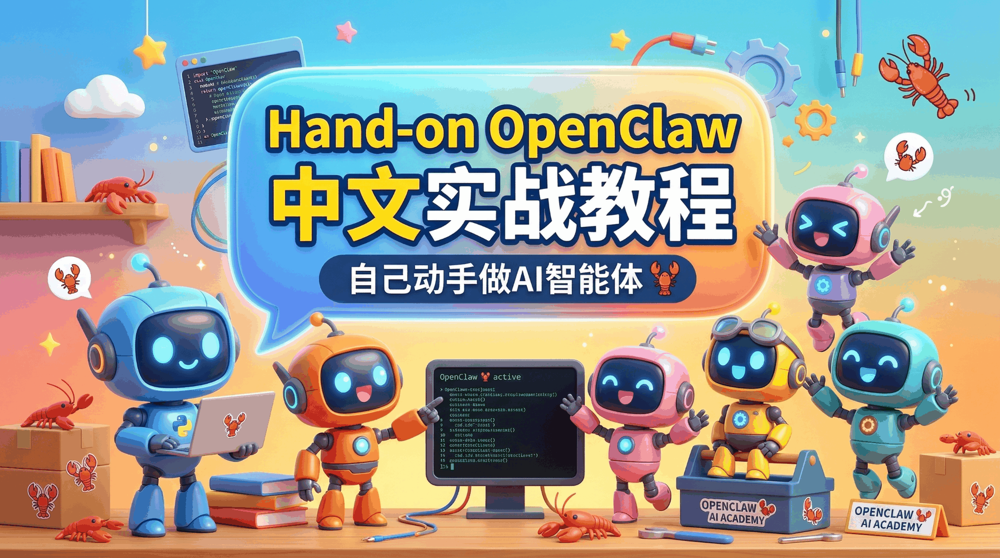

  

<h1 align="center">hand-on-openclaw</h1>

<h3 align="center">《OpenClaw 中文安装与使用手册》</h3>

从安装部署到初始化配置、ClawHub、联网、自动化与常用应用场景，帮助中文用户一步一步把 OpenClaw 真正用起来。

---

## 项目介绍

很多人第一次接触 OpenClaw，最容易卡住的不是“它能做什么”，而是：

1. 不知道该怎么装
2. 不知道 API 应该怎么配
3. 不知道本地、WSL、Docker、第三方平台到底怎么选
4. 装好之后，不知道从哪里开始真正把它用起来

这个仓库就是为这些问题准备的。

它不是一份只讲概念的速览，而是一套偏实操、偏中文语境、偏普通用户上手路径的教程集合。你可以把它理解成一份 OpenClaw 中文电子手册雏形。

总入口：

- [介绍](./doc/介绍.md)

---

## 快速开始

如果你是第一次接触 OpenClaw，建议按下面顺序阅读：

1. 先看 [介绍](./doc/介绍.md)
2. 安装路线优先选：
   - [Windows-WSL-飞书群聊入门](./doc/怎么安装openclaw/Windows-WSL-飞书群聊入门.md)
   - 或 [clawX安装openclaw（qq、飞书、企微、微信）](./doc/怎么安装openclaw/clawX安装openclaw（qq、飞书、企微、微信）.md)
3. 安装完成后先看 [OpenClaw 必做的初始化配置](./doc/怎么使用openclaw/openclaw必做的初始化配置.md)
4. 再继续看 [ClawHub 指南](./doc/怎么使用openclaw/clawhub指南.md) 和 [应用场景目录](./doc/怎么使用openclaw/15个OpenClaw应用场景)

---

## 你将收获什么

- 理解 OpenClaw 到底适合拿来做什么，而不只是把它当成另一个聊天工具
- 了解 Windows、WSL、Docker、第三方平台几种典型安装路线的差异
- 学会把常见模型和 API 接入 OpenClaw
- 能把 OpenClaw 接到飞书、QQ、企业微信、微信等 IM 平台
- 理解 `SOUL.md`、`IDENTITY.md`、`USER.md`、ClawHub、Skills、工作区这些概念在实际使用里的作用
- 通过一组应用场景看懂 OpenClaw 的“连接器 / 胶水层”逻辑

---

## 内容导航

### 安装 OpenClaw

下面这张表把当前安装教程按几个维度做了标注：

- `API配置`：是否包含模型或平台 API 配置
- `环境`：偏本地、云，还是两者都能参考
- `安全性`：仅作为上手层面的相对建议，不代表严格安全审计结论
- `IM接入`：是否包含 QQ / 飞书 / 企业微信 / 微信等接入内容

| 教程 | 适用的操作系统 | API配置 | 环境 | 安全性 | IM接入 |
| --- | --- | --- | --- | --- | --- |
| [Windows-WSL-飞书群聊入门](./doc/怎么安装openclaw/Windows-WSL-飞书群聊入门.md) | Windows | 有 | 本地 | 中 | 飞书 |
| [Windows WSL2 + GLM API 接入 OpenClaw](./doc/怎么安装openclaw/Windows%20WSL2%20+%20GLM%20API%20接入%20OpenClaw.md) | Windows | 有 | 本地 | 中 | 无 |
| [openclaw docker配置](./doc/怎么安装openclaw/openclaw%20docker配置.md) | Windows / macOS / Linux | 有 | 本地 | 高 | 飞书 |
| [clawX安装openclaw（qq、飞书、企微、微信）](./doc/怎么安装openclaw/clawX安装openclaw（qq、飞书、企微、微信）.md) | Windows | 有 | 本地 | 中 | QQ / 飞书 / 企业微信 / 微信 |
| [Kimi Claw 与本地 OpenClaw 飞书接入教程](./doc/怎么安装openclaw/Kimi%20Claw%20与本地%20OpenClaw%20飞书接入教程.md) | Windows / macOS / 云端 | 有 | 本地 / 云均可 | 中 | 飞书 |
| [LM Studio qwen3.5本地模型接入 OpenClaw](./doc/怎么安装openclaw/LM%20Studio%20%20qwen3.5本地模型接入%20OpenClaw.md) | Windows | 有 | 本地 | 中 | 无 |
| [macos虚拟机隔离安装 OpenClaw](./doc/怎么安装openclaw/macos虚拟机隔离安装%20OpenClaw.md) | macOS | 无 | 本地 | 高 | 无 |
| [Step 3.5 Flash API Key 与 OpenClaw 配置](./doc/怎么安装openclaw/Step%203.5%20Flash%20API%20Key%20与%20OpenClaw%20配置.md) | Windows / macOS / Linux / 云端 | 有 | 本地 / 云均可 | 中 | 无 |
| [火山豆包模型接入 OpenClaw](./doc/怎么安装openclaw/火山豆包模型接入%20OpenClaw.md) | Windows / macOS / Linux | 有 | 本地 | 中 | 无 |
| [火山 Coding Plan 小白配置教程](./doc/怎么安装openclaw/火山%20Coding%20Plan%20小白配置教程.md) | Windows / macOS | 有 | 本地 | 中 | 无 |
| [阿里云 Coding Plan 接入 OpenClaw](./doc/怎么安装openclaw/阿里云%20Coding%20Plan%20接入%20OpenClaw.md) | Windows / macOS / Linux | 有 | 本地 | 中 | 无 |

### 使用 OpenClaw

| 模块 | 说明 |
| --- | --- |
| [介绍](./doc/介绍.md) | 整体理解这个仓库的阅读路径，以及 OpenClaw 的定位 |
| [OpenClaw 必做的初始化配置](./doc/怎么使用openclaw/openclaw必做的初始化配置.md) | 理解 `SOUL.md`、`IDENTITY.md`、`USER.md`，先把助手调教成“你的助手” |
| [ClawHub 指南](./doc/怎么使用openclaw/clawhub指南.md) | 学会怎么搜索、安装、更新和安全使用 Skills |
| [15个OpenClaw应用场景](./doc/怎么使用openclaw/15个OpenClaw应用场景) | 按场景理解 OpenClaw 的能力组合方式 |

### 应用场景目录

- [01-个人知识库](./doc/怎么使用openclaw/15个OpenClaw应用场景/01-个人知识库.md)
- [02-定时任务](./doc/怎么使用openclaw/15个OpenClaw应用场景/02-定时任务.md)
- [03-邮箱管理](./doc/怎么使用openclaw/15个OpenClaw应用场景/03-邮箱管理.md)
- [04-任务管理](./doc/怎么使用openclaw/15个OpenClaw应用场景/04-任务管理.md)
- [05-图片、视频生成](./doc/怎么使用openclaw/15个OpenClaw应用场景/05-图片、视频生成.md)
- [06-日程管理](./doc/怎么使用openclaw/15个OpenClaw应用场景/06-日程管理.md)
- [07-自媒体文稿撰写](./doc/怎么使用openclaw/15个OpenClaw应用场景/07-自媒体文稿撰写.md)
- [08-金融助手](./doc/怎么使用openclaw/15个OpenClaw应用场景/08-金融助手.md)
- [09-代码开发助手](./doc/怎么使用openclaw/15个OpenClaw应用场景/09-代码开发助手.md)
- [10-浏览器自动化](./doc/怎么使用openclaw/15个OpenClaw应用场景/10-浏览器自动化.md)
- [11-文件分析和生成（PDF-word-PPT-excel）](./doc/怎么使用openclaw/15个OpenClaw应用场景/11-文件分析和生成（PDF-word-PPT-excel）.md)
- [12-图表](./doc/怎么使用openclaw/15个OpenClaw应用场景/12-图表.md)
- [13-动画生成（基于Remotion）](./doc/怎么使用openclaw/15个OpenClaw应用场景/13-动画生成（基于Remotion）.md)
- [14-新闻汇总](./doc/怎么使用openclaw/15个OpenClaw应用场景/14-新闻汇总.md)
- [15-论文科研](./doc/怎么使用openclaw/15个OpenClaw应用场景/15-论文科研.md)
- [16-联网](./doc/怎么使用openclaw/15个OpenClaw应用场景/16-联网.md)

---

## 如何学习这份仓库

这套内容更适合这样使用：

1. 先跑通一条主链路，不要一开始就同时折腾模型、IM、Skills、自动化
2. 先解决“能装、能配、能对话”
3. 再解决“认主、联网、装技能”
4. 最后再开始把多个能力组合起来用

如果你是普通用户：

1. 优先看 WSL 或 ClawX
2. 先接一个稳定模型
3. 再接飞书或其他 IM

如果你更重视隔离和安全：

1. 优先看 Docker 或虚拟机隔离方案
2. 尽量把高权限运行环境和主力工作环境分开

---

## 仓库结构

- [doc/](./doc/)：当前主文档目录
- [doc/怎么安装openclaw/](./doc/怎么安装openclaw/)：安装、模型接入、IM 接入
- [doc/怎么使用openclaw/](./doc/怎么使用openclaw/)：初始化配置、ClawHub、应用场景

---

## 如何贡献

欢迎继续补充和完善这份中文教程：

- 补充更清晰的安装路径
- 修正文档中的过期步骤
- 增加更多 API / 模型 / 平台接入方案
- 增加新的使用场景和踩坑总结

提交前请注意：

- 不要提交真实密钥、Token、组织信息
- 涉及外部平台配置时，尽量写清前置条件和限制

---

## 开源协议

本项目采用 [Apache 2.0](./LICENSE) 协议。
