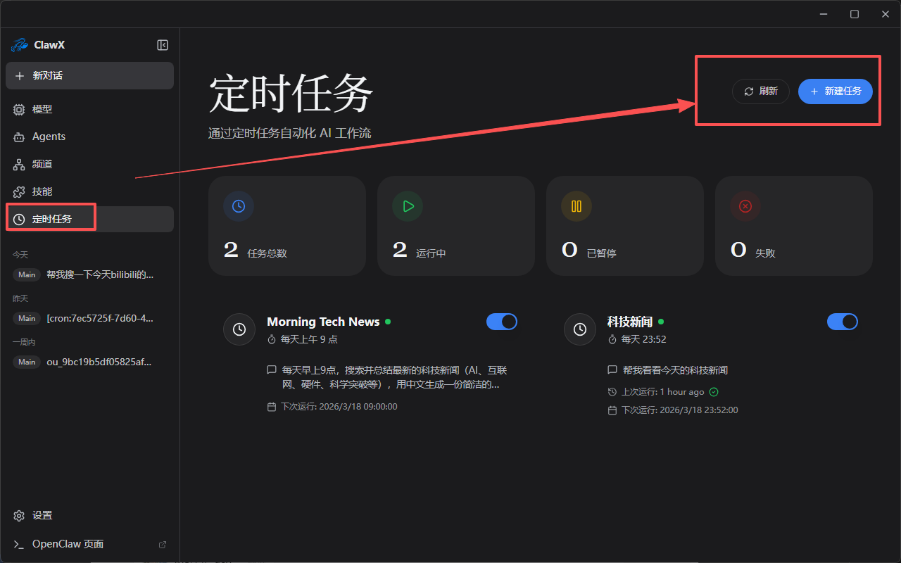
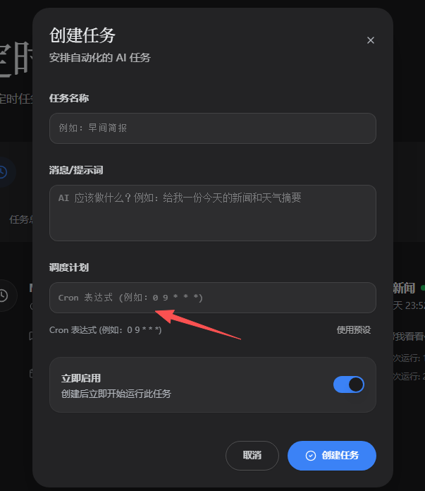
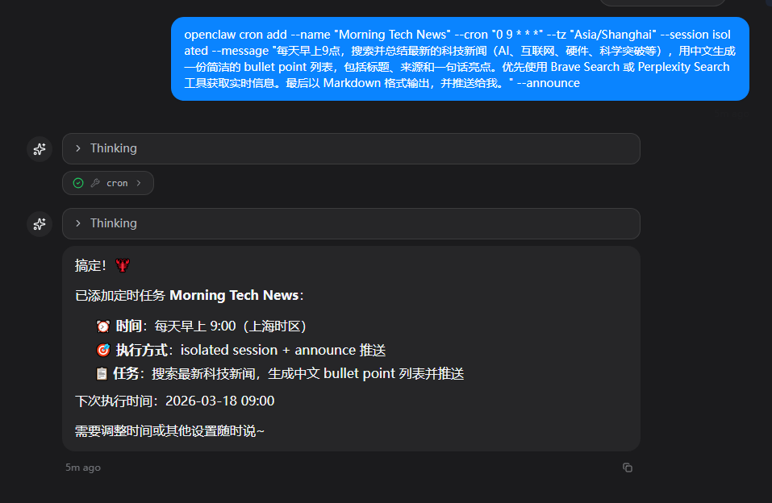
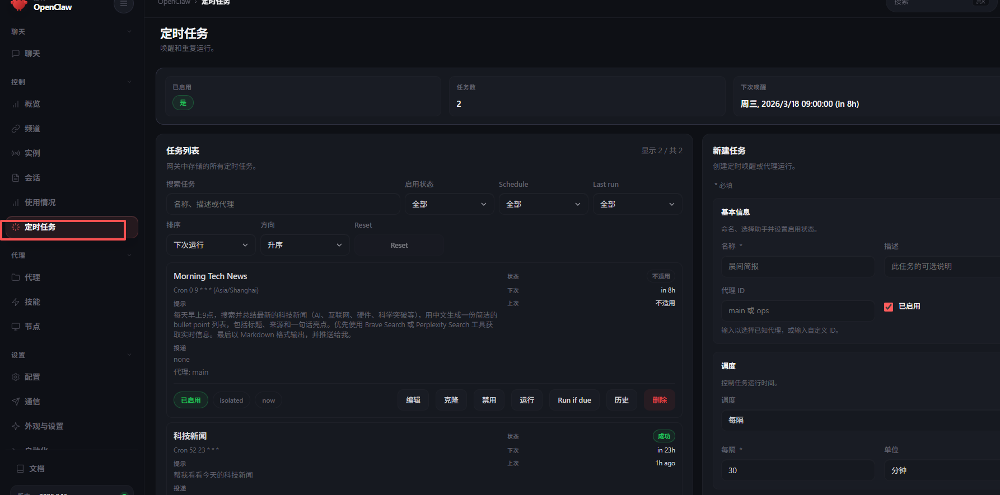

# 2. 定时任务

有的时候我们需要得到一些定时推送，方便我们完成一些任务。

在clawx里大家可以快速在可视化界面里配置。



然后选择自定义cron，咱们可以自己写时间 比如0 9 * * * 是每天九点 0分。第一个数字代表分 第二个是时 24小时制，大家自己调即可。



如果没有用clawx的伙伴可以在terminal输入下面这样的格式内容，或者直接给虾发即可。下面大家只需要改message、name两块的内容。

```Plain
openclaw cron add --name "Morning Tech News" --cron "0 9 * * *" --tz "Asia/Shanghai"  --session isolated  --message "每天早上9点，搜索并总结最新的科技新闻（AI、互联网、硬件、科学突破等），用中文生成一份简洁的 bullet point 列表，包括标题、来源和一句话亮点。优先使用 Brave Search 或 Perplexity Search 工具获取实时信息。最后以 Markdown 格式输出，并推送给我。" --announce
```



搞定后也能在webui看到~



