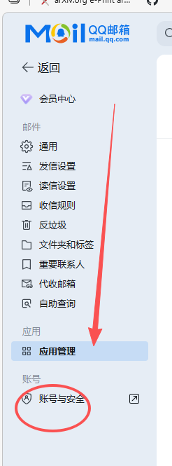
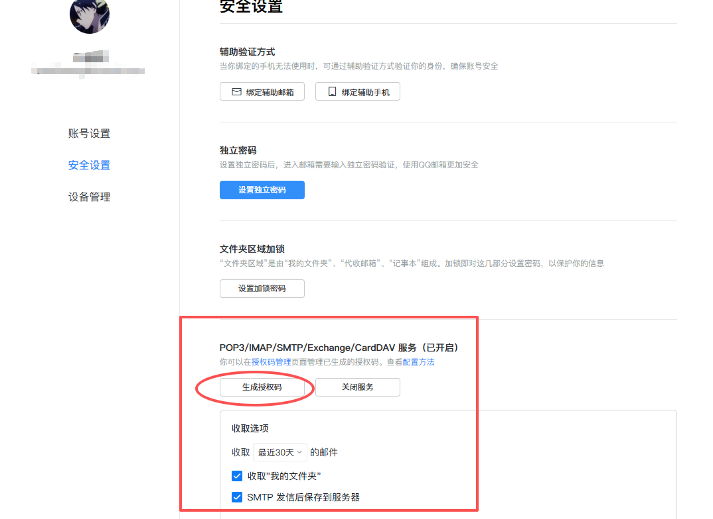
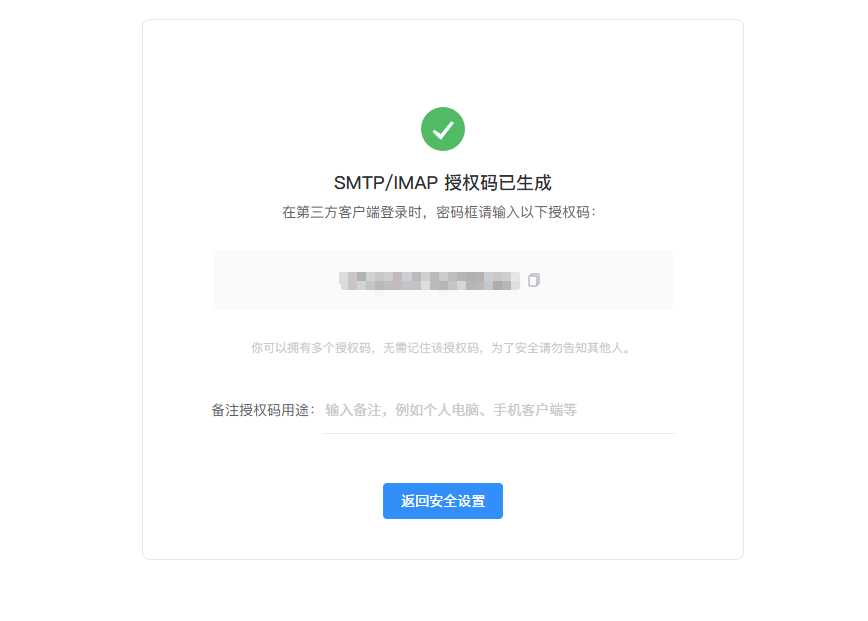
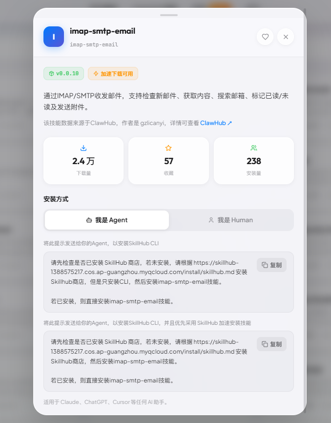
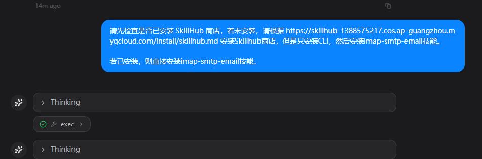
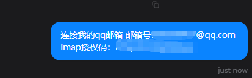
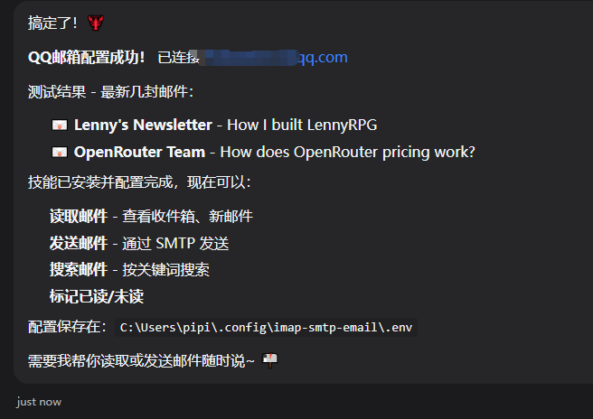
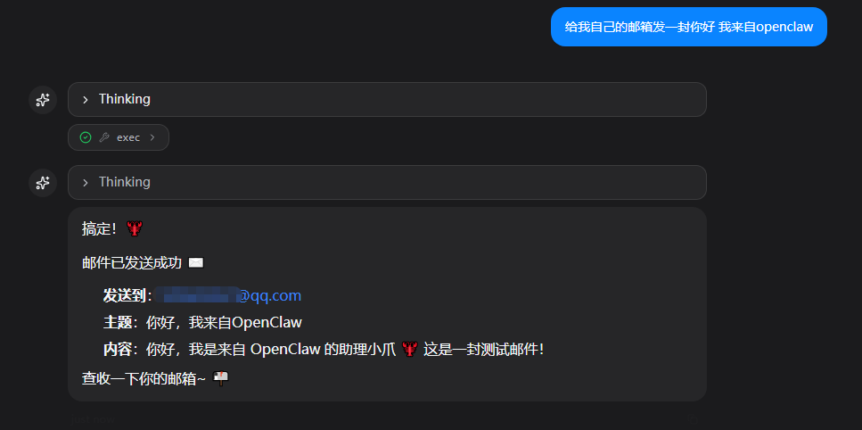
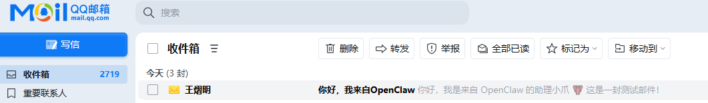

# 3. 邮箱管理

这次我们来试试用openclaw管理一下QQ邮箱，如果是HR应该两眼放光了看到这条。那咱们就嗨起来。先打开你的QQ邮箱。



找到这个账号安全，进去打开下面这套服务。



接着拿到你的授权码~



然后我们回到openclaw的对话框。输入

```Plain
请先检查是否已安装 SkillHub 商店，若未安装，请根据 https://skillhub-1388575217.cos.ap-guangzhou.myqcloud.com/install/skillhub.md 安装Skillhub商店，但是只安装CLI，然后安装imap-smtp-email技能。

若已安装，则直接安装imap-smtp-email技能。
```

我说一下，咱们这个邮箱skill是拿腾讯验证过得，安全的skill。不要见到这个就自己下载，邮箱完蛋了可就真完了昂！



然后输入：

```Plain
连接我的QQ邮箱，邮箱号：XXXXXXXXXX@qq.com
imap授权码：xXXXXXXXXXXXXXXXXXX
```





我们让他测试一下，给openclaw说“给我自己的邮箱发一封你好 我来自openclaw”



得到效果：



