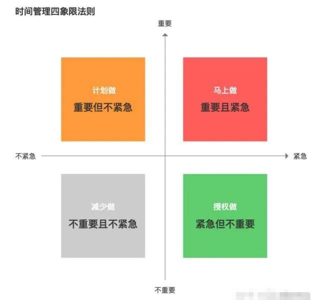
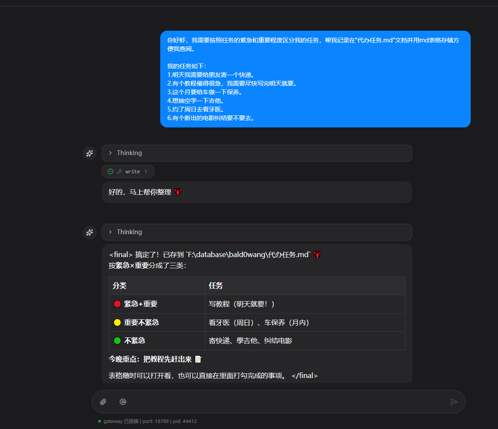
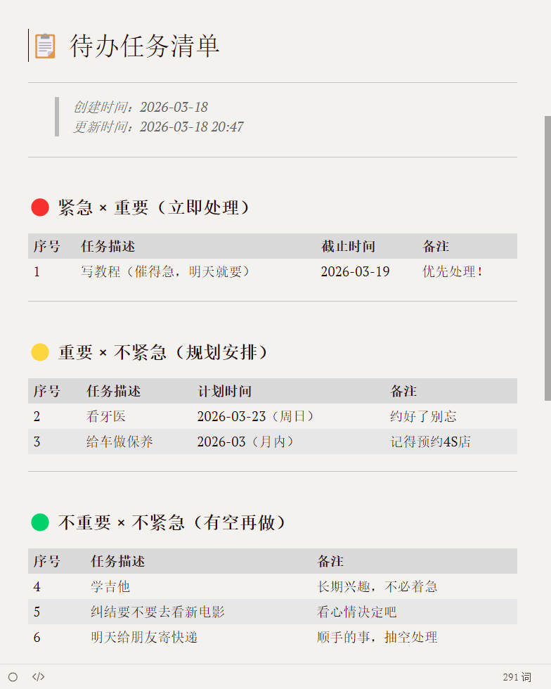
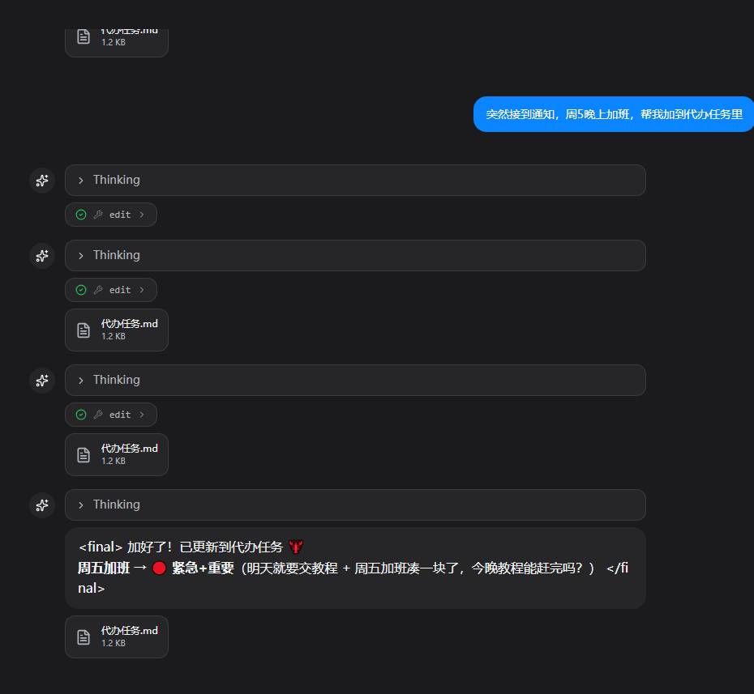
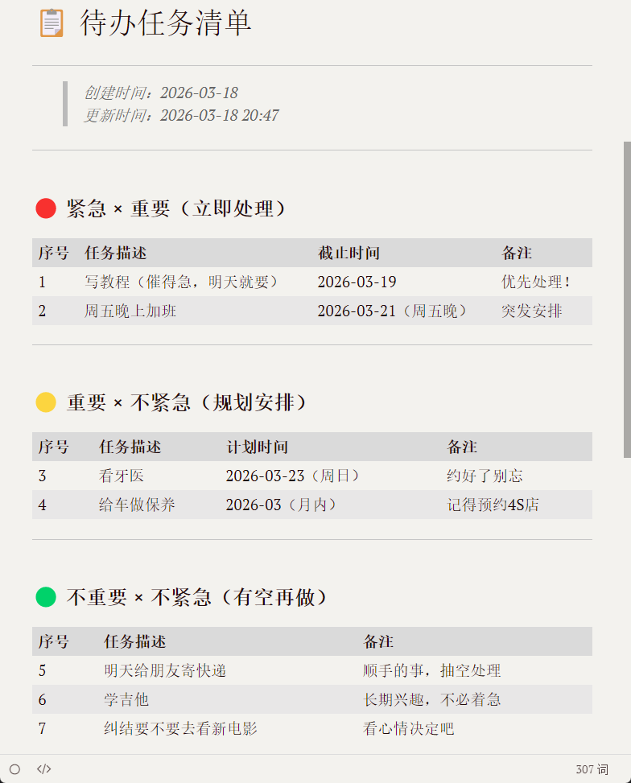

# 4. 任务管理

任务管理一般是大家常用的工作，大家可以通过openclaw把你的任务按任务管理四象限拆解一下，这样你可以在不知道干嘛时让虾给你最合适的推荐。或是提醒你去关注一些要紧的工作。



提示词：

```Plain
你好虾，我需要按照任务的紧急和重要程度区分我的任务，帮我记录在“代办任务.md”文档并用md表格存储方便我查阅。

我的任务如下：
1.明天我需要给朋友寄一个快递。
2.有个教程催得很急，我需要尽快写完明天就要。
3.这个月要给车做一下保养。
4.想抽空学一下吉他。
5.约了周日去看牙医。
6.有个新出的电影纠结要不要去。
```

好的 我的虾很快搞定了~



当你临时有任务加入就参考下面~提出“代办清单”这个关键词（如果实在不行就提醒他还记得我们的“代办任务.md”吗？加进去新任务）这样~



