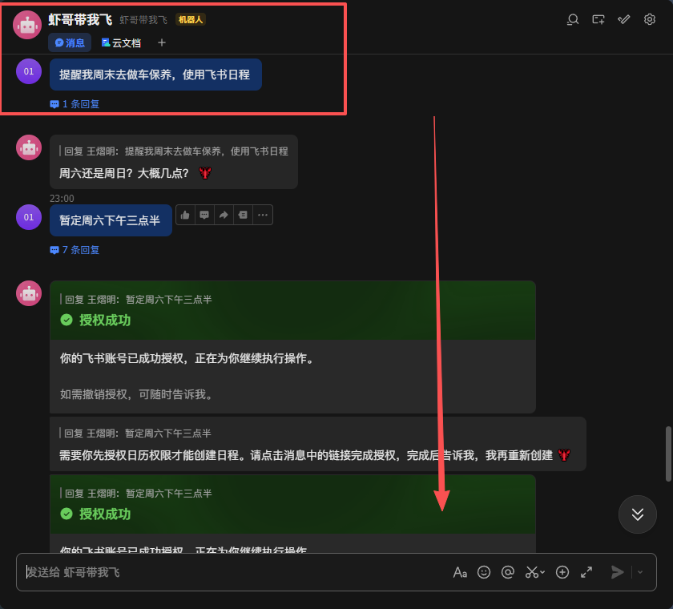
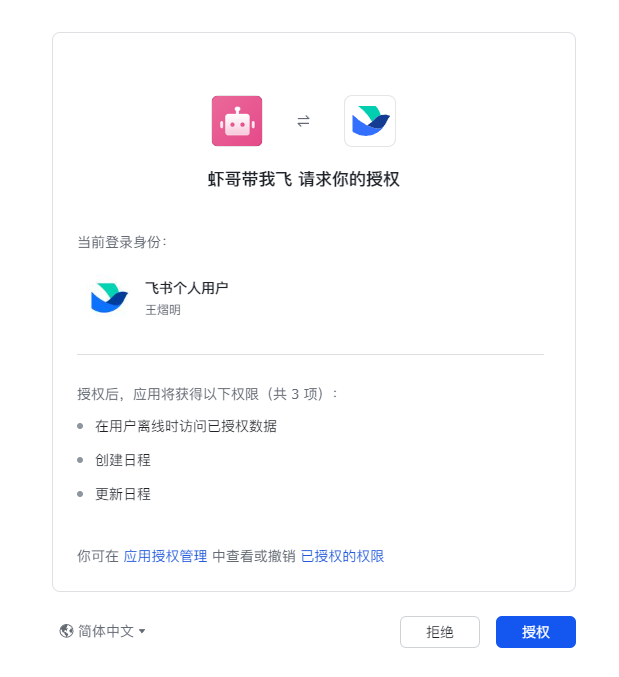
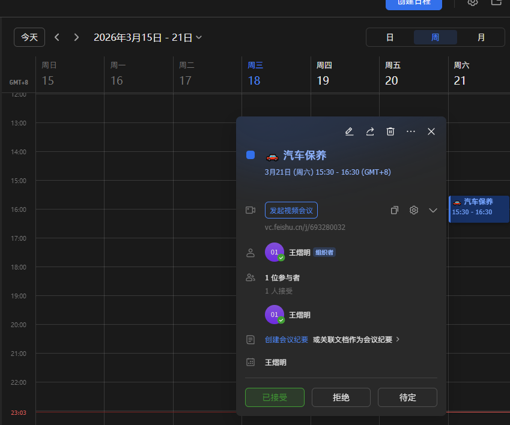
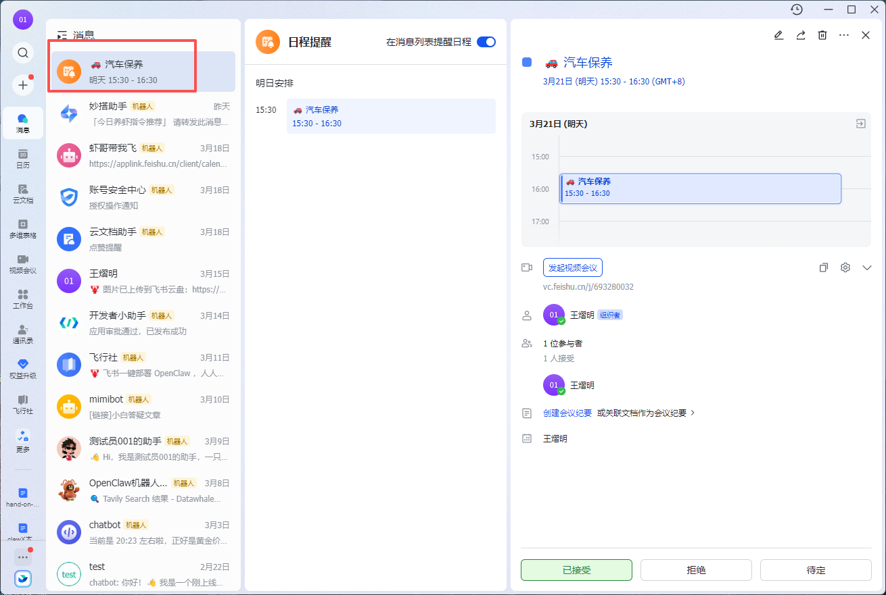

# 6. 日程管理

这个任务我们需要借助飞书日程来合作实现~再此之前需要大家先接入飞书。

接下来我们进入飞书与openclaw对话，我直接说：

```Plain
提醒我周六下午3点半去做汽车保养，记录在飞书的日历中。
```

虾会找你要一些授权，你照做就好~



得到授权后虾帮我做了日程管理。比如你有一些纪念日啊，什么日期需要定的都可以在这里搞定~





后续：之前写是周三，周五的时候飞书自动提醒：



