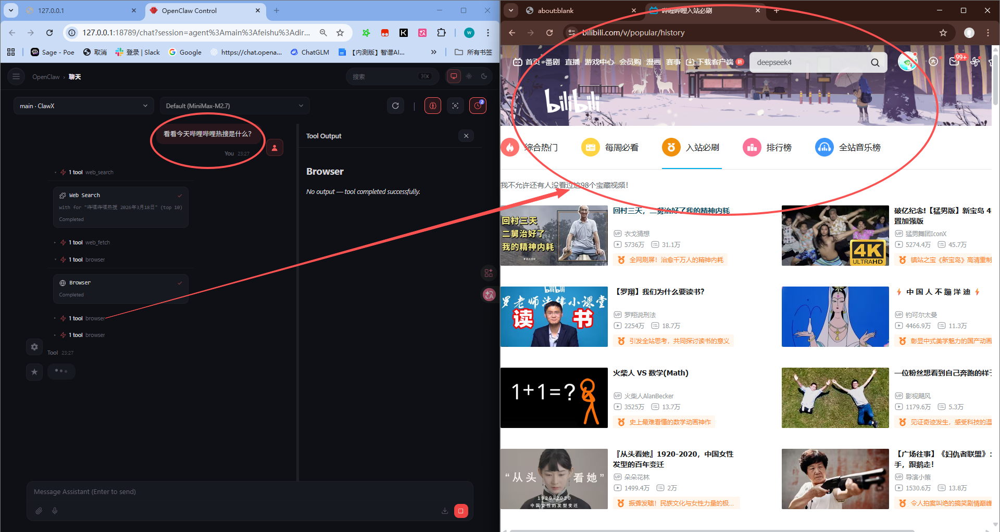
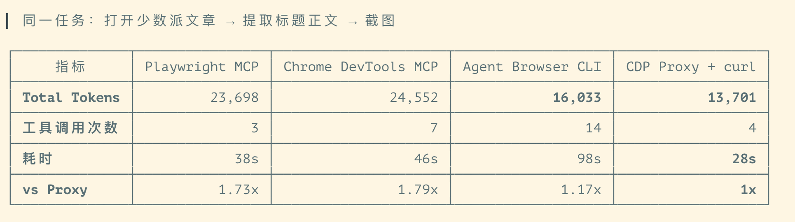
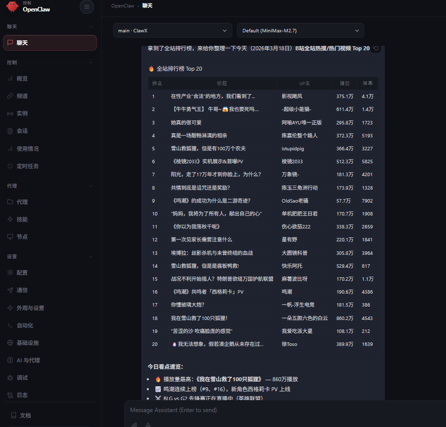
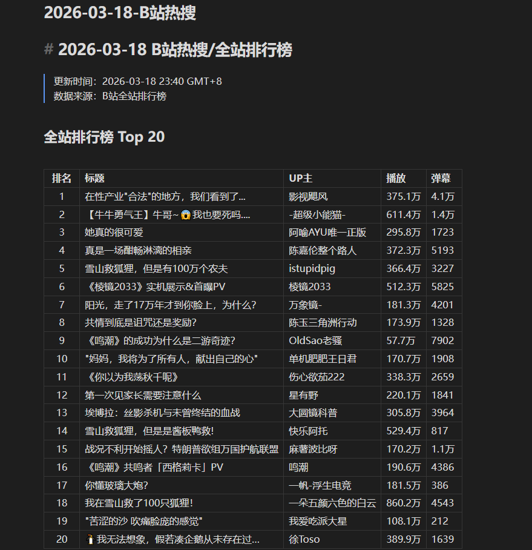

# 10. 浏览器自动化

这是一个最简单的用法，而且现在的openclaw做的也很好。我来带大家快速尝试体验。需要大家打开openclaw，然后输入搜索内容，会自动出发使用browser插件。

值得注意的是openclaw使用的browser插件是默认CDP模式，相对省token也比较安全。下面是一泽（一泽Eze）老师测试过的token使用情况大家可以简单了解~

下面是得到的结果。

（这里补充一下，使用的模型质量越好browser的智能模式就会越高，效果越好。但如果你使用更弱的模型就需要更多的提示，比如检索哔哩哔哩热门视频，你可能要给他热门视频的URL）

还有，CDP模式是打开一个你的默认浏览器，你可以自行登录账号，这样openclaw可以拿到登录权限后的页面内容，这样的操作上限会更高。

下面是openclaw browser的效果。相比之前版本会好很多。

我们让他将内容填充到obsidian~咱们试试看，效果如下~

