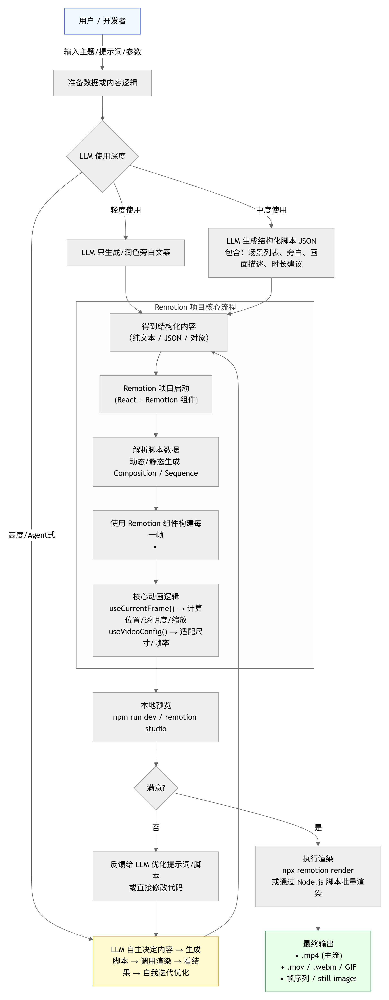
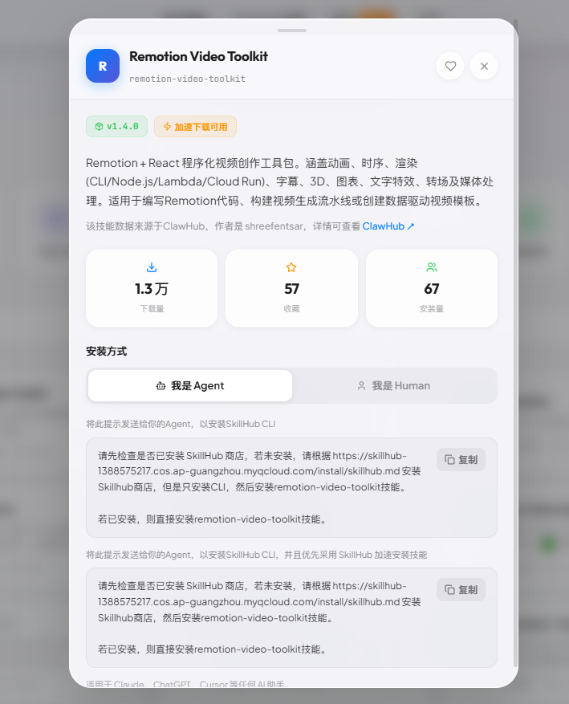
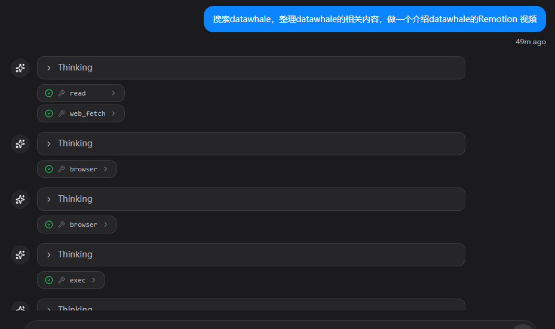

# 13. 动画生成（基于Remotion）

今天我们来用大名鼎鼎的remotion做做动画视频~做教程必备哦

我们来简单了解一下remotion：

Remotion 是一个开源的 React 框架，专门用于用代码（特别是 React 组件）程序化地创建真实 MP4 视频。它让开发者可以用熟悉的 React 语法、组件复用、CSS 动画、Canvas/SVG、三维等 web 技术来制作视频，而不是依赖传统视频编辑软件。

下面是llm驱动remotion的流程图~ 和我一起补补课吧~

### remotion处理任务流程图 



### skill配置



依旧skillhub，依旧一句话搞定skill

```Plain
请先检查是否已安装 SkillHub 商店，若未安装，请根据 https://skillhub-1388575217.cos.ap-guangzhou.myqcloud.com/install/skillhub.md 安装Skillhub商店，但是只安装CLI，然后安装remotion-video-toolkit技能。

若已安装，则直接安装remotion-video-toolkit技能。
```

测试~



这次openclaw主动搜索了datawhale的github官网搜集好信息，只做了视频。

这个skill第一次使用感觉很费时间，大家做好准备。如果着急要结果就使用claude code（减轻痛苦）

<video data-lark-video-uri="drivetoken://Dcegb6lxAoICRMxhpLOcjJqzn8d" data-lark-video-mime="video/mp4" data-lark-video-size="3006773" data-lark-video-duration="0" data-lark-video-name="datawhale-intro.mp4" data-lark-video-width="1920" data-lark-video-height="1080"></video>

