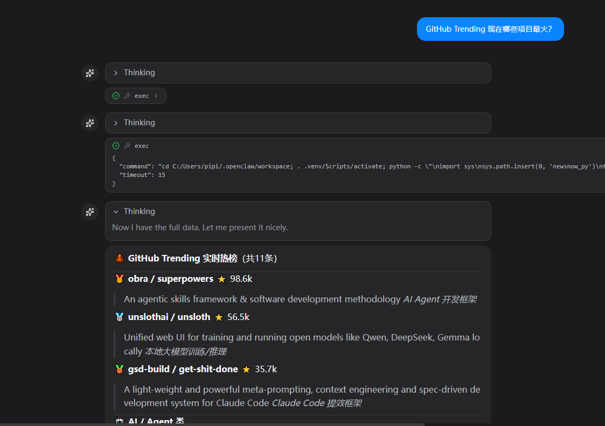
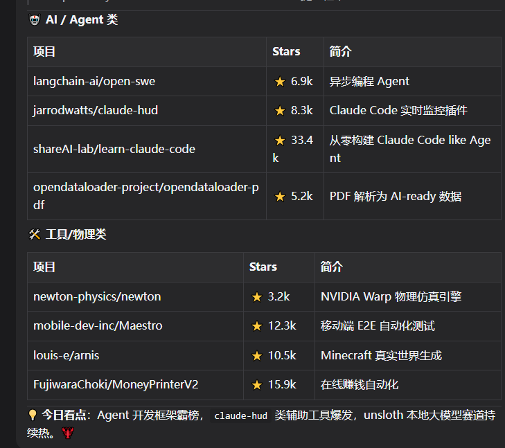
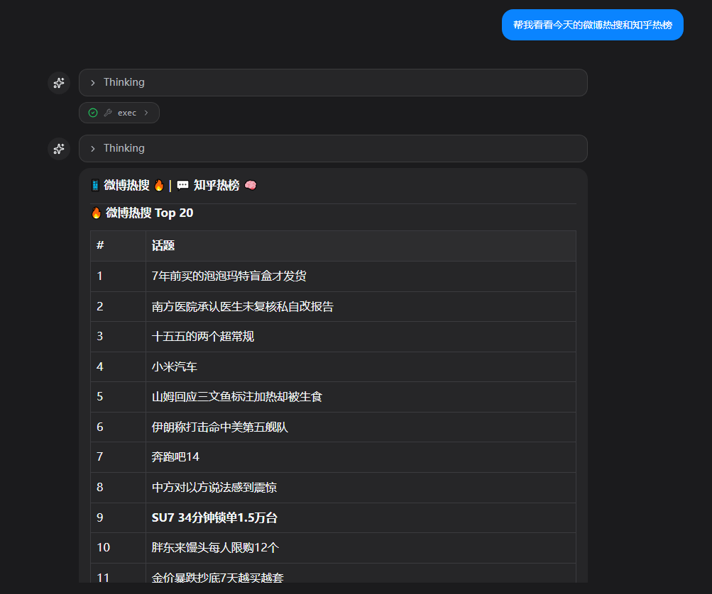
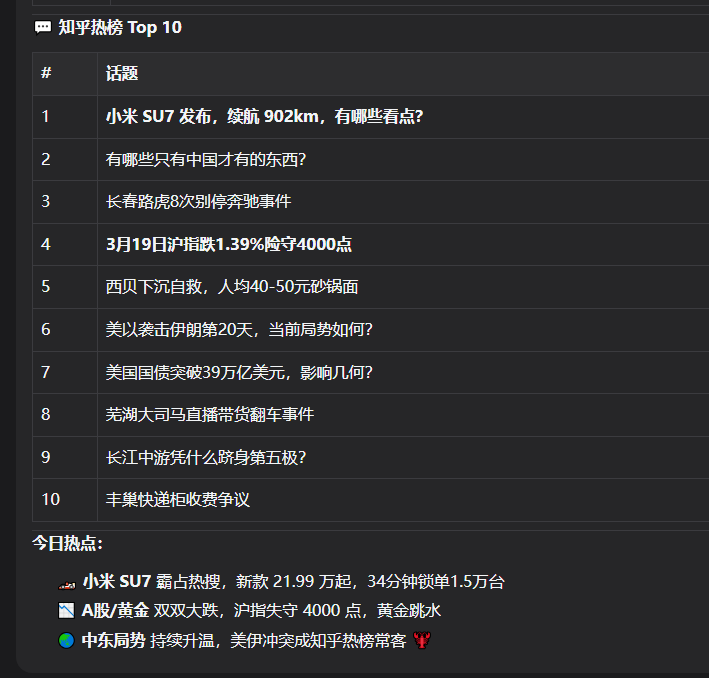
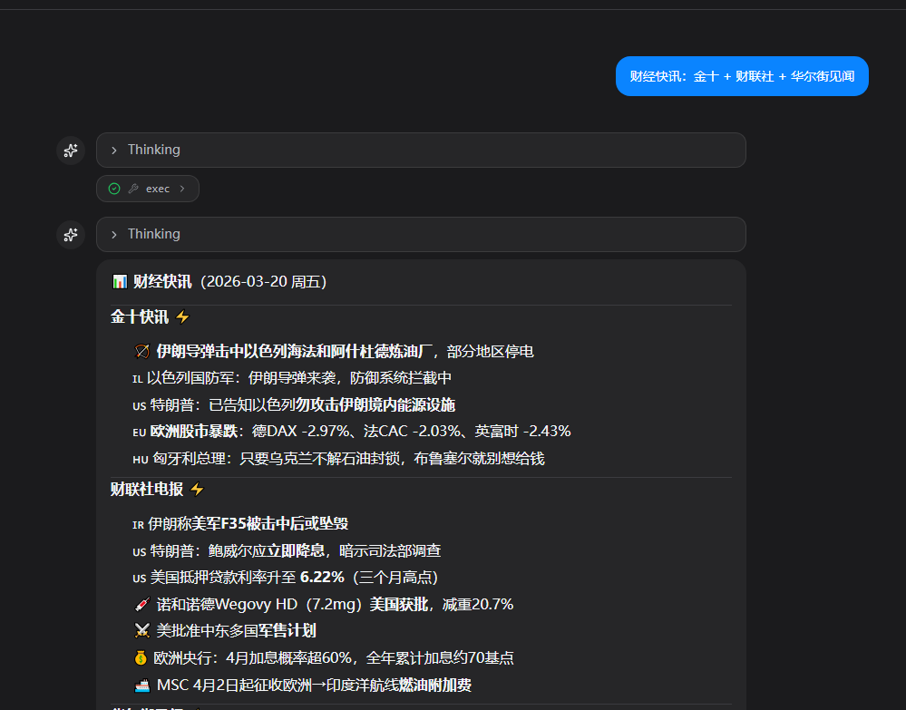
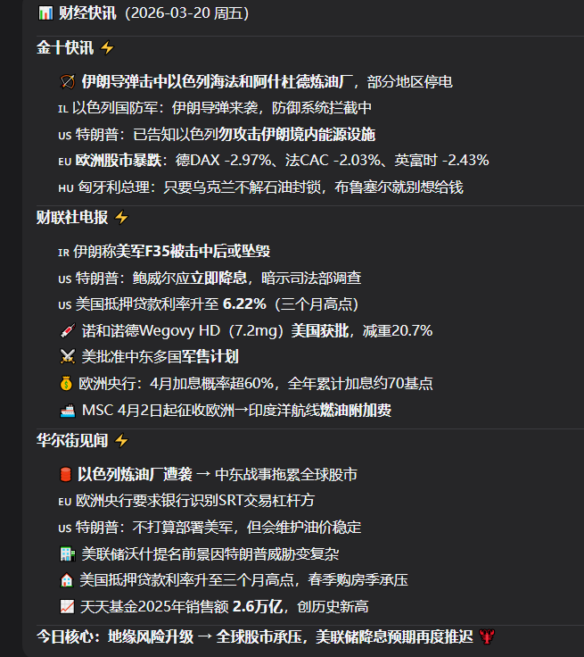

# 14. 新闻汇总

这里推荐大家使用我整理的信息源，我目前把newsnow这个项目的信息源整理成py版本，然后大家可以一键搞定skill~非常香。

直接对虾说：

```Plain
帮我将仓库https://github.com/Bald0Wang/newsnow_py克隆到本地，然后根据用法做一个skill 随时方便查看当前新闻
```

### 可用信源

66个信源供大家任选~

Source ID说明价值评分(1-5)36kr36 氪：快讯 + 热榜。436kr-quick36 氪：快讯。436kr-renqi36 氪：热榜（人气）。3baidu百度：实时热搜榜。4bilibiliB 站：热搜词。3bilibili-hot-searchB 站：热搜词。3bilibili-hot-videoB 站：热门视频（popular）。3bilibili-rankingB 站：排行榜。3cankaoxiaoxi参考消息：多频道合并（中国/观点/国际）。3chongbuluo虫部落：热榜。2chongbuluo-hot虫部落：热榜。2chongbuluo-latest虫部落：最新（RSS）。2cls财联社：电报流。5cls-telegraph财联社：电报流。5cls-depth财联社：深度。4cls-hot财联社：热榜。4coolapk酷安：今日热门。3douban豆瓣：近期热门电影。2douyin抖音：热搜。3fastbullFastbull：快讯。4fastbull-expressFastbull：快讯。4fastbull-newsFastbull：资讯。3freebufFreebuf：安全文章列表。4gelonghui格隆汇：新闻列表。3ghxi果核剥壳：文章列表。2githubGitHub：Trending。4github-trending-todayGitHub：Trending。4hackernewsHacker News：首页列表。4hupu虎扑：热帖榜。2ifeng凤凰网：热点新闻。3iqiyi-hot-ranklist爱奇艺：热榜。2ithomeIT 之家：资讯列表（过滤广告）。3jin10金十：快讯。5juejin掘金：热榜文章。3kaopuKaopu：聚合新闻 JSON。3kuaishou快手：热榜/热搜。3linuxdoLinux.do：最新主题。2linuxdo-latestLinux.do：最新主题。2linuxdo-hotLinux.do：日榜热帖。2mktnewsMKTNews：快讯。4mktnews-flashMKTNews：快讯。4nowcoder牛客：热搜。2pcbeta-windows11PCBeta：Windows 11（RSS）。2pcbeta-windowsPCBeta：Windows（RSS）。2producthuntProduct Hunt：Top（需要 PRODUCTHUNT_API_TOKEN）。3qqvideo-tv-hotsearch腾讯视频：电视剧热搜榜。2smzdm什么值得买：热榜。3solidotSolidot：资讯列表。3sputniknewscn俄罗斯卫星通讯社（中文）：列表。2sspai少数派：热门文章。3steamSteam：在线人数榜（当前玩家数）。2tencent-hot腾讯新闻：综合早报/热点。3thepaper澎湃新闻：热点。4tieba百度贴吧：热议话题。2toutiao今日头条：热榜。4v2exV2EX：多节点 JSON Feed 合并。3v2ex-shareV2EX：多节点 JSON Feed 合并。3wallstreetcn华尔街见闻：快讯（live）。5wallstreetcn-quick华尔街见闻：快讯（live）。5wallstreetcn-news华尔街见闻：资讯流（article）。4wallstreetcn-hot华尔街见闻：热门文章。3weibo微博：实时热搜。4xueqiu雪球：热门股票。4xueqiu-hotstock雪球：热门股票。4zaobao早晨报：实时列表（GB2312 页面）。2zhihu知乎：热榜。4







