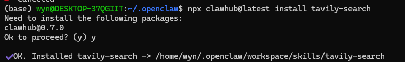

# 16. 联网

## 16.1 联网 skills

联网是个大问题hh，可能需要两个方面。一个是主动拉取浏览器，另一个是阅读网址。

这里我们选择使用Tavily作为我们的核心工具~请大家先注册一个账号：

https://app.tavily.com/home

然后需要你新建一个api并复制key~


接着来到ubuntu的界面，输入下面命令并输入y。

```Plain
 npx clawhub@latest install tavily-search
```



装好之后再输入，下面的“apikey”替换为你的key即可~

```Plain
export TAVILY_API_KEY="apikey"
```


接着进入飞书，找一个想用这个技能的agent：

让他查看skill并将刚才我们安装的tavily-searchskill也加进来~


测试通过~


