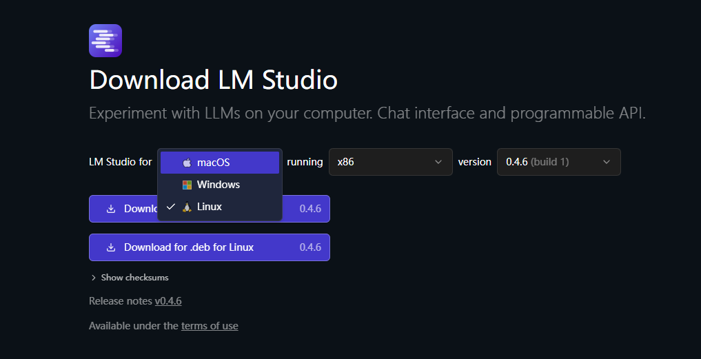
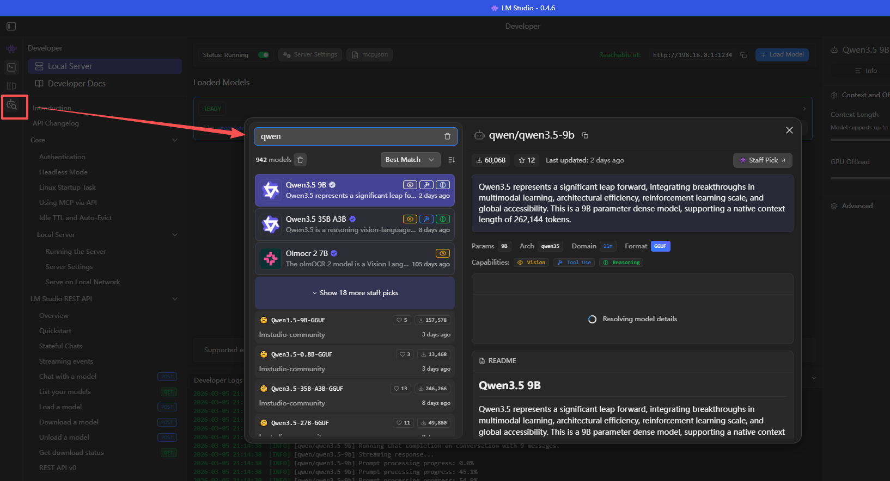
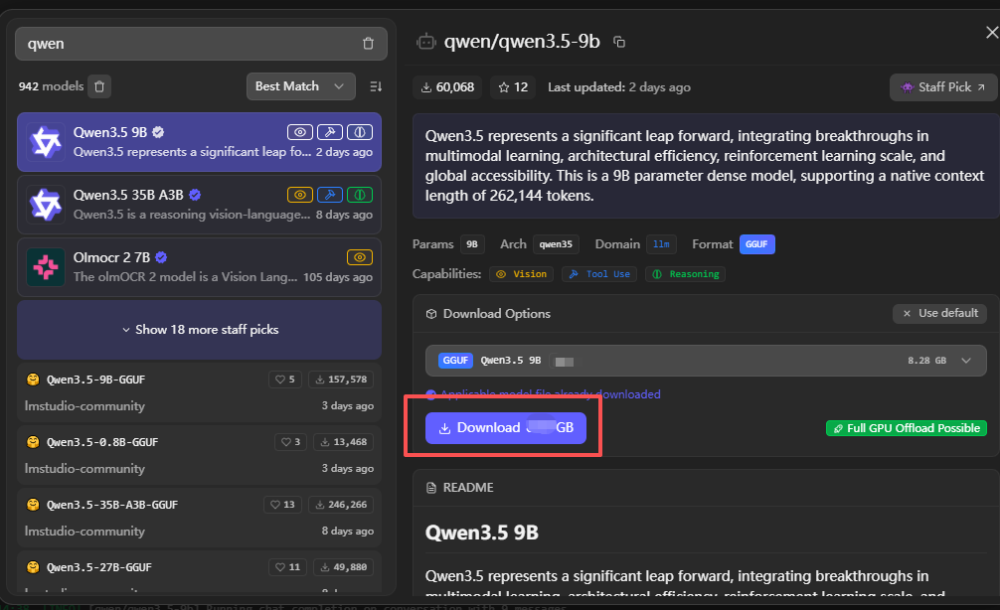
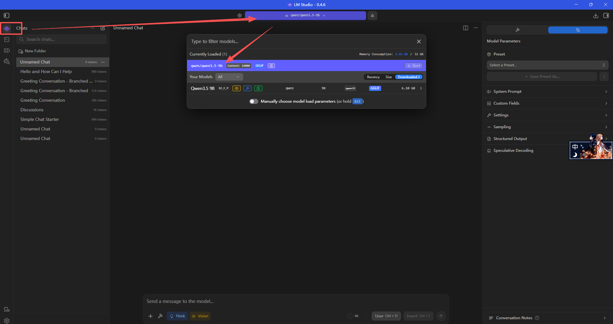
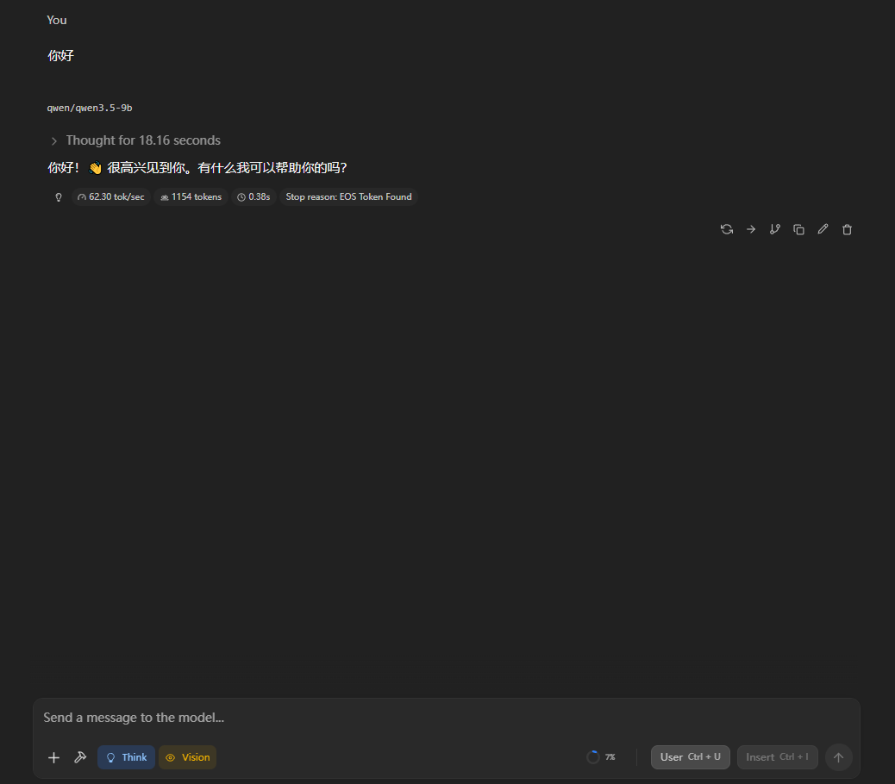
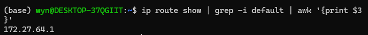
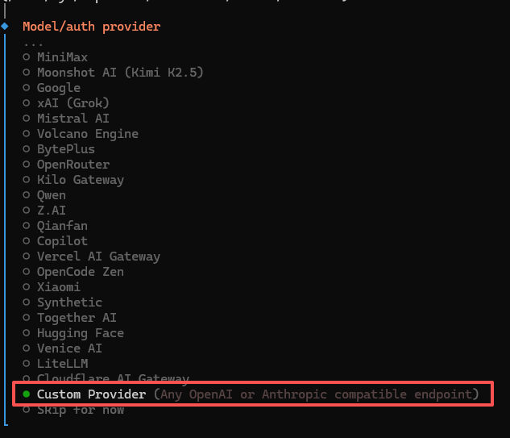
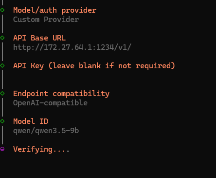
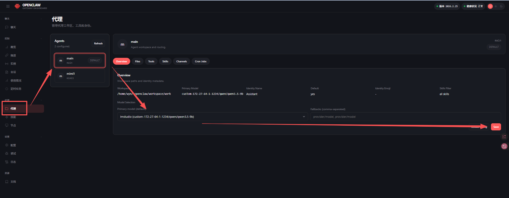

# LM Studio 本地模型接入 OpenClaw

> 标签：`API配置：有` `环境：本地` `安全性：中` `IM接入：无`

这篇文档综合整理自 `tpm3` 和 `tpm4`。两份草稿主题相同，都是用 `LM Studio` 部署本地模型，并把模型接入 OpenClaw。

本示例使用：

1. `LM Studio`
2. `Qwen 3.5 9B`
3. 4bit 量化版本
4. Windows 主机 + WSL 中运行 OpenClaw

## 1. 安装 LM Studio

先根据自己的系统下载 LM Studio：

https://lmstudio.ai/download?os=win32



## 2. 下载本地模型

安装并打开 LM Studio 后，在左侧搜索栏中搜索 `qwen`，找到 `Qwen 3.5 9B`，选择 4bit 量化版本。



点击下载按钮，把模型下载到本地。



下载完成后，进入模型列表，找到 `qwen3.5-9b`。



可以先在 LM Studio 里直接输入“你好”做一次本地对话测试，确认模型本身可以正常运行。



## 3. 打开 LM Studio 的本地服务

接下来需要把 LM Studio 的模型服务对外开放，让 OpenClaw 可以调用。

按照图中的方式开启本地服务配置。


## 4. 在 WSL 中测试连通性

如果你的 OpenClaw 跑在 WSL 里，就需要先拿到 Windows 主机在 WSL 视角下的 IP。

原稿中这里的具体命令没有显示出来，因此只保留流程说明：

1. 在 WSL 中查看 Windows 主机映射 IP
2. 用该 IP 测试 LM Studio 暴露出来的接口
3. 确认接口能返回模型信息




如果测试成功，说明 WSL 已经可以访问到 Windows 上的 LM Studio 服务。


## 5. 在 OpenClaw 中接入本地模型

执行：

```bash
openclaw onboard
```

进入模型配置流程。





### 5.1 Base URL

原稿这里没有展示具体地址，但根据上下文，这里应填写 LM Studio 暴露出来的 OpenAI 兼容接口地址。

通常会是这种形式：

```text
http://<Windows主机IP>:1234/v1
```

这里的 `<Windows主机IP>` 需要替换成你在前一步查到的地址。

### 5.2 API Key

原稿说明这里可以随便填一个值，主要是为了通过表单，不需要真实的云端密钥。

### 5.3 模型 ID

模型 ID 填写：

```text
qwen/qwen3.5-9b
```



测试通过后，继续回车并填写模型来源。


其余选项按实际需要配置即可。

## 6. 打开 Web UI

最后选择打开 Web UI。


进入 OpenClaw 后，就可以把这个本地模型作为当前会话模型来使用。

## 7. 结论

到这里，你已经完成了：

1. 用 LM Studio 下载并运行本地模型
2. 打开本地 OpenAI 兼容接口
3. 在 WSL 中验证对 Windows 主机服务的访问
4. 在 OpenClaw 中接入本地模型

如果你后面要做“完全私有化”方案，这就是一条比较直接的起点。
