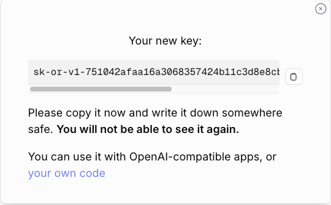
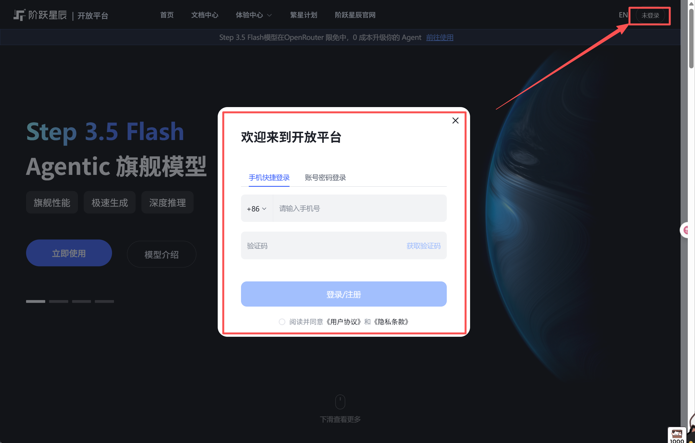
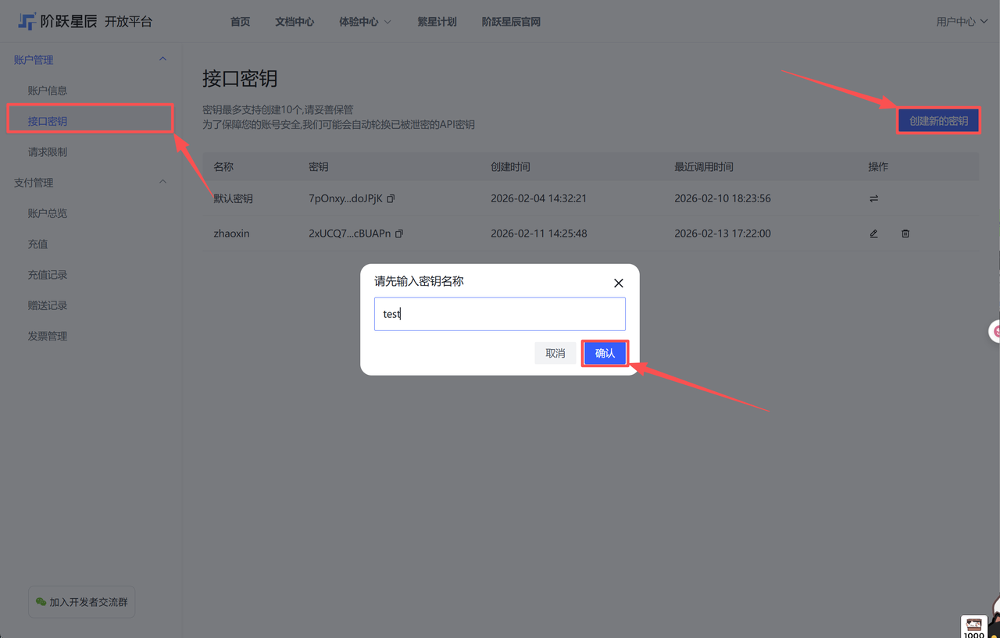
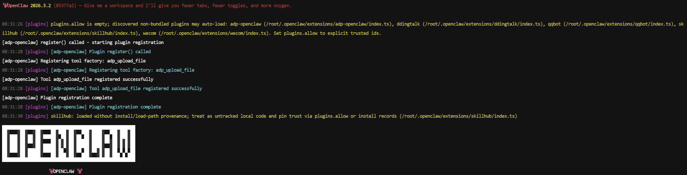
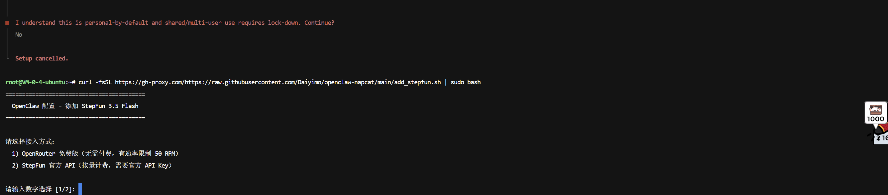
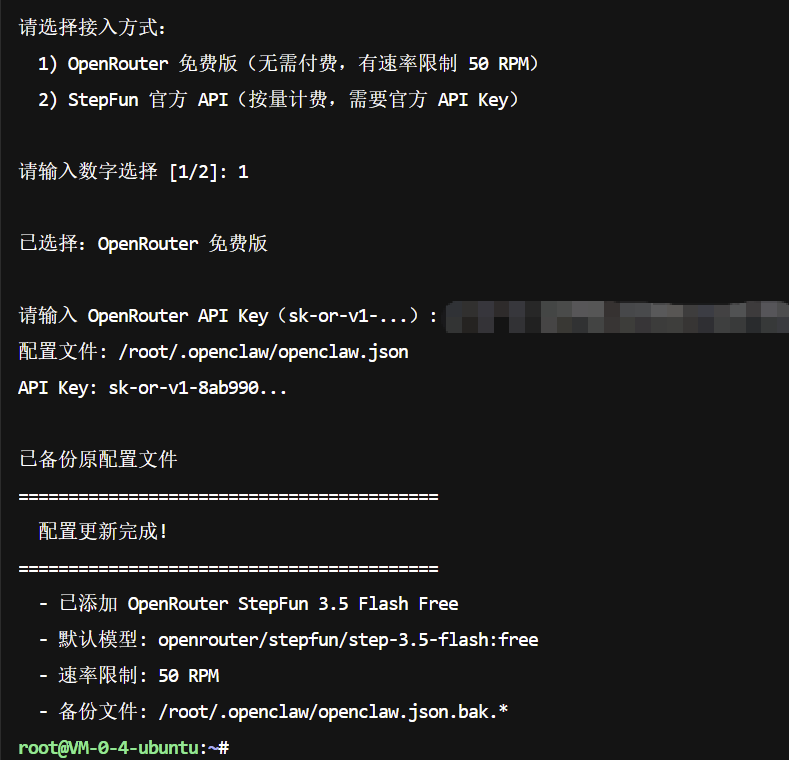

# Step 3.5 Flash API Key 与 OpenClaw 配置

> 标签：`API配置：有` `环境：本地 / 云均可` `安全性：中` `IM接入：无`

这篇文档整理自 `tpm5`，主要讲两件事：

1. 如何获取 `Step 3.5 Flash` 的 API Key
2. 如何把对应密钥配置到 OpenClaw 中

## 1. 获取 API Key

原稿给了两种方式：

1. 通过 OpenRouter 获取
2. 通过阶跃星辰开放平台获取

### 1.1 通过 OpenRouter 获取

打开 OpenRouter：

https://openrouter.ai/settings/keys

先注册或登录账号。

进入密钥页面后，创建新的 API Key。

在弹窗里输入一个名称，然后点击创建。由于密钥通常只显示一次，建议立刻复制到安全位置保存。

### 1.2 通过阶跃星辰开放平台获取

打开阶跃星辰开放平台：

https://platform.stepfun.com/

注册或登录账号。

创建新的 API Key。

生成后，在后台复制对应密钥。

## 2. 安装 OpenClaw

原稿这里包含了两种安装思路：

1. 通过安装脚本安装
2. 通过全局安装方式安装

同时也给出了前置条件：

1. Node.js 22/23
2. 如果走手动安装，还需要 `git`

原稿中的具体命令在飞书外不可见，因此这里保留说明，不补造命令。  
如果你还没安装 OpenClaw，可以优先参考本目录中的：

`Windows-WSL-飞书群聊入门.md`

先完成 OpenClaw 的基础安装，再回来配置这个模型密钥。

## 3. 配置 OpenClaw 的 API Key

完成 OpenClaw 安装后，会进入初始化配置流程。

原稿建议先按 `Ctrl + C` 退出，然后通过额外命令快速配置 API Key。

这里的具体命令在原稿中未展示，因此整理时只保留流程：

1. 退出当前向导
2. 使用命令方式快速写入 API Key
3. 按不同平台提示完成配置

根据原稿，后面还给出了多平台的配置参考界面：

## 4. 建议

如果你准备把 `Step 3.5 Flash` 长期接到 OpenClaw 中，建议这样做：

1. 先把 API Key 单独保存好
2. 先完成 OpenClaw 基础安装
3. 再根据你选的平台写入对应的 Key
4. 最后到 OpenClaw 里做一次实际对话测试

## 5. 结论

这篇原稿的核心并不在复杂配置，而是在提醒你：

1. `API Key` 可以来自不同平台
2. 密钥生成后通常只展示一次
3. 配置 OpenClaw 前，先把安装和密钥准备好会更顺

如果你后面要把这篇继续扩成正式教程，建议补全两处缺失内容：

1. 安装 OpenClaw 的具体命令
2. 快速写入 API Key 的具体命令
