# Windows WSL2 + GLM API 接入 OpenClaw

> 标签：`API配置：有` `环境：本地` `安全性：中` `IM接入：无`

这篇文档整理自 `tpm9`。目标是在 Windows 上通过 `WSL2 + Ubuntu 24.04` 部署 OpenClaw，并接入 `GLM / Z.AI / DeepSeek` 一类 API，最后通过 TUI 和 Web UI 验收。

## 1. 安装 WSL2

### 1.1 检查系统要求

先在 Windows 管理员 PowerShell 中执行 `winver`，确认系统版本满足 WSL2 要求。

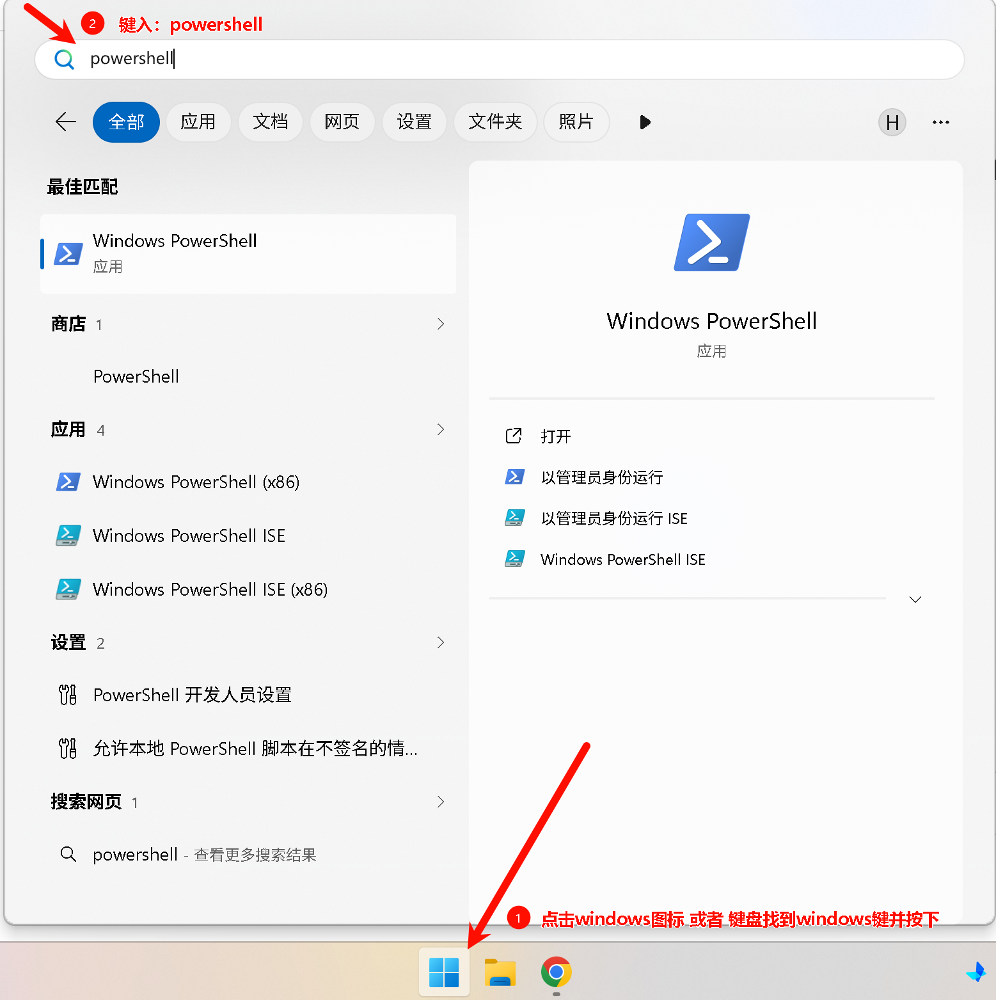


### 1.2 一键安装 WSL2 和 Ubuntu 24.04

在管理员 PowerShell 中执行：

```powershell
wsl --install -d Ubuntu-24.04
```

安装完成后，按提示设置 Ubuntu 的用户名和密码。


### 1.3 验证安装结果

继续执行：

```powershell
wsl --version
wsl -l -v
```

确认 Ubuntu 已正常注册并运行在 WSL2 上。


## 2. 启用 systemd

### 2.1 修改 `/etc/wsl.conf`

进入 Ubuntu 终端后，执行：

```bash
sudo nano /etc/wsl.conf
```

把内容改成原稿中的结构：

```ini
[boot]
systemd=true

[automount]
enabled = true
root = /mnt/
options = "metadata,umask=22,fmask=11"

[network]
generateHosts = true
generateResolvConf = true

[interop]
enabled = true
appendWindowsPath = true

[user]
default = <你的用户名>
```

其中 `<你的用户名>` 需要替换成你刚创建的 Ubuntu 用户名。


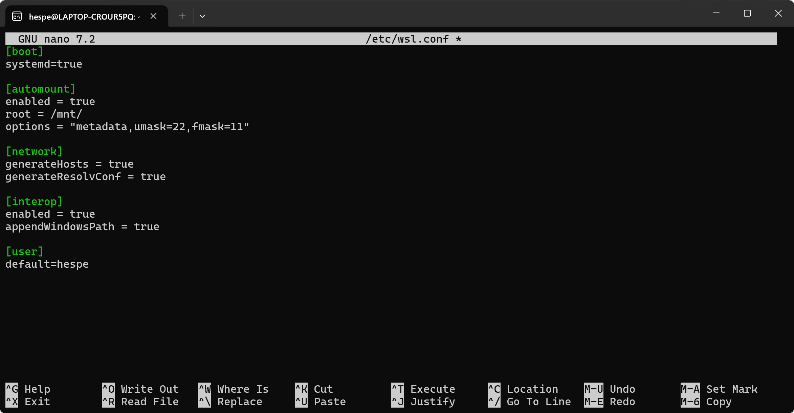

### 2.2 重启 WSL

回到 Windows PowerShell，执行原稿说明的重启动作，使配置生效。


### 2.3 验证 systemd

回到 Ubuntu，执行：

```bash
systemctl --version
ps -p 1 -o comm=
sudo systemctl status cron
```

确认 systemd 已经正常接管。

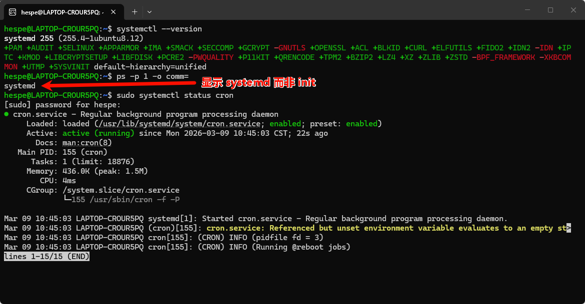

## 3. 安装 Node.js 22 和 OpenClaw

### 3.1 安装 Node.js 22

原稿使用 NodeSource 安装 Node.js 22：

```bash
sudo apt update && sudo apt upgrade -y
curl -fsSL https://deb.nodesource.com/setup_22.x | sudo -E bash -
sudo apt install -y nodejs
```

### 3.2 验证 Node.js

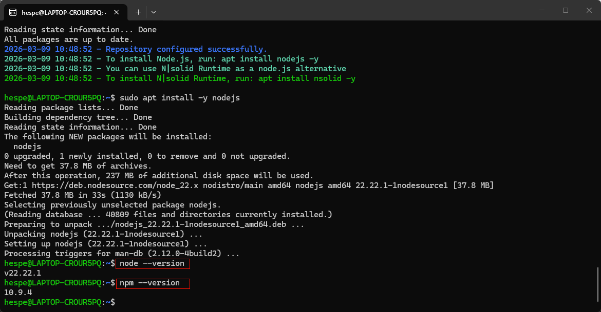

### 3.3 安装 OpenClaw

原稿给了两种方式，推荐优先使用官方脚本：

```bash
# 方式一：官方一键安装脚本
curl -fsSL https://openclaw.ai/install.sh | bash

# 方式二：npm 全局安装
npm install -g openclaw@latest
```

安装完通常会自动进入 `openclaw onboard`。

### 3.4 验证安装结果

执行：

```bash
openclaw --version
which openclaw
```

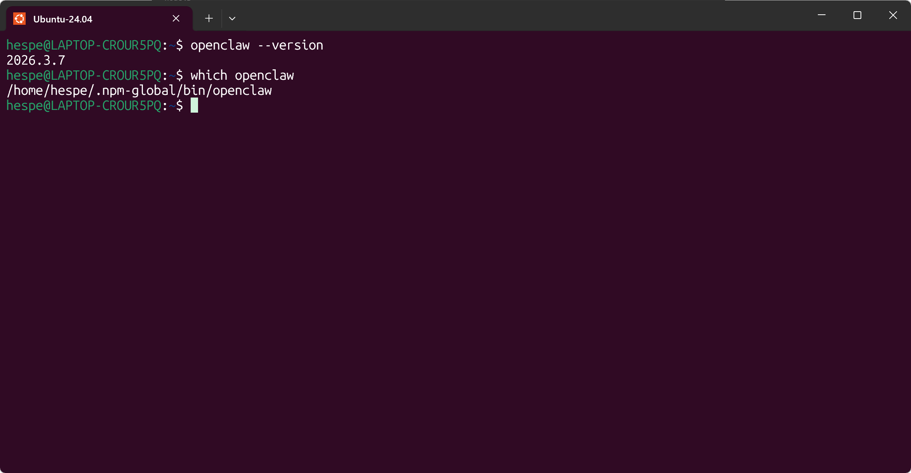

## 4. 接入 API

### 4.1 启动配置向导

如果安装后没有自动进入引导界面，可以手动执行：

```bash
openclaw onboard
```

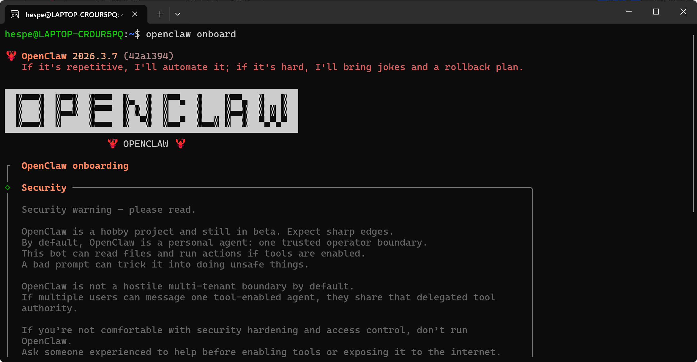

### 4.2 选择 GLM / Z.AI 提供商

原稿这里的主线是接入智谱 GLM。

在配置向导中，选择对应提供商：

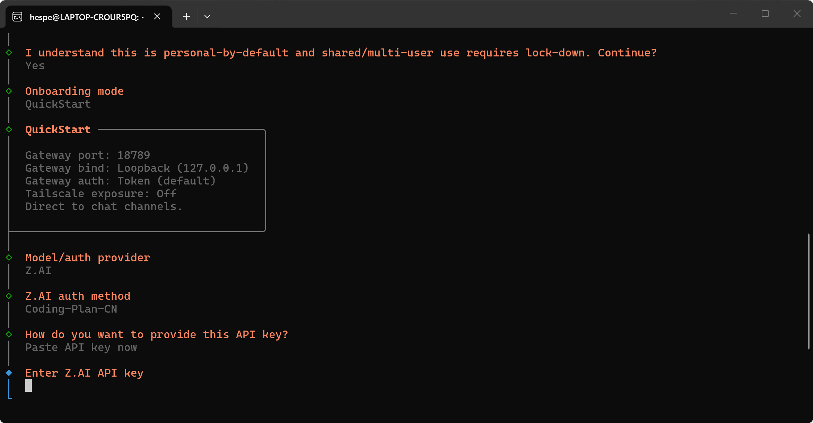

### 4.3 获取智谱 API Key

获取智谱 API Key 的方式：

1. 访问 https://bigmodel.cn/
2. 登录后进入个人中心
3. 找到 `API Keys`
4. 创建并复制新的 API Key

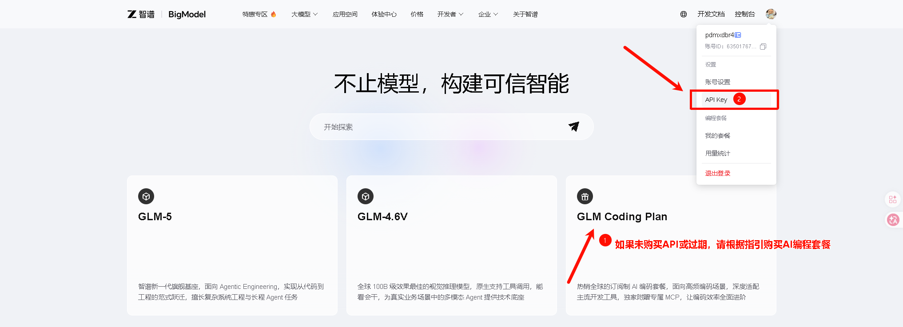

原稿还提供了一个订阅链接：

https://www.bigmodel.cn/glm-coding?ic=STUVXPL2VO

### 4.4 选择正确的套餐模型

原稿给出的关键提醒是：

1. Model/auth provider 选 `Z.AI`
2. 再选 `Coding-Plan-CN`
3. 输入智谱 API Key
4. 选择想使用的模型，例如 `zai/glm-5` 或 `zai/glm-4.7`

同时原稿特别提醒：

1. 目前编程套餐里支持 `GLM-5`、`GLM-4.7`、`GLM-4.5-Air`、`GLM-4.6` 等
2. 不要误选 `Flash / FlashX`，避免额外扣费
3. Lite 用户更建议先用 `zai/glm-4.7`

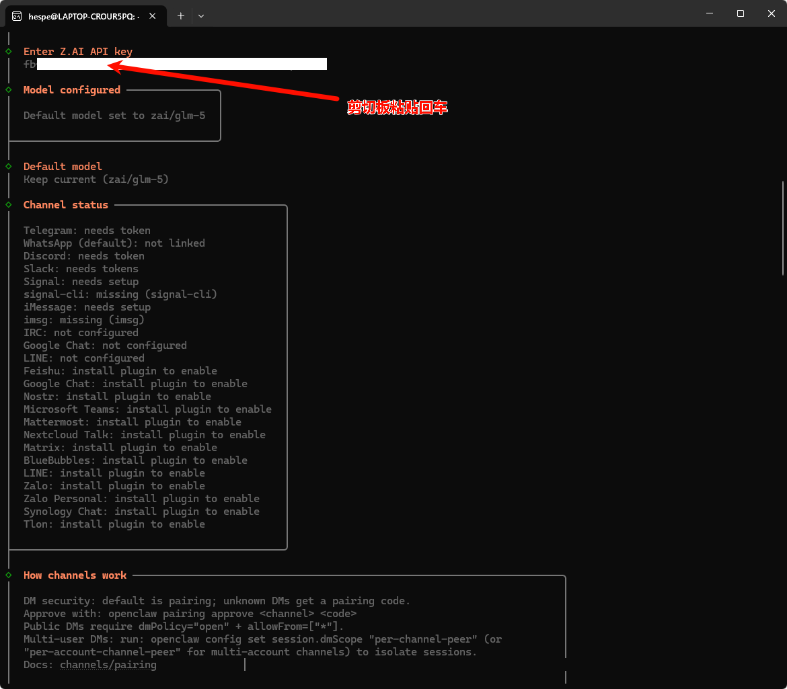

配置完后重启 OpenClaw：

```bash
openclaw gateway restart
```

## 5. 安装验收

### 5.1 TUI 验收

启动终端界面：

```bash
openclaw tui
```


### 5.2 Web UI 验收

执行：

```bash
openclaw dashboard
```

复制带 token 的地址，在 Windows 浏览器中打开。

原稿也说明了：

1. WSL2 默认没有 GUI，所以不会自动弹浏览器
2. `localhost` 端口会共享到 Windows 主机
3. 只要防火墙允许，就能在浏览器里直接访问

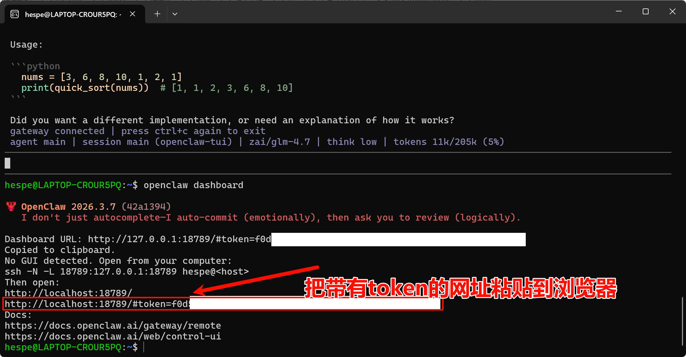


### 5.3 最终检查

执行完整诊断：

```bash
openclaw doctor
```

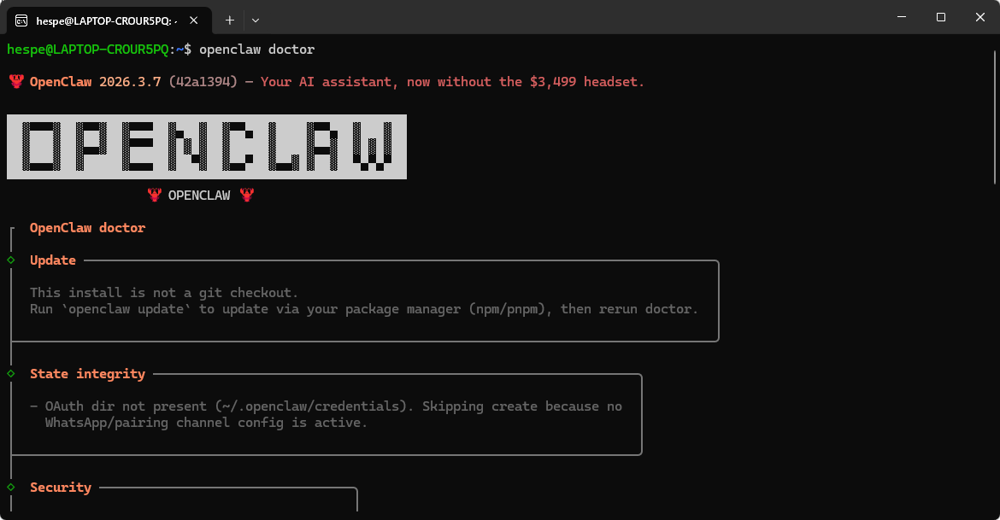

## 6. 完成总结

按这篇流程，你最终完成的是：

1. WSL2 + Ubuntu 24.04 安装
2. systemd 启用
3. Node.js 22 环境准备
4. OpenClaw 安装
5. 智谱 GLM / Z.AI API 接入
6. TUI 和 Web UI 验收

如果你后面还要继续接飞书、群聊或多 Agent，可以在这个基础上继续扩展。
