# OpenClaw Windows + WSL + 飞书群聊入门

> 标签：`API配置：有` `环境：本地` `安全性：中` `IM接入：飞书`

这篇文档把原来分散的草稿重新整理成一条完整流程，适合第一次接触 OpenClaw 的用户按顺序操作。目标是：

1. 在 Windows 上通过 WSL 安装 OpenClaw
2. 完成基础模型配置
3. 接入飞书机器人
4. 进阶配置多模型、多 Agent 和常用 Skills

如果你只是想先跑通一遍，建议先完成第 1 到第 4 部分。后面的多 Agent、Workspace、Skills 都可以等基础链路打通后再继续。

## 1. 环境准备

### 1.1 安装 WSL

先在 Windows 中打开 `CMD`。如果你不知道在哪里打开，可以按下 Windows 键后直接搜索 `CMD` 或“命令提示符”。


然后执行下面的命令安装 WSL：

```bash
wsl --install
```


### 1.2 安装 Ubuntu

WSL 安装完成后，去 Microsoft Store 搜索 `Ubuntu`。常见版本都可以，`24.04` 也可以直接使用。


安装完成后，第一次启动会要求你设置用户名和密码。这个密码后面进入 Ubuntu 时还会用到，请务必记住。


### 1.3 为什么推荐把 OpenClaw 装在 WSL 里

对于大多数 Windows 用户来说，把 OpenClaw 装到 WSL 里会更稳妥：

1. Linux 工具链更完整，兼容性更好
2. 不容易污染原生 Windows 环境
3. 就算后续折腾出问题，也更容易清理和重装

简单理解，你是在 Windows 里准备了一个独立的 Linux 工作区，专门拿来跑 OpenClaw。

## 2. 安装 OpenClaw

在 Windows 中搜索并打开 `Ubuntu`，进入 WSL 终端。

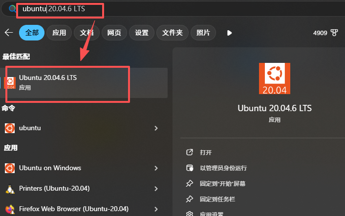

然后执行官方安装脚本：

```bash
curl -fsSL https://openclaw.ai/install.sh | bash
```

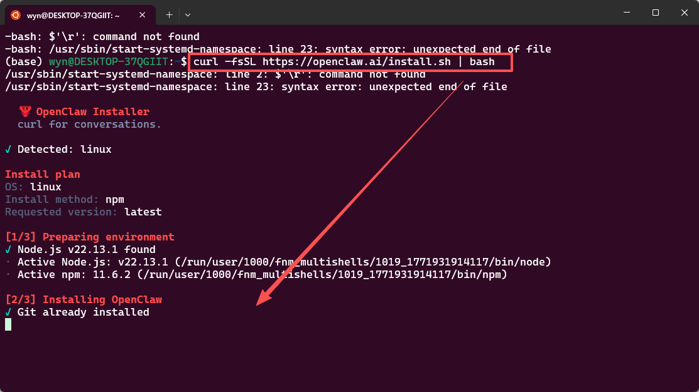

这个脚本会自动帮你准备 OpenClaw 运行所需的依赖环境，通常不需要再手动安装 Node.js 或其他基础组件。

安装过程中会进入初始化配置界面。这里建议你提前准备好一个模型平台的 API Key。入门阶段先保证能正常对话即可，后面再扩展更多模型。


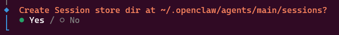


## 3. 完成基础配置

安装完成后，可以再次执行引导命令：

```bash
openclaw onboard
```

这一步的目标很简单：先让 OpenClaw 拥有一个可用的模型，并且能够正常对话。


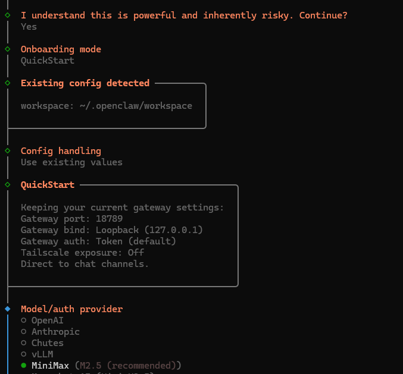

把前面准备好的 API Key 填进去。


在渠道配置中选择飞书，后面我们会继续把飞书机器人接完整。


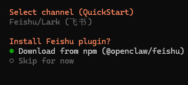
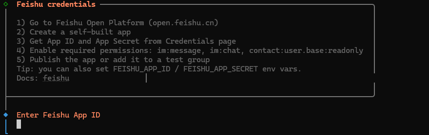

### 3.1 如何更新 OpenClaw

后续如果要更新 OpenClaw，直接在 Ubuntu 中执行：

```bash
openclaw update
```


## 4. 接入飞书机器人

### 4.1 准备飞书组织账号

先访问飞书账号页面：

https://www.feishu.cn/accounts/

这里建议使用组织账号，不要用个人号。组织账号更适合后续邀请成员、建群和测试机器人。

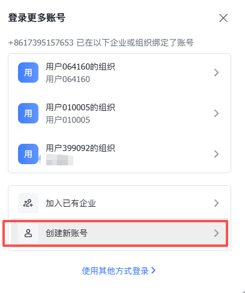

### 4.2 在飞书开发者后台创建应用

打开飞书开放平台：

https://open.feishu.cn/?lang=zh-CN

进入开发者后台后，创建企业自建应用。


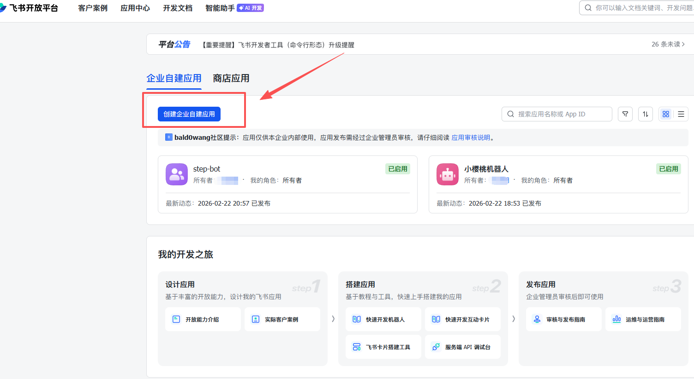

应用名称可以先随便写，后面随时可以改。


然后在成员管理里添加机器人。

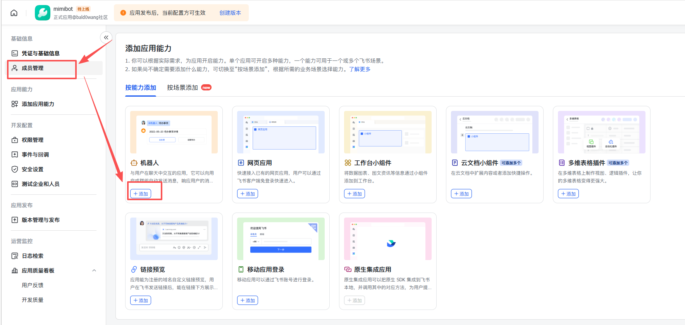

### 4.3 开通权限

进入权限管理，点击开通权限。

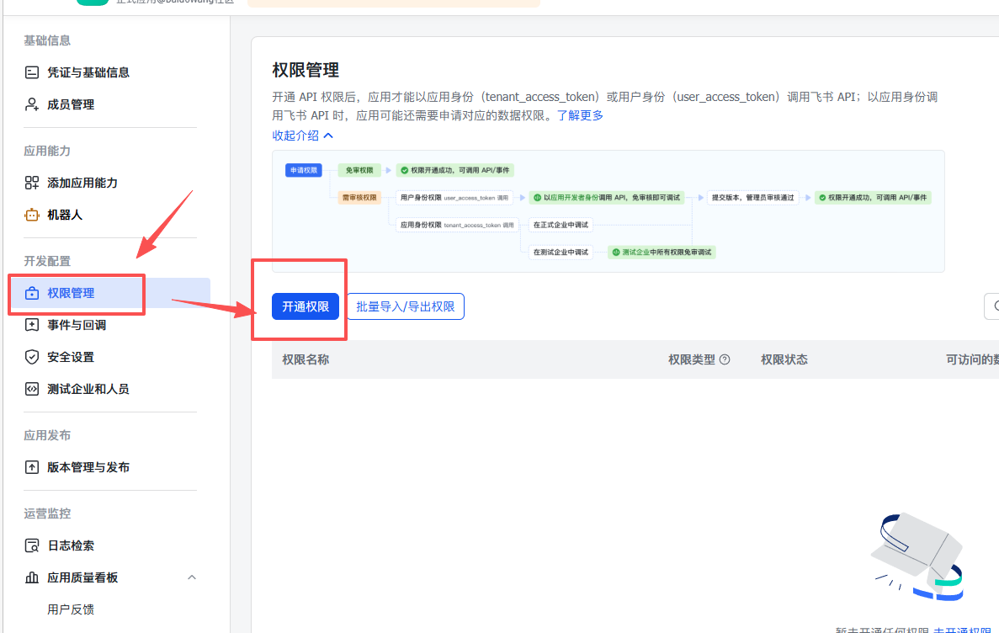

优先搜索并开通 `im:` 相关权限。

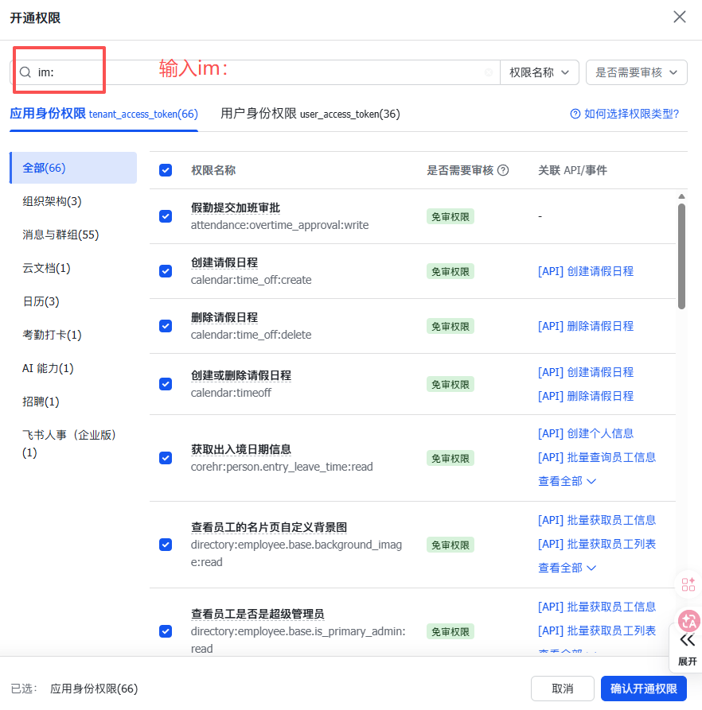

再补上基础通讯录权限：

```text
contact:user.base:readonly
```


如果你后面需要使用飞书文档能力，可以继续搜索并开通 `docs:` 相关权限。


### 4.4 填写 App ID 和 App Secret

进入“凭证与基础信息”，复制 `App ID` 和 `App Secret`。


回到 OpenClaw 的配置向导，把这两个值填进去，区域选择 `China`。


如果向导中还会让你选择一些附加能力或 Skills，先按自己需要选择即可。不确定的项可以先跳过，后续再补。


### 4.5 进入 OpenClaw Web UI 测试

配置完成后，终端里会给出一个 `control UI` 地址。打开后进入 Web UI，先测试基础对话是否正常。

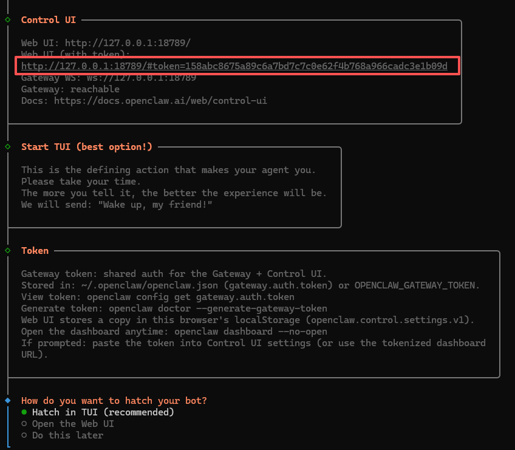


如果这里已经能正常对话，说明模型和 OpenClaw 的基础配置没有问题。

### 4.6 配置飞书事件订阅

回到飞书开发者后台，在“事件与回调”里选择长连接模式并保存。


然后添加和消息、群组相关的事件。


在回调配置中，也启用长连接。


最后创建并发布一个新版本，让前面的配置真正生效。


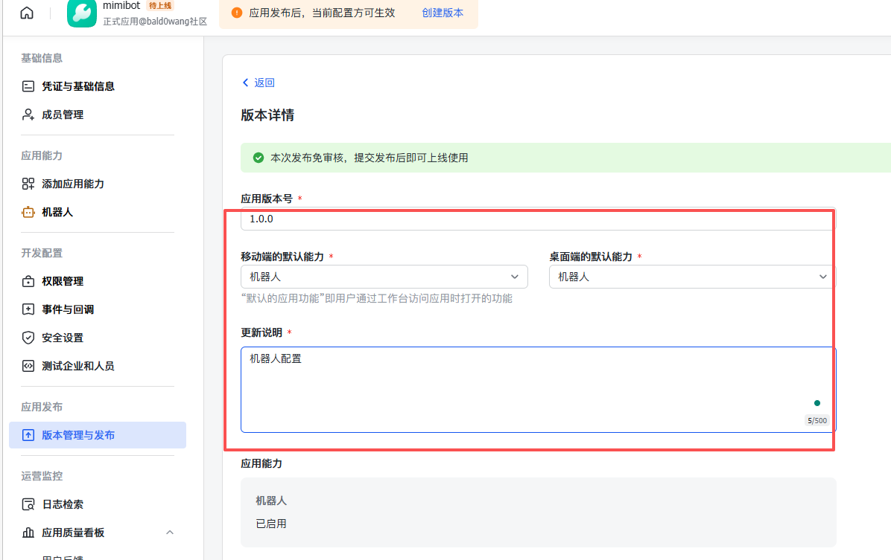


发布后，组织账号登录飞书进行审批，并打开应用。


如果飞书侧提示需要配对，就把配对内容复制回 OpenClaw 对应的机器人页面。


完成后，飞书机器人就可以正常工作了。


## 5. 多模型与多 Agent 配置

当单机器人跑通以后，就可以继续往下做多模型和多 Agent。

### 5.1 增加更多模型

如果你想增加第二个或第三个模型，最简单的方式仍然是再次执行：

```bash
openclaw onboard
```

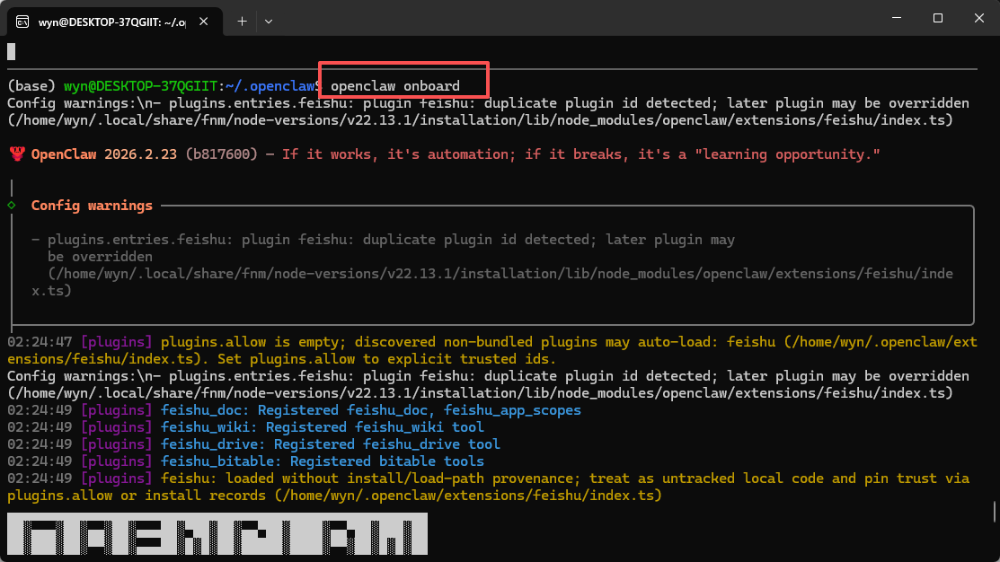

如果新增模型后默认模型被改掉了，可以直接打开配置文件手动调整：

```bash
code ~/.openclaw/openclaw.json
```

在 `agents.defaults.model.primary` 中指定你想用的主模型。

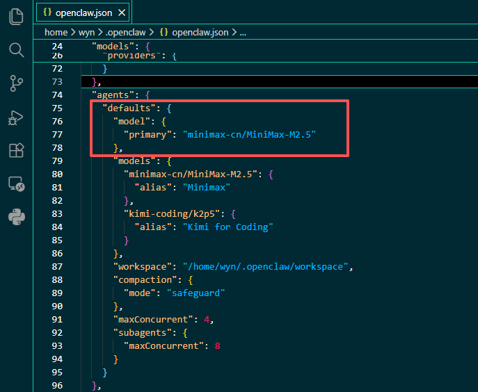

### 5.2 多 Agent 的核心思路

多 Agent 配置里最关键的不是“多建几个机器人”，而是把以下三件事分清楚：

1. 每个 Agent 用哪个模型
2. 每个 Agent 的 `workspace` 和 `agentDir` 放在哪里
3. 收到飞书消息后，应该路由给哪个 Agent

这里会涉及两个核心概念：

1. `channels`：定义要接入哪些外部平台，以及每个平台下有哪些账号
2. `bindings`：定义消息路由规则，决定某个账号收到的消息交给哪个 Agent 处理

### 5.3 配置第二个飞书账号

如果你要给第二个 Agent 单独配置一个飞书机器人，可以在飞书后台再创建一个应用，获取新的 `App ID` 和 `App Secret`。


然后在 OpenClaw 的配置里，为不同 Agent 分别设置不同的工作区和状态目录。


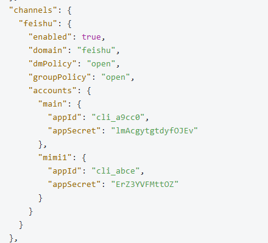

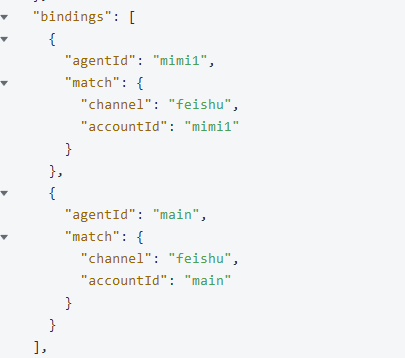

一个简化后的结构示意如下：

```json
{
  "channels": {
    "feishu": {
      "accounts": {
        "main": {
          "appId": "cli_xxx",
          "appSecret": "xxx"
        },
        "mimi1": {
          "appId": "cli_xxx",
          "appSecret": "xxx"
        }
      }
    }
  },
  "agents": {
    "entries": {
      "mimi1": {
        "workspace": "~/.openclaw/workspace-mimi1",
        "agentDir": "~/.openclaw/agents/mimi1/agent"
      }
    }
  },
  "bindings": [
    {
      "channel": "feishu",
      "account": "mimi1",
      "agent": "mimi1"
    }
  ]
}
```

配置改完以后重启网关：

```bash
openclaw gateway restart
```


### 5.4 飞书群聊里使用多个 Agent

机器人都接好之后，可以把它们拉进一个飞书群里做群聊协作。


配置完成后，就可以在群里分别 `@` 不同机器人，让它们按各自的角色工作。


如果还要邀请其他同事或伙伴，可以直接分享群二维码。


## 6. 理解 Workspace 和 AgentDir

当你开始使用多 Agent 后，就一定要理解 `Workspace` 和 `AgentDir`。

### 6.1 Workspace 是什么

`Workspace` 可以理解为 Agent 的工作空间，也就是它平时读写文件、存放说明文档、人格设定和知识文件的地方。

常见用途包括：

1. 放置本地资料、代码和文档
2. 编写 `SOUL.md`、`MEMORY.md` 等控制 Agent 行为的文件
3. 给不同 Agent 划分不同任务边界

### 6.2 AgentDir 是什么

`AgentDir` 更像是 Agent 的状态目录。这里通常会存放：

1. 登录状态
2. 授权信息
3. 模型相关的运行状态
4. 每个 Agent 独立的配置数据

如果两个 Agent 共用同一个 `AgentDir`，状态就可能冲突。所以多 Agent 场景下，最好给每个 Agent 单独分配。


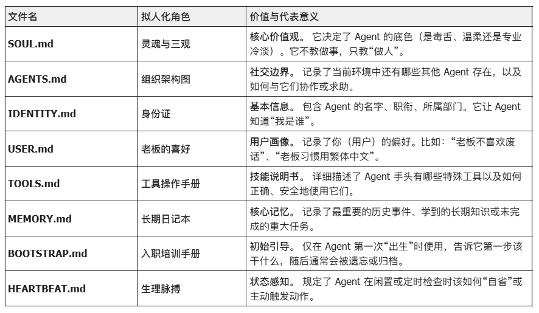

### 6.3 如何直接塑造 Agent 的性格

进入 OpenClaw Web UI 的 Agent 页面：

http://127.0.0.1:18789/agents


例如你可以编辑 `workspace/SOUL.md`，为某个 Agent 写入人格设定：

```text
你是一个极其严谨的资深架构师，对代码洁癖有执念。
在回复时，先指出风险，再给出优化方案。
```


OpenClaw 会把这些文件注入到系统提示词里，所以它们会持续影响 Agent 的行为方式。也正因为如此，这些文件不要写得过长，尽量保持清晰和高密度。

## 7. 常用 Skills 与 ClawHub

## 7.1 给 Agent 增加联网能力

如果你希望 Agent 可以查实时信息，一个非常常见的组合是 `Tavily + ClawHub`。

先注册 Tavily：

https://app.tavily.com/home

创建 API Key 后，在 Ubuntu 里安装 Skill：

```bash
npx clawhub@latest install tavily-search
export TAVILY_API_KEY="your_api_key"
```


然后回到飞书或 Web UI，把这个 Skill 加到你想使用的 Agent 上。

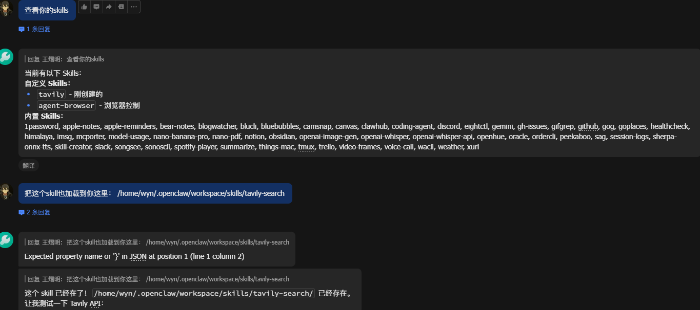


### 7.2 ClawHub 的基础用法

`ClawHub` 可以理解成 OpenClaw 的 Skills 商店。常用命令只有几条：

```bash
npm i -g clawhub
clawhub search "calendar"
clawhub install find-skills
clawhub list
clawhub update --all
```

如果你已经装好了 `clawhub`，也可以直接让 Agent 帮你执行安装流程。

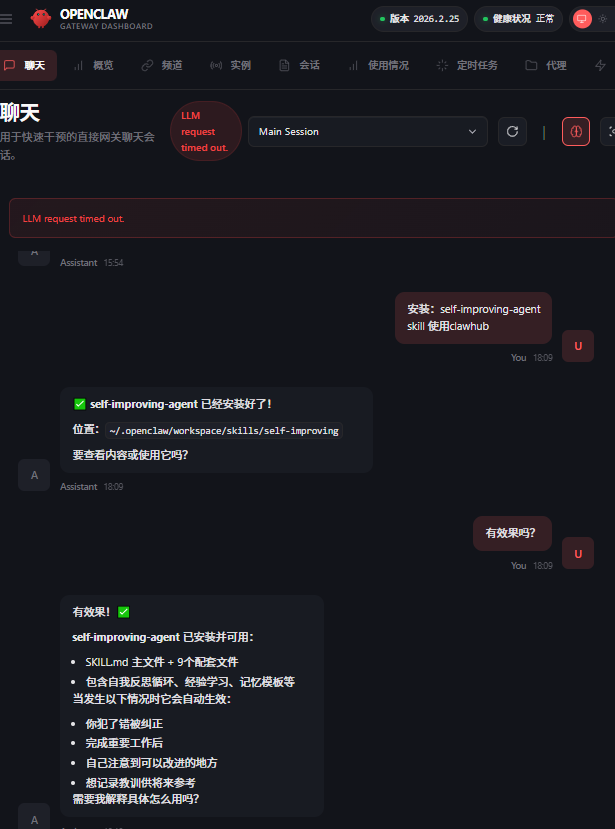

### 7.3 给新手的 Skills 建议

入门阶段最常用、也最容易立刻见效的 Skills，通常是这几个：

1. `tavily-search`：联网搜索
2. `find-skills`：帮你继续找其他 Skills
3. `self-improving-agent`：增强长期使用体验
4. `github`：适合开发者
5. `gog`：适合办公流

安装第三方 Skills 时，务必注意两件事：

1. 优先看 `SKILL.md`，确认它会读写什么、要求什么权限
2. 对来路不明、要求敏感凭据、诱导执行复杂命令的 Skill 保持警惕

## 8. 常见维护操作

### 8.1 更新 OpenClaw

```bash
openclaw update
```

### 8.2 重新运行配置向导

```bash
openclaw onboard
```

### 8.3 修改主配置

```bash
code ~/.openclaw/openclaw.json
```

### 8.4 重启网关

```bash
openclaw gateway restart
```

## 9. 后续建议

如果你已经完成了：

1. WSL 安装
2. OpenClaw 初始配置
3. 飞书机器人接入
4. 群聊多 Agent 测试

那么下一步最值得继续深入的是：

1. 细化每个 Agent 的人格和职责
2. 拆分不同的 `workspace` 和 `agentDir`
3. 给不同 Agent 安装不同 Skills
4. 再逐步接入本地模型、更多模型平台和自动化任务

先把基础链路打通，比一开始就追求复杂配置更重要。
