# 虚拟机隔离安装 OpenClaw

> 标签：`API配置：无` `环境：本地` `安全性：高` `IM接入：无`

这篇文档整理自 `tpm8`，重点不是模型接入，而是先把 OpenClaw 放进隔离环境里运行，降低高权限工具直接接触你主系统的风险。

## 1. 为什么建议隔离安装

OpenClaw 的权限很高，理论上可以：

1. 读取本地文件
2. 执行终端命令
3. 修改甚至删除数据

如果你担心误操作、恶意提示词或者不安全插件，最稳的做法就是先给它一个独立环境。  
原稿推荐的方案是：在 macOS 上先创建一个虚拟机，再把 OpenClaw 装到虚拟机里。

推荐硬件：

1. MacBook Air / Pro
2. Mac mini
3. 16GB 统一内存
4. 512GB 固态硬盘以上

## 2. 安装 VirtualBuddy

先下载并安装 VirtualBuddy：

https://github.com/insidegui/VirtualBuddy/releases/tag/2.1

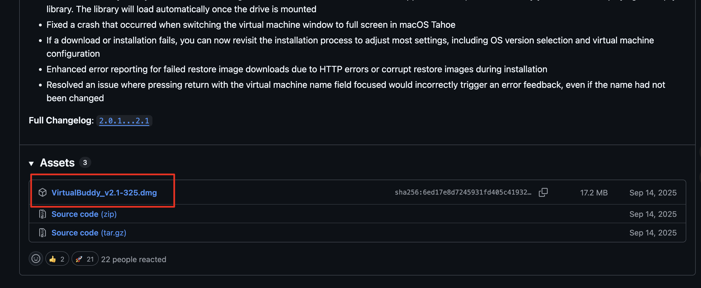

安装完成后打开软件，先创建一个新的虚拟机。

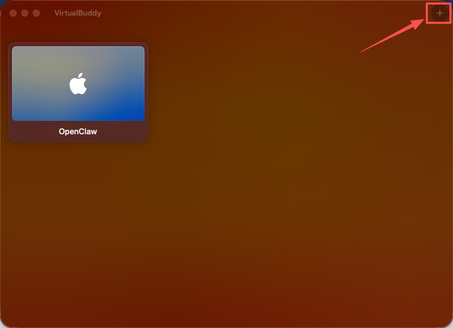

## 3. 创建虚拟机

### 3.1 选择系统

可以选择 `macOS`，也可以选择 Linux。原稿示例使用的是 macOS。

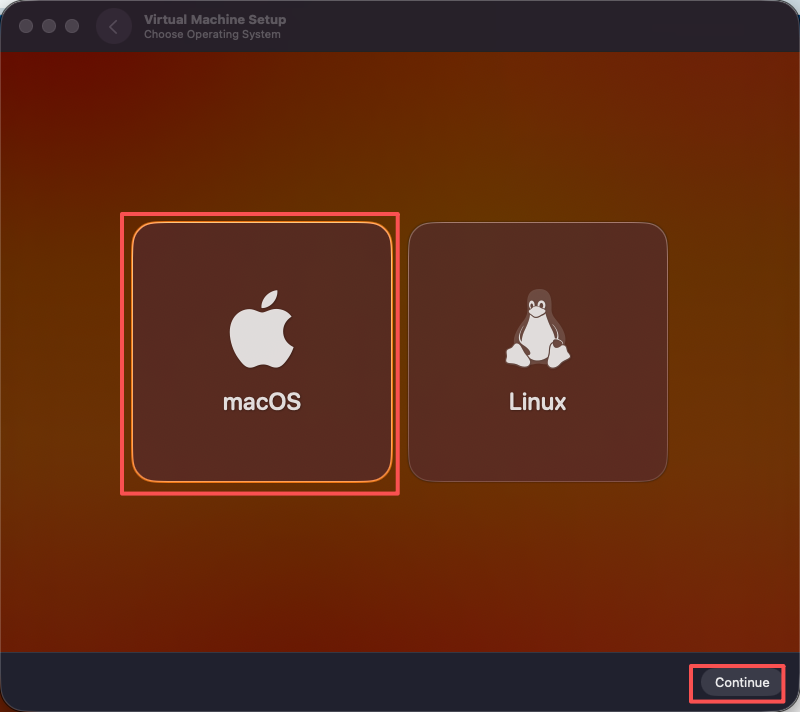

建议选择较新的系统版本，旧版本有时会遇到苹果验证问题。

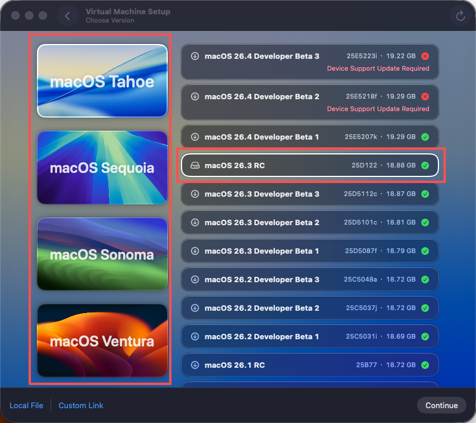

### 3.2 设置名称与资源

给虚拟机起一个方便识别的名字。

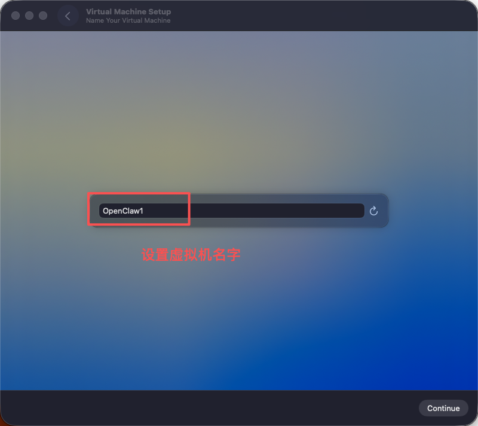

然后根据自己设备性能分配资源。原稿建议：

1. `2 核 4G` 或 `4 核 8G`
2. 系统盘推荐 `100G`

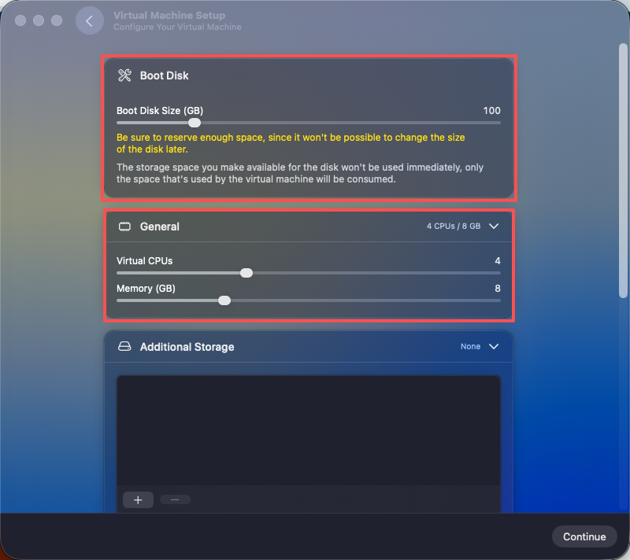

### 3.3 设置分辨率和共享目录

分辨率推荐 `1920 x 1080`。

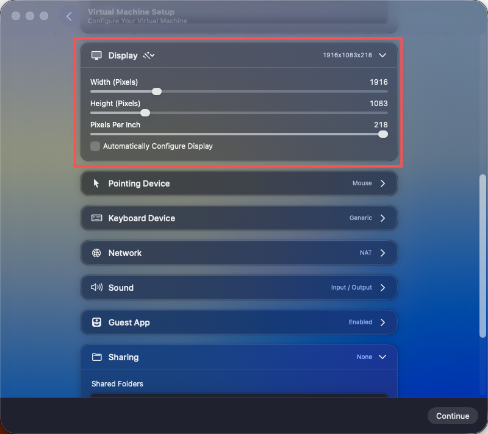

如果你还需要和宿主机共享文件，可以顺手配置共享文件夹。

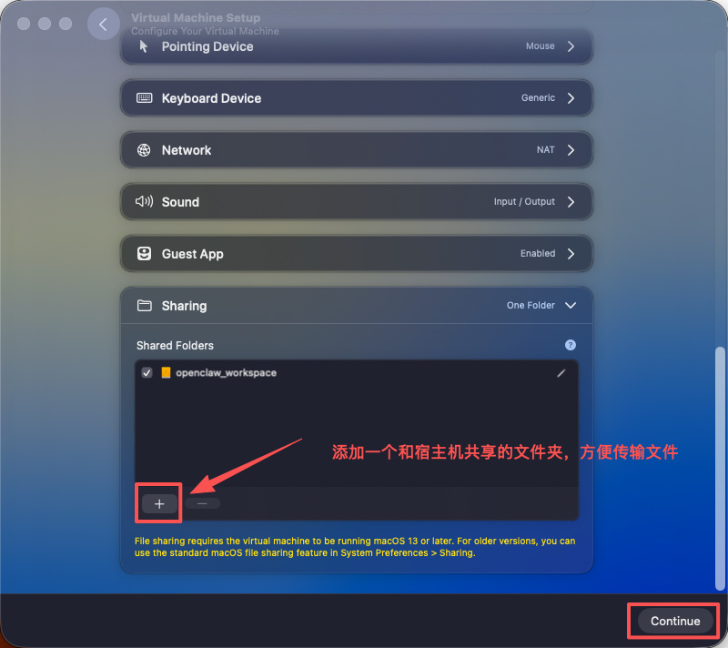

## 4. 安装并启动虚拟机

接下来等待系统安装完成。

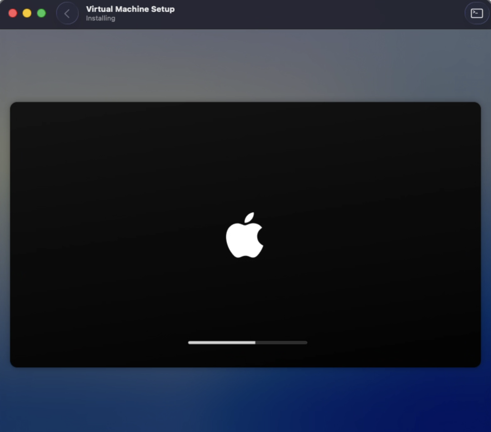
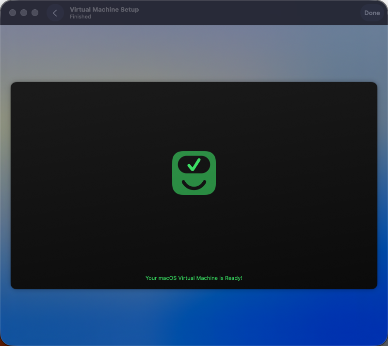

安装好后，选择刚创建的虚拟机启动。

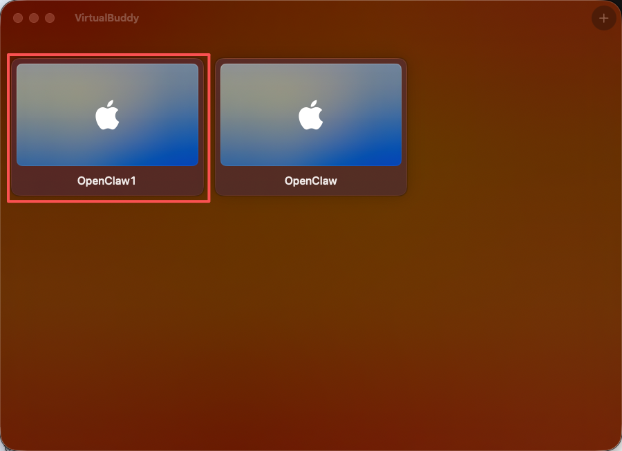
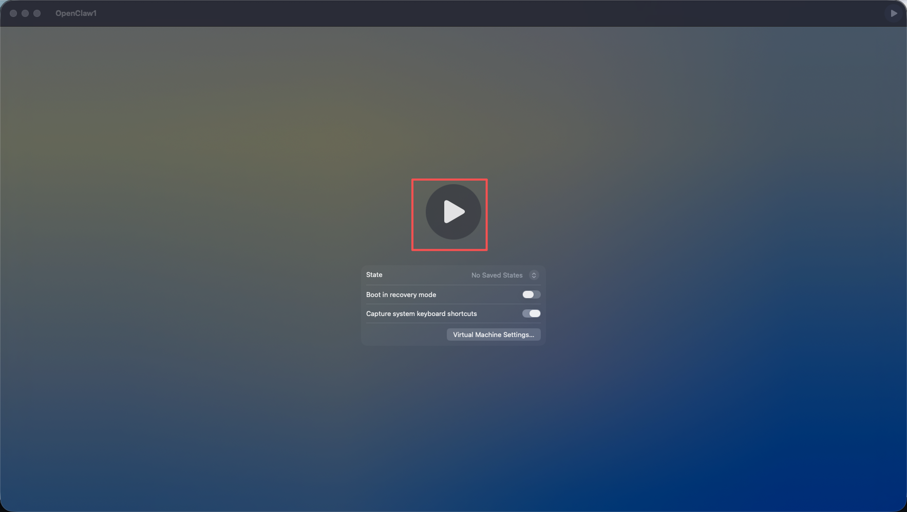

之后就是正常的 macOS 新机初始化流程，按向导完成即可。

原稿里还提到一个实用建议：  
如果你希望更方便控制虚拟机，可以在虚拟机中安装远程控制工具，例如 `UU 远程`。

## 5. 在虚拟机中配置环境

### 5.1 安装 Node.js

原稿使用 `nvm` 安装 Node.js，步骤如下：

```bash
# 下载并安装 nvm
curl -o- https://raw.githubusercontent.com/nvm-sh/nvm/v0.40.3/install.sh | bash

# 代替重启 shell
\. "$HOME/.nvm/nvm.sh"

# 安装 Node.js
nvm install 24

# 验证 Node.js 版本
node -v

# 验证 npm 版本
npm -v
```

### 5.2 安装 OpenClaw

安装 OpenClaw：

```bash
npm i -g openclaw
```

### 5.3 初始化配置

执行：

```bash
openclaw onboard
```

## 6. 结论

这条路线的核心价值不是“安装更快”，而是“风险更可控”。

适合这类用户：

1. 不想让 OpenClaw 直接接触宿主机文件
2. 会长期测试模型、Skills 或自动化能力
3. 希望把高权限工具放到一个可丢弃、可重建的环境里

如果你更重视安全隔离而不是极致轻量，这个方案是值得的。
