# 火山 Coding Plan 小白配置教程

> 标签：`API配置：有` `环境：本地` `安全性：中` `IM接入：无`

这篇文档整理自 `tpm6`，适合完全零基础的用户。目标是通过火山引擎的 `Coding Plan`，快速把 OpenClaw 跑起来。

## 1. 先理解这套东西是做什么的

原稿的解释很直白，可以保留成一个简单模型：

1. `OpenClaw`：负责调度和调用 AI 的中枢
2. `Coding Plan`：火山引擎提供的套餐
3. `AI 模型`：豆包、DeepSeek、Kimi 等不同模型
4. `API Key`：调用模型时要用到的密钥

## 2. 准备工作

### 2.1 开通 Coding Plan 套餐

打开火山引擎页面：

https://www.volcengine.com/activity/codingplan

登录后开通套餐。

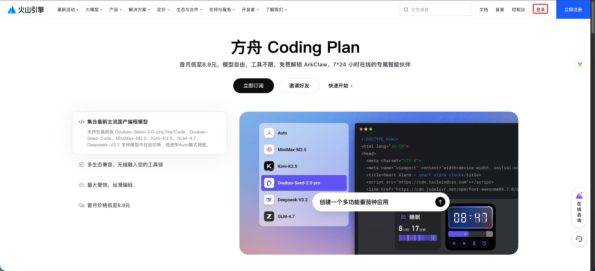

原稿里还给出了邀请码：

```text
CXWFCWZ5
```


完成支付后，就可以使用对应额度。

原稿还附了 Lite / Pro 套餐的用量说明，核心结论是：普通个人用户通常从 Lite 起步就够了。

### 2.2 获取 API Key

打开 API Key 管理页：

https://console.volcengine.com/ark/region:ark+cn-beijing/apikey

点击创建 API Key。

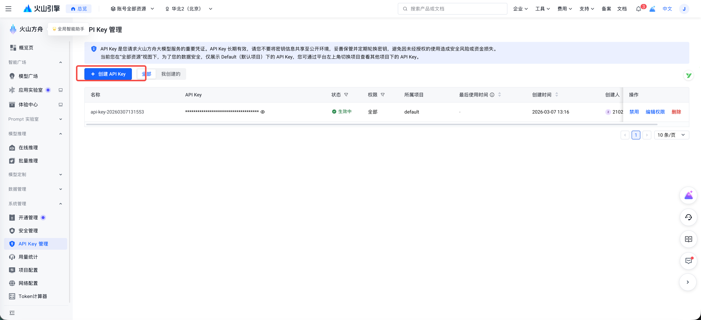

生成后复制这串类似 `ark-xxxxx` 的密钥，并妥善保管。

## 3. 安装 OpenClaw

原稿把安装分成了 Mac 和 Windows 两类，但具体命令在飞书外不可见，因此这里只保留安装思路：

### 3.1 Mac 用户

1. 打开终端
2. 粘贴安装命令
3. 等待安装完成

### 3.2 Windows 用户

1. 打开 PowerShell
2. 粘贴安装命令
3. 等待安装完成

如果你需要一个可直接执行的安装版本，可以先参考本目录里的：

`Windows-WSL-飞书群聊入门.md`

## 4. 配置火山 Coding Plan

### 4.1 新安装 OpenClaw 的用户

安装完成后，OpenClaw 会进入配置向导。原稿里给出了推荐选项，整理如下：

1. 风险确认：选择 `Yes`
2. Onboarding mode：选择 `QuickStart`
3. Model/auth provider：选择 `Volcano Engine`
4. API Key 提供方式：选择 `Paste API key now`
5. 粘贴前面创建的火山 API Key
6. 默认模型：直接回车，使用推荐模型
7. 渠道配置：先选择 `Skip for now`
8. Skills：先选 `No`
9. Hooks：按空格选中，再回车
10. Hatch 方式：选择 `Hatch in TUI`

其中几步原稿配了截图：

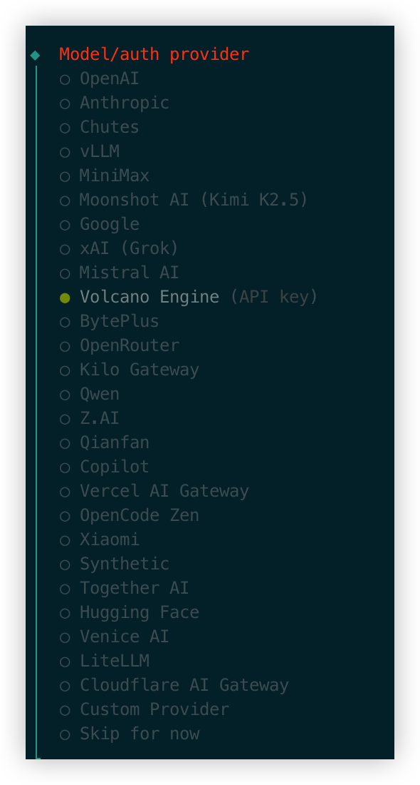
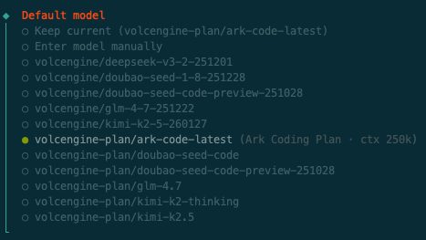
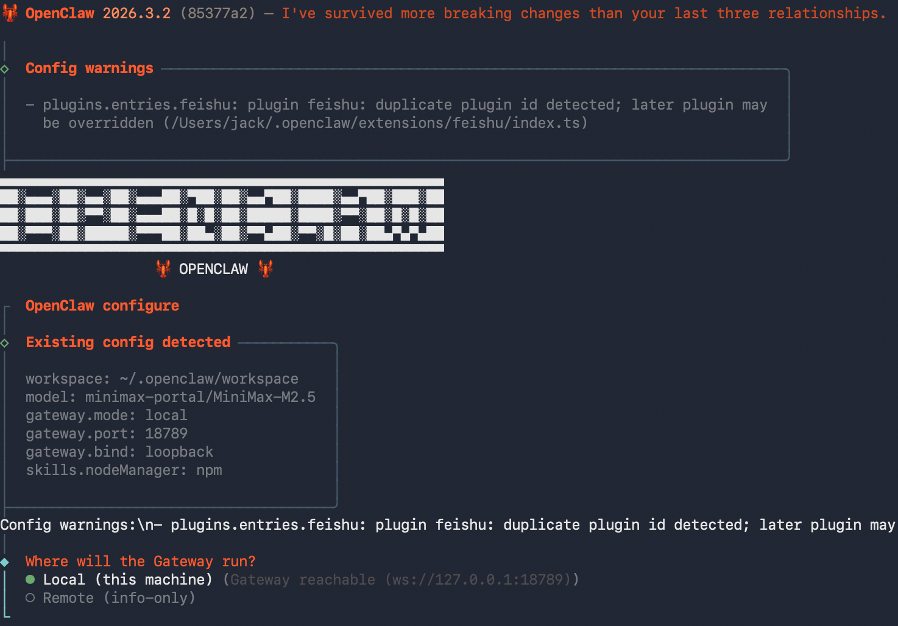
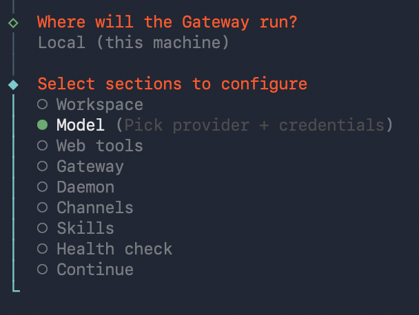
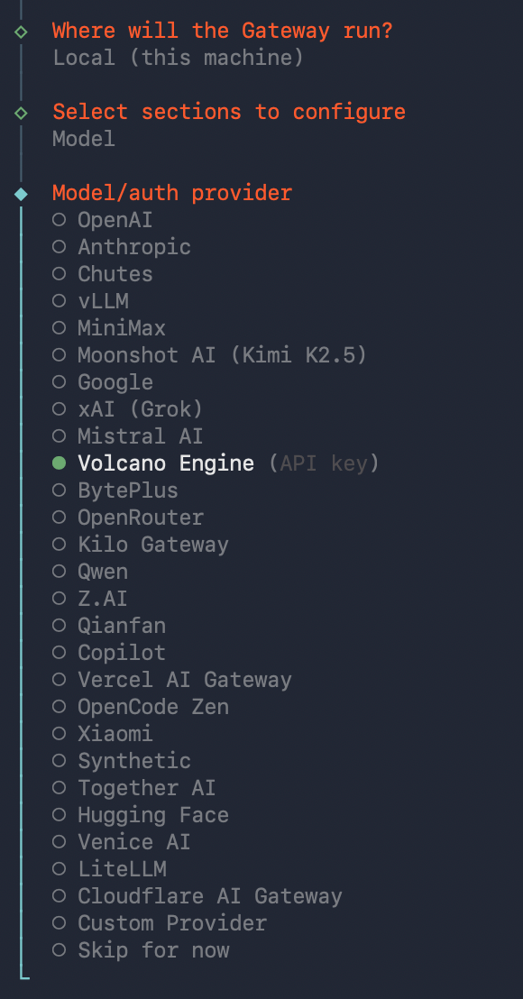

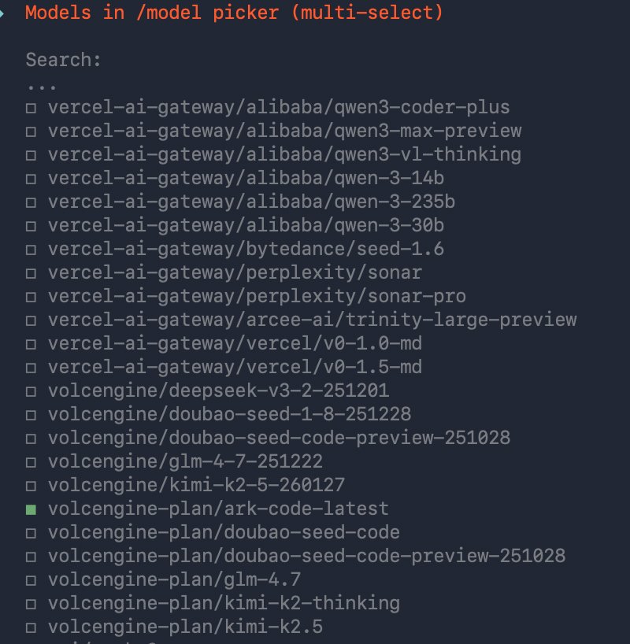

### 4.2 已安装 OpenClaw 的用户

如果你已经装好了 OpenClaw，可以重新运行配置流程，再只改模型相关部分。

原稿里的建议路径是：

1. 运行配置向导
2. 选择 `Model`
3. 选择 `Volcano Engine`
4. 粘贴 API Key
5. 在模型列表里选择要启用的模型
6. 完成配置

配套截图如下：

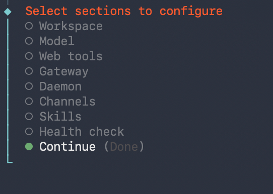
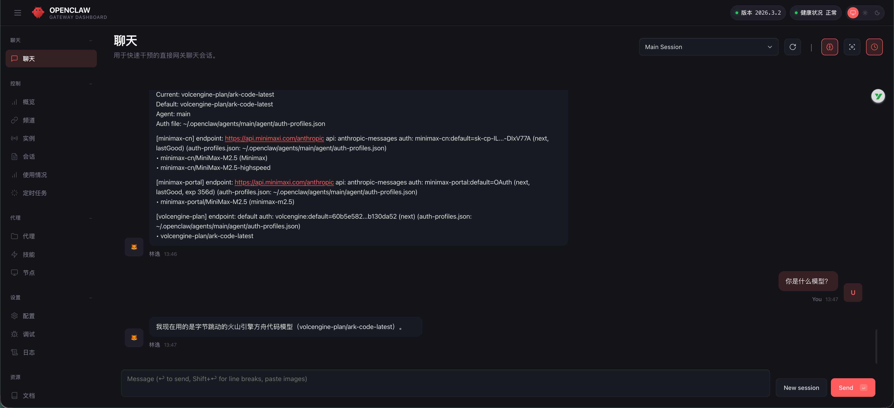


## 5. 验证是否成功

配置完成后，打开 OpenClaw 的页面并随便发一条消息，看看它是否能正常回复、并且识别出你正在使用火山引擎的模型。

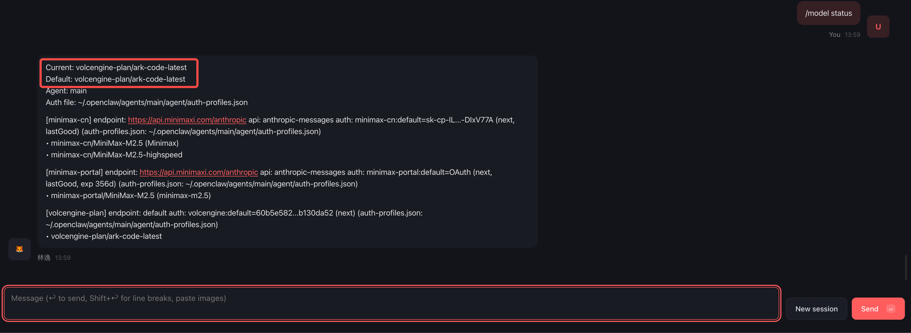

如果这里能对话，就说明基础接入成功。

## 6. 模型切换

### 6.1 查看火山侧支持的模型

可以在火山方舟的开通管理页面查看当前可用模型。

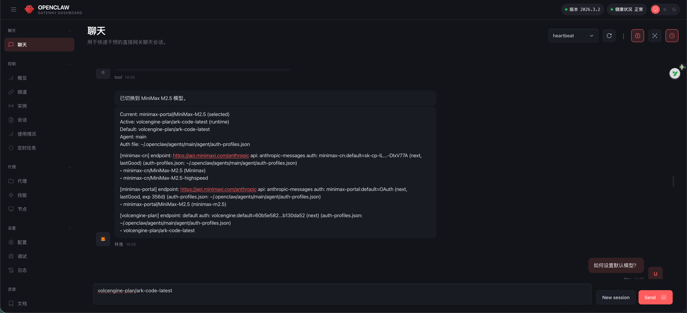

原稿中列出的常见模型包括：

1. `Auto`
2. `doubao-seed-2.0-code`
3. `doubao-seed-code`
4. `minimax-m2.5`
5. `glm-4.7`
6. `deepseek-v3.2`
7. `kimi-k2.5`

### 6.2 在当前会话中切换模型

原稿给出的思路是：

1. 先查看当前模型状态
2. 再通过 `/model <provider/model>` 切换

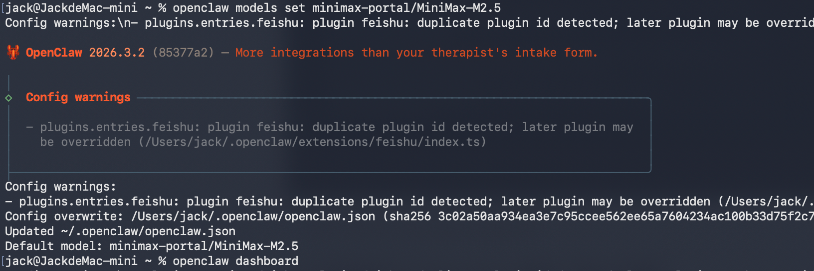

## 7. 常见问题

### 7.1 Coding Plan 会额外收费吗

原稿的回答是：不会额外收费，消耗包含在套餐额度里。

### 7.2 能同时使用多个模型吗

可以。不同会话或不同阶段可以切换到不同模型。

### 7.3 如何查看用量

可以直接到火山引擎控制台的套餐或开通管理页面查看。

## 8. 结论

这篇教程最适合的使用方式是：

1. 先开套餐
2. 再拿 API Key
3. 再装 OpenClaw
4. 最后把模型配置进去

如果你是第一次接触 OpenClaw，优先把这条链路跑通，比一开始折腾飞书、多 Agent 或 Skills 更重要。
