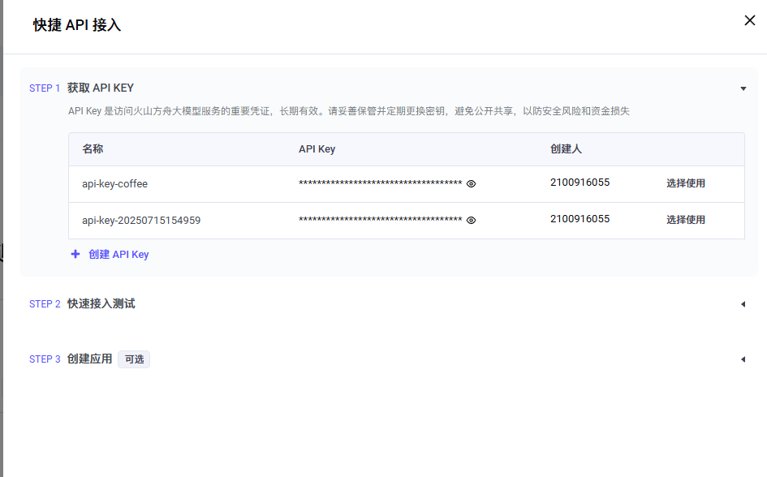
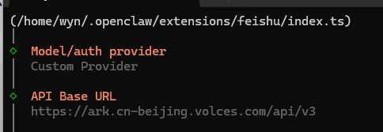
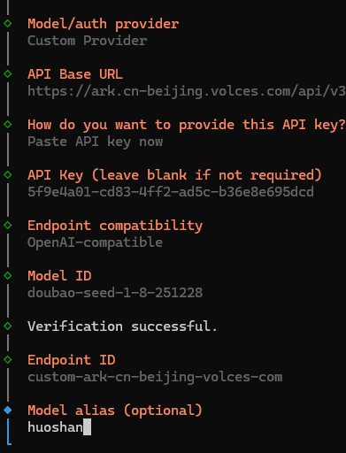
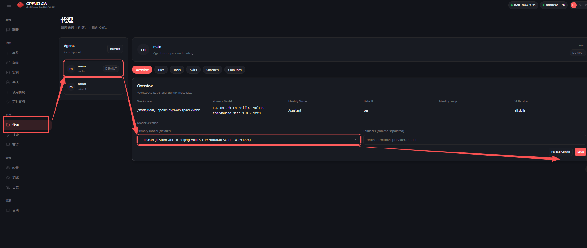
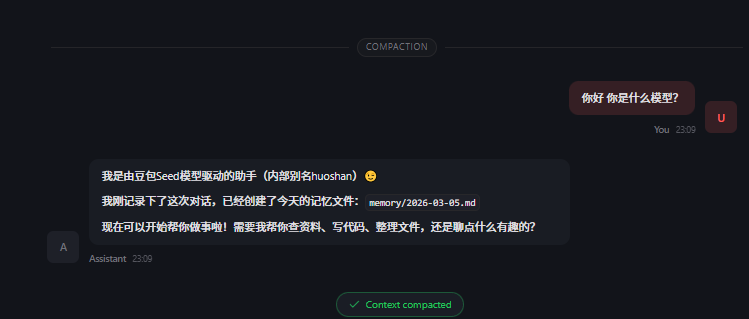

# 火山豆包模型接入 OpenClaw

> 标签：`API配置：有` `环境：本地` `安全性：中` `IM接入：无`

这篇文档整理自 `tpm2`，目标是把火山引擎的豆包模型接入到 OpenClaw 中，并在 Web UI 里完成测试。

## 1. 开通豆包模型

先打开火山引擎方舟体验页，找到目标模型，例如：

https://www.volcengine.com/experience/ark?mode=chat&modelId=doubao-seed-1-8-251228

进入模型页面后，点击 `API 接入`。


然后获取 API Key，并确认目标模型已经开通。




## 2. 在 OpenClaw 中新增模型

回到 OpenClaw 终端，执行：

```bash
openclaw onboard
```

然后按照向导一步步配置。


## 3. 填写模型参数

### 3.1 Base URL

先填写火山引擎的 Base URL：

```text
https://ark.cn-beijing.volces.com/api/v3
```



### 3.2 API Key

接着填写刚才获取到的 API Key。


### 3.3 Model ID

模型 ID 直接填写你开通的模型名称即可。示例：

```text
doubao-seed-1-8-251228
```


如果测试通过，说明模型接入没有问题。


### 3.4 模型来源

最后填写模型来源，原稿里这里使用的是“火山”。



其他选项按你自己的需要继续配置即可。

## 4. 打开 Web UI 并切换默认模型

配置结束后，选择打开 Web UI。


进入 Web UI 后，在代理或模型设置页面中，选择刚才配置好的“火山”模型并保存。



回到聊天页面测试，如果能够正常回复，说明接入成功。



## 5. 结论

到这里，你已经完成了：

1. 开通火山豆包模型
2. 在 OpenClaw 中录入 Base URL、API Key 和 Model ID
3. 在 Web UI 中切换到火山模型
4. 完成基础对话测试

如果你后面还想接入飞书、群聊或多 Agent，可以继续参考本目录下的其他整理文档。
