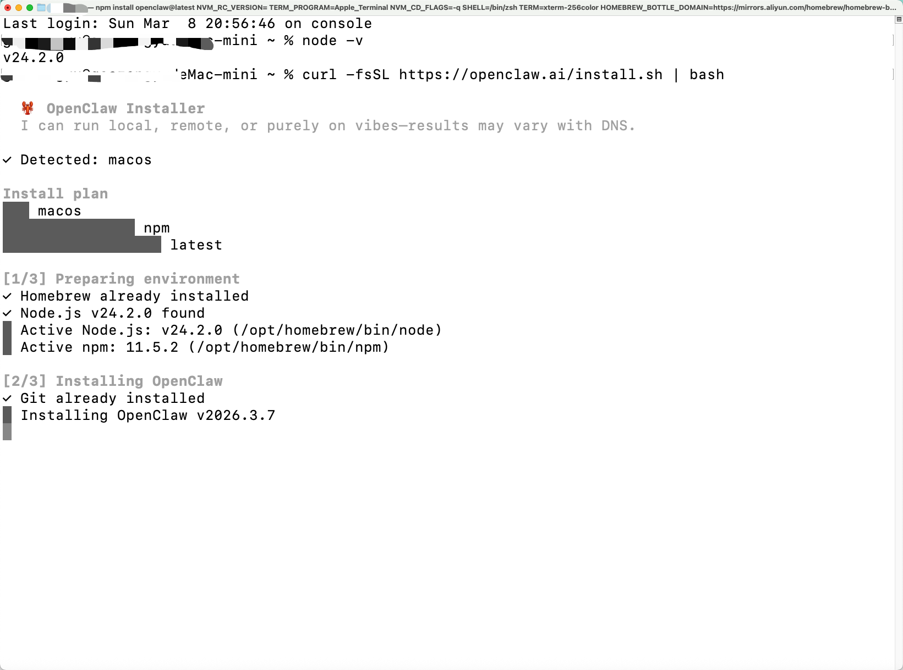

# 阿里云 Coding Plan 接入 OpenClaw

> 标签：`API配置：有` `环境：本地` `安全性：中` `IM接入：无`

这篇文档整理自 `tpm7`，适合第一次接触 OpenClaw，并且希望使用阿里云 `Coding Plan` 跑稳定编码工作流的用户。

## 1. 这篇教程解决什么问题

完成后，你可以做到：

1. 开通阿里云 Coding Plan
2. 获取专属 `sk-sp-` API Key
3. 安装并初始化 OpenClaw
4. 在 `~/.openclaw/openclaw.json` 中补充百炼模型配置
5. 验证 `bailian/qwen3-coder-plus` 是否可用

## 2. 前置条件

开始前请先确认：

1. 你已经有阿里云账号
2. 已完成支付方式设置
3. 本机已安装 Node.js 22 或更高版本
4. 你接受 Coding Plan 的使用限制，不把它当成批量自动化 API 来刷

## 3. 一分钟总流程

原稿总结得很清楚，可以直接保留：

1. 在阿里云 Model Studio 订阅 Coding Plan
2. 获取专属 `sk-sp-xxxxx` Key，而不是普通 `sk-xxxxx`
3. 安装 OpenClaw，并先跳过模型绑定
4. 编辑 `~/.openclaw/openclaw.json`，添加 `bailian` provider
5. 重启 OpenClaw gateway
6. 切换到 `bailian/qwen3-coder-plus` 做测试

## 4. 详细步骤

### 4.1 订阅 Coding Plan

打开阿里云 Model Studio 的 Coding Plan 页面：

https://cn.aliyun.com/benefit/scene/codingplan?from_alibabacloud=

选择合适套餐并完成购买。

### 4.2 获取专属 API Key

打开百炼控制台的 API Key 页面，获取你的专属 Key：

https://bailian.console.aliyun.com/cn-beijing/?spm=a2c81.expense_cost_summary.aillm.2.19a120a0ZJrHpV&tab=model&scm=20140722.S_APIkey页面._.RL_APIkey页面-LOC_aillm-OR_chat-V_3-RC_llm#/api-key

这里要特别注意：

1. 必须使用 `sk-sp-` 开头的专属 Key
2. 不要误用普通百炼 Key

### 4.3 安装 OpenClaw

原稿先让你验证 Node.js 版本，再安装 OpenClaw。

不过具体命令在飞书外不可见，所以这里保留为流程说明：

1. 先确认 Node.js 版本 `>= 22`
2. 再执行 OpenClaw 安装命令
3. 安装完成后执行初始化

安装界面的示意图如下：

如果首次引导中出现模型配置选项，原稿建议先跳过，后面手动写配置会更稳。

## 5. 首次配置建议

原稿给出的推荐选项可以整理成这样：

1. 风险确认：`Yes`
2. Onboarding mode：`QuickStart`
3. Model/auth provider：`Skip for now`
4. Filter models by provider：`All providers`
5. Default model：`Keep current`
6. Channel：`Skip for now`
7. Skills：`No`
8. Hooks：空格选中，再继续
9. Hatch your bot：`Do this later`

这样做的目的是先把 OpenClaw 装干净，再单独接百炼模型。

## 6. 手动写入百炼配置

原稿后半段的关键步骤是：

1. 设置环境变量保存 API Key
2. 打开 `~/.openclaw/openclaw.json`
3. 把 `bailian` provider 合并进去
4. 设定默认模型
5. 重启 gateway

但这里有几段具体命令和 JSON 原文，在飞书外不可见，所以这篇整理稿只保留结构，不凭空补造细节。

如果你后面准备把这篇继续完善成正式教程，最值得优先补上的就是：

1. 环境变量设置命令
2. `openclaw.json` 的完整示例
3. 重启命令和验证命令

## 7. 验证是否接通

原稿的验收标准很明确：

1. 没有 `401`
2. 没有 `invalid api key`
3. 模型能正常返回内容
4. 可以在多个 `bailian/*` 模型之间切换

如果这几点都满足，就说明接入成功。

## 8. 常见问题

### 8.1 `HTTP 401: Incorrect API key provided`

先检查：

1. Key 是否是 `sk-sp-` 开头
2. 订阅是否仍在有效期
3. 配置中是否有空格、换行或多余引号

### 8.2 明明开了套餐，还是按量计费或提示欠费

通常是因为参数不对。原稿强调必须同时满足：

1. Key 是专属 `sk-sp-xxxxx`
2. Base URL 使用 Coding Plan 对应地址

### 8.3 配置修改后不生效

常见原因：

1. 忘记重启 gateway
2. JSON 格式写错
3. 配置合并时把别的字段覆盖掉了

## 9. 后续建议

原稿最后的建议值得保留：

1. 尽量不要明文暴露密钥
2. 默认模型只保留最常用的 2 到 3 个
3. 团队使用时最好整理一份标准配置模板
4. 高权限工具最好放到隔离环境里运行

## 10. 参考资料

原稿附的参考资料如下：

1. Alibaba Cloud Model Studio - Coding Plan Overview: <https://www.alibabacloud.com/help/en/model-studio/coding-plan>
2. Alibaba Cloud Model Studio - Get started with Coding Plan: <https://www.alibabacloud.com/help/en/model-studio/coding-plan-quickstart>
3. Alibaba Cloud Model Studio - OpenClaw integration: <https://www.alibabacloud.com/help/en/model-studio/openclaw-coding-plan>
4. OpenClaw Docs - Model Providers: <https://docs.openclaw.ai/concepts/model-providers>
