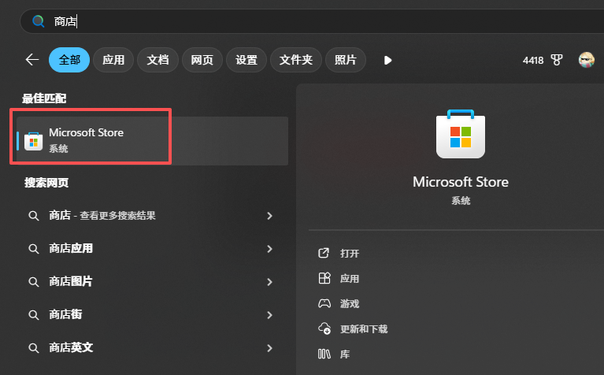
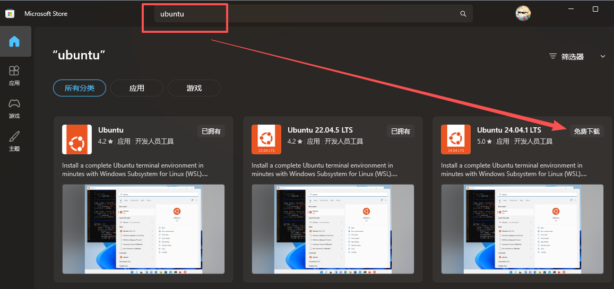
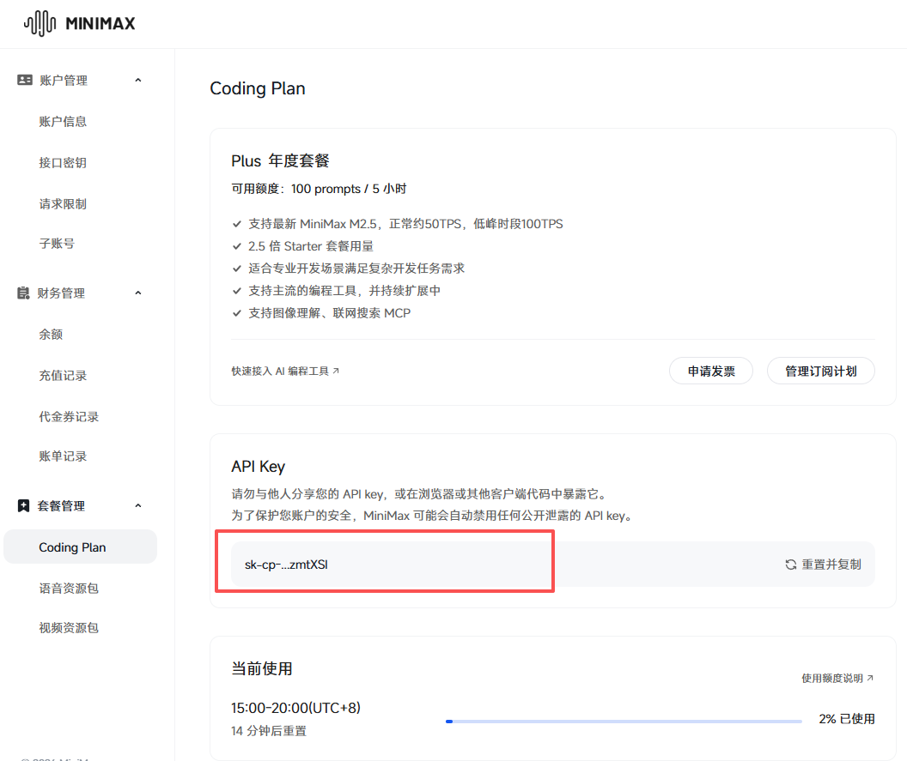
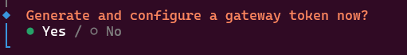
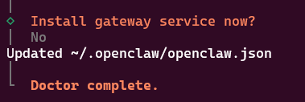

# 2. 环境准备

## 2.1 windows WSL配置

详细内容大家可以看下面这一篇，我简单把关键步骤给大家截图出来。

https://learn.microsoft.com/zh-cn/windows/wsl/install

首先打开cmd，可能有很多新手不知道CMD是什么，就是按一下windows键，然后输入CMD出来的这个命令提示符。这个是可以直接调用windows命令的界面。


接下来我们输入`wsl --install`进行安装，这里windows就会自动帮我们安装WSL。


## 2.2 wsl ubuntu安装

接下来我们需要打开windows商店，大家可以在windows键按下后输入商店就能找到这个应用，然后我们再输入ubuntu。找到24.04也可以，其他的版本也可以，大家安装一个就好。



这里点击免费下载后配置即可。初始化配置的时候需要输入用户名密码，大家把密码记住，后面每次用ubntu系统的时候就需要去输入密码。



可能大家到这里还不知道大家在做什么。其实我们现在给windows电脑配置了一个linux的子系统。然后我们通过这个子系统就可以去使用linux的一些工具和服务。这样子相比于直接使用windows来说，稳定性和安全性更高一些。也就是说我们把openclaw（龙虾）装到这里，我们不怕它扰乱我们正常windows电脑的环境。它把子系统搞崩了也无所谓。我们这里面只需要把子系统卸载删除就行。这样子的话，大家就不用太担心安装openclaw（龙虾）后会导致你的电脑不能用，或者是害怕它删除一些你电脑里面的东西。

## 2.3 openclaw的安装

这里面我们在win按下windows键后输入ubuntu，然后我们打开ubuntu的界面，这样子我们可以在子系统里进行一系列的使用和操作。


接着我们输入下面这一句。

```Plain
curl -fsSL https://openclaw.ai/install.sh | bash
```

这样我们就不需要手动的去安装note JS和其他的依赖环境。1个SH命令就能全部搞定相关依赖的下载和安装。可以说这个方法是非常偷懒了：D。


装好进入配置页面~~在这边大家可以抽空去自己的code plan，把对应的API key拿过来。比如说我这里面就用的minimax的2.5的，然后我就去minimax2.5这边把API key拿过来。我个人用下来minimax还是比较流畅的~

如果你只想试着玩，可以先买一点token先不买plan。









