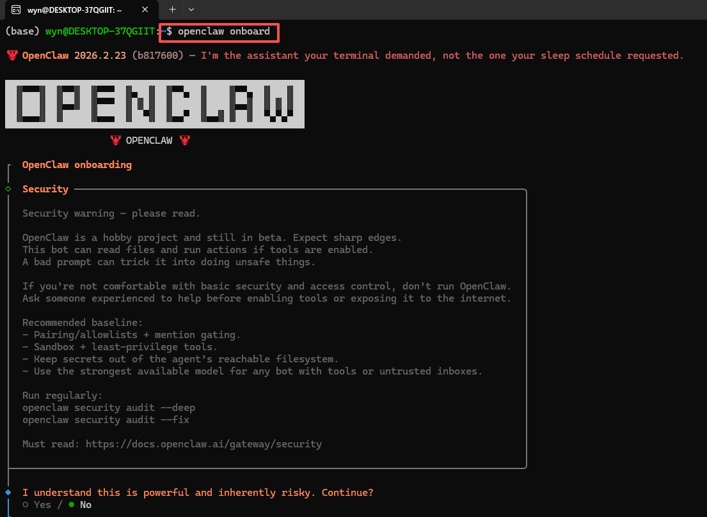
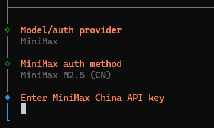

# 3. openclaw配置

这里面我们需要先打开onboard，然后我们配置模型，先让open claw可以完成我们的基本对话。

这里大家跟着我的选择就好~

到这里我们就需要把2.3等待时找到的apikey导入就好~

配好key后我们选择飞书

到这里就需要切换到飞书的配置了

## 如何更新？

在ubuntu输入下面命令即可~

`Plain
openclaw update
`

ok搞定~

