1. # 飞书配置

飞书的创建登录在这里：

https://www.feishu.cn/accounts/

这里需要大家创建一个组织账号，不要创建个人号【注意注意注意！！！】。只有组织账号才能邀请好友一起来玩！

接着打开飞书开发者平台：

https://open.feishu.cn/?lang=zh-CN

选择开发者后台，点击企业建应用。

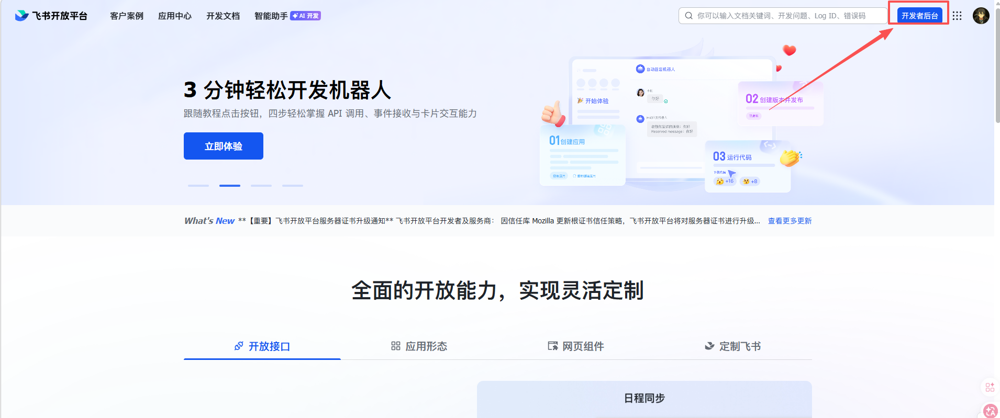

名称随便写写就好

接着在成员管理点击添加机器人

然后我们来到权限管理，点击开通权限。

输入im: 然后点击右下角开通权限。

然后输入：contact:user.base:readonly

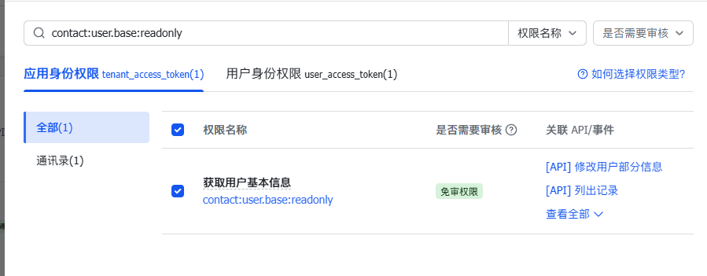

开通完后如果你想使用文档功能，就输入docs:

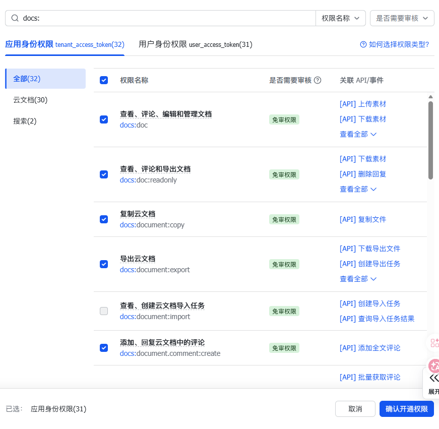

接着来到凭证与基础信息，复制`App ID与App Secret` 对应的内容。

然后返回到刚才的内容填写id和secre，下面有个选项选china版本即可。

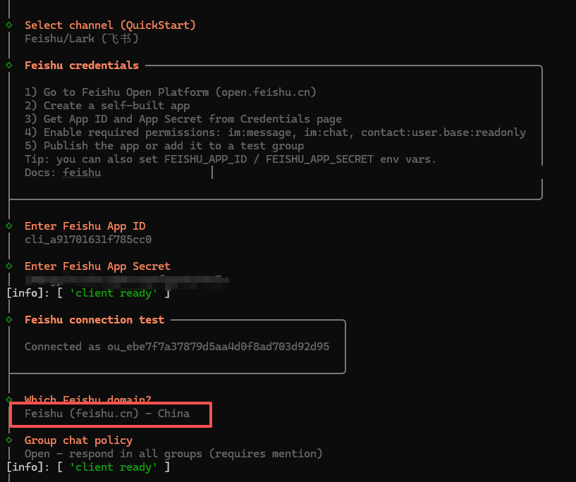

下面的skill你可以选，用空格选择回车确认即可。其他的可以no如果你没有api的话。

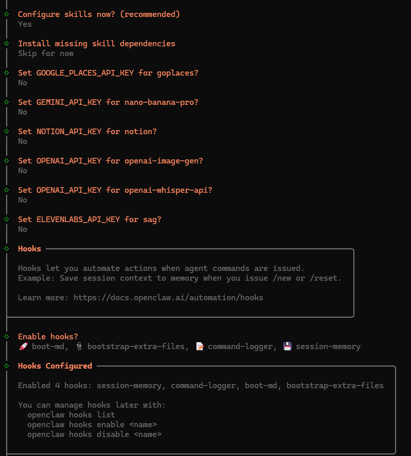

接下来你可以看到在control UI地方有一个地址，你可以按下ctrl点击鼠标左键或者直接复制进入一个页面。这个就是openclaw的在线页面。

这里我们对话测试没有问题，说明api配置无误。

如果测试通过选择do this later退出即可。现在我们返回飞书开发者平台。我们需要找到时间与回调里面的订阅方式，选择长链接并保存。

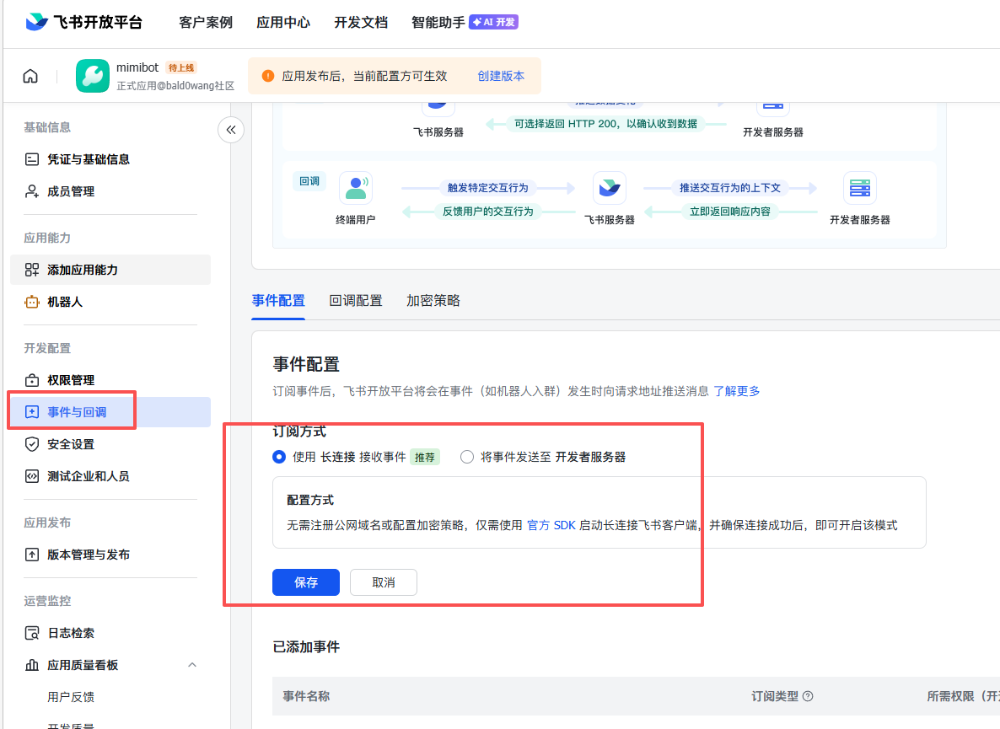

如果没有报错说明你的配置无误，飞书和openclaw配置都没问题。然后看右下角有个添加事件，把消息与群组全部勾选，确认添加。

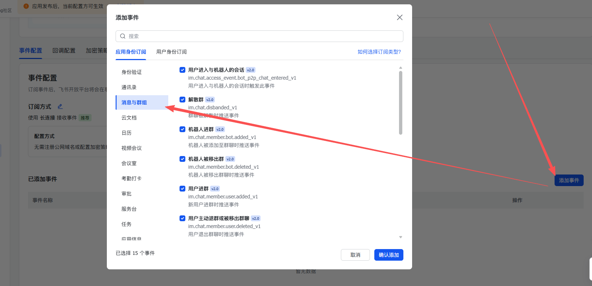

然后到回调配置里，也打开长连接即可。

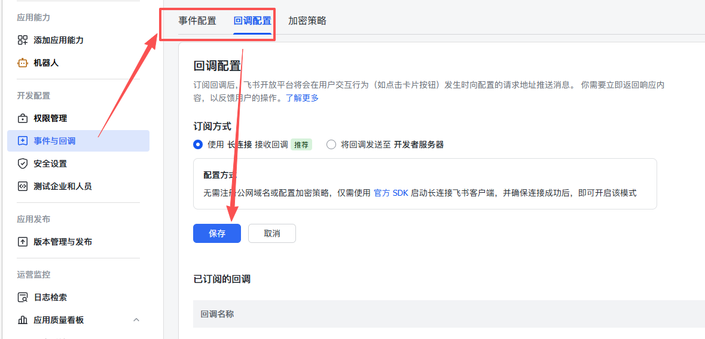

最后最关键的一步来了！我们需要把所有配置落地，需要点击一下创建版本。

简单填写版本信息，然后保存即可~

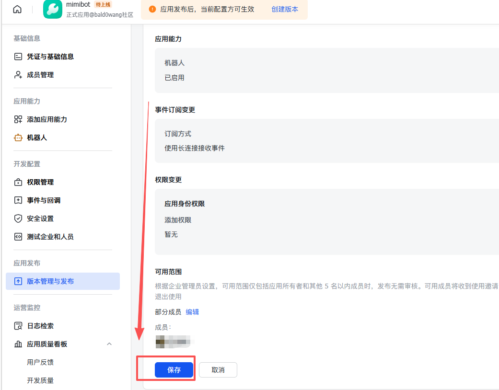

发布成功后飞书会收到申请。请大家将组织账号登录在飞书，然后打开。飞书会告诉你审批通过，这里你点击打开应用。

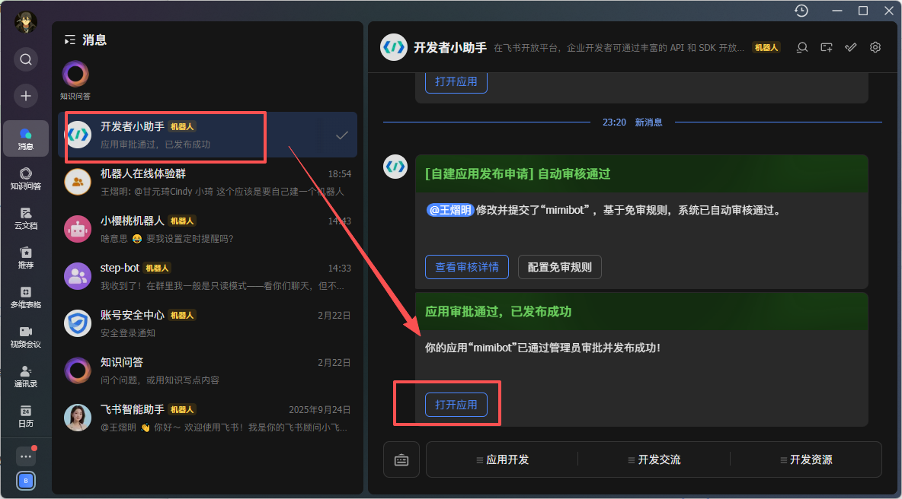

这里我们发送你好，机器人做了配对申请。你需要将最后这句复制并发送给刚才浏览器的机器人。

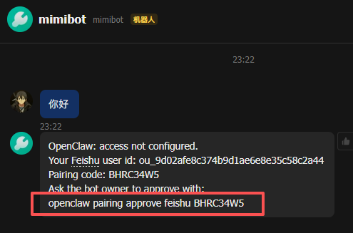

就像我这样复制进去就好啦。

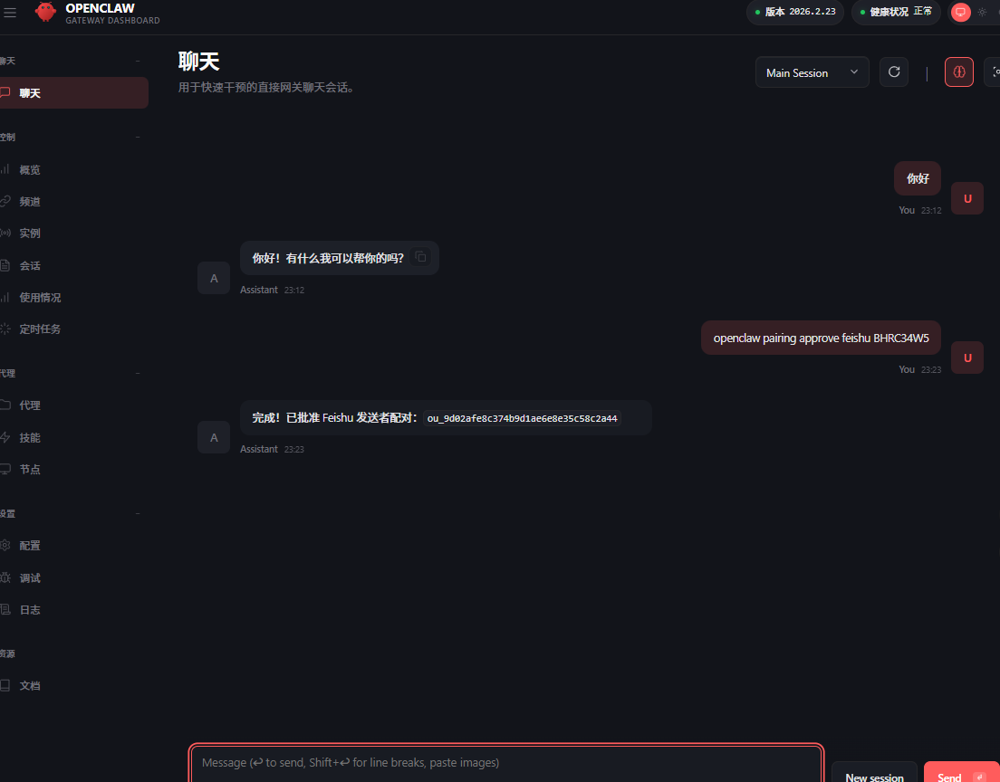

再次回到飞书，这里大家可以看到飞书已经配好啦~~开心

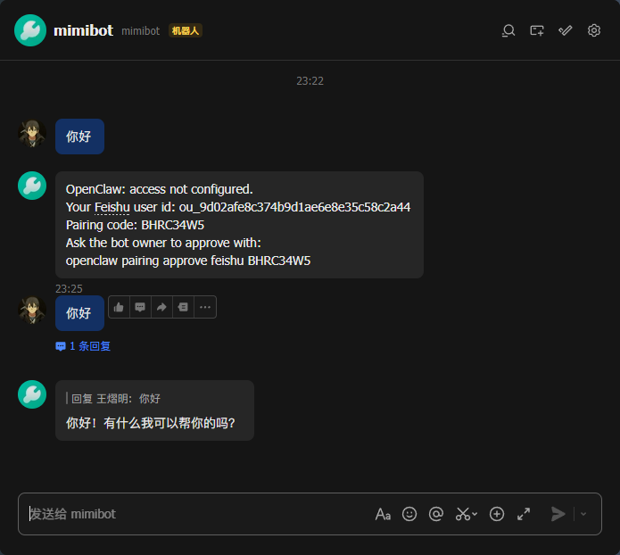
