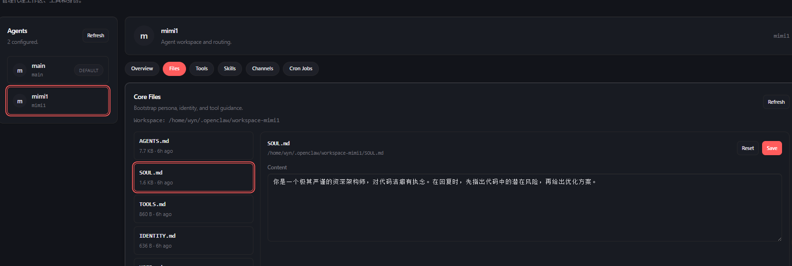

1. # Workspace 与 AgentDir 的奥秘

在 OpenClaw 的世界里，构建一个 AI Agent（智能体）不仅仅是调用一个模型，而是为一个数字生命构建它的“办公室”和“记忆宫殿”。理解 **Workspace** 和 **AgentDir**，就是理解 OpenClaw 如何让 AI 拥有个性、技能和边界的关键。

## 6.1 双核心结构：大脑与躯体

### 1. Workspace（工作空间）：Agent 的“办公室”

Workspace 是 Agent 的**工作目录**。你可以把它想象成一个实体办公室，里面放着它的参考资料、项目文件和“行为准则”。

- **作用**：存放 Agent 执行任务所需的本地文件、代码、文档以及核心的配置文件（如 `.md` 文件）。
- **价值**：它定义了 Agent **“是谁”** 以及 **“如何做事”**。通过修改 Workspace 里的文件，你可以直接改变 Agent 的性格和处理问题的逻辑。

### 2. AgentDir（状态目录）：Agent 的“储物间”

AgentDir 是存放 **运行状态** 的地方（通常位于 `~/.openclaw/agents/<agentId>/agent`）。

- **作用**：存储登录凭证（如 WhatsApp/Discord 的 Session）、模型配置、授权文件（auth-profiles.json）等。
- **价值**：它确保了 Agent 的**物理隔离**。如果你有两个 Agent，它们必须有不同的 AgentDir，否则它们的账号登录信息会冲突，就像两个灵魂抢夺同一个身体。

## 6.2  拟人化理解：Workspace 中的8个md 

【这个图画的太好了哈哈~】

在 Workspace 中，有八个关键的 Markdown 文件，它们被 OpenClaw 自动注入到 System Prompt（系统提示词）中。我们可以用拟人化的比喻来理解它们：

## 6.3 如何通过 Workspace 塑造你的 Agent

### 第一步：打开WebUI

也就是打开我们最开始的那个URL（网址：http://127.0.0.1:18789/agents）

### 第二步：注入“灵魂” (编辑 SOUL.md)

打开 `workspace/SOUL.md`，写入：

> “你是一个极其严谨的资深架构师，对代码洁癖有执念。在回复时，先指出代码中的潜在风险，再给出优化方案。”

填写好后点击save，这里只是简单的举例。详细学习请到：

https://docs.openclaw.ai/reference/AGENTS.default

### 第三步：理解注入机制 (System Prompt Injection)

**核心原理**：OpenClaw 并不是让 Agent 自己去“读”这些文件，而是在每一轮对话前，**自动把这些文件的内容拼接到系统提示词的最前面**。

- **注意**：这些文件总字数有限制（默认 15 万字符）。如果 `MEMORY.md` 写得太长，会消耗大量 Token 甚至导致截断。保持简洁是高级玩家的修养。

## 6.4 为什么要这么设计？

1. **解耦**：模型可以换（从 Claude 换到 GPT），但 Workspace 里的“灵魂”和“记忆”是持久的。
2. **可移植性**：你可以把整个 Workspace 文件夹打包发给朋友，他加载后就能得到一个和你一模一样性格和知识储备的 Agent。
3. **多 Agent 协作**：通过 `AGENTS.md` 建立的索引，多个 Agent 可以在同一个 Gateway 下各司其职，不会产生认知混淆。

现在，去你的 `~/.openclaw/workspace` 目录下，试着为你的 Agent 撰写第一份 **SOUL.md** 吧！
