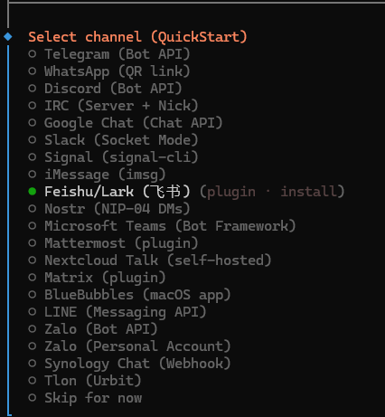
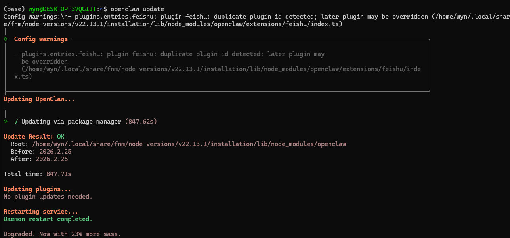
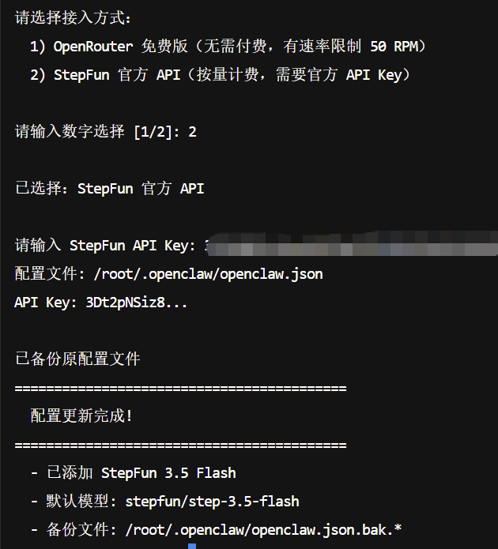
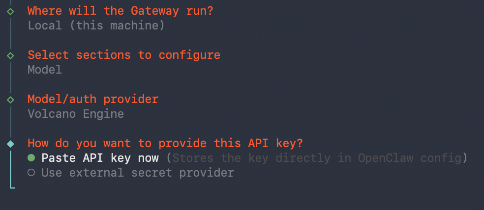
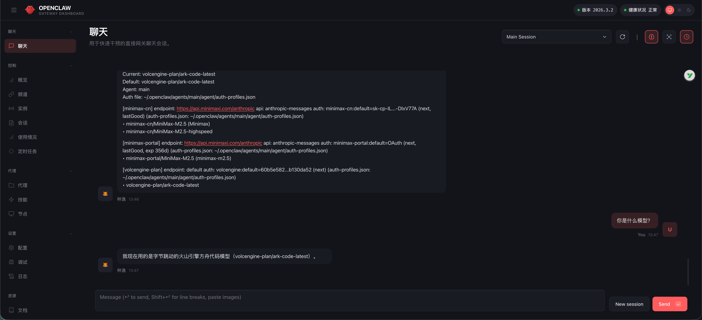

# 第一次对话与基础配置

这里面我们需要先打开onboard，然后我们配置模型，先让open claw可以完成我们的基本对话。


这里大家跟着我的选择就好~


到这里我们就需要把2.3等待时找到的apikey导入就好~


配好key后我们选择飞书




到这里就需要切换到飞书的配置了


## 如何更新？

在ubuntu输入下面命令即可~

```Plain
openclaw update
```

ok搞定~



<!-- TMP5_INSTALL_START -->
## 安装并配置 OpenClaw

### 安装 OpenClaw

### 安装脚本的方式来安装OpenClaw：

#### 安装前置条件

[Node.js 22/23版本](https://nodejs.org/en/download/)

**MacOS/Linux：**

- 按下快捷键 `Command (⌘) + 空格键` 唤出 Spotlight（聚焦搜索）。
- 输入 `Terminal` 或 `终端`，然后按下回车键打开。
- 输入下面的指令

```bash
curl -fsSL https://openclaw.ai/install.sh | bash
```

**Windows（需要Win11）：**

- 点击任务栏的搜索框，输入 `PowerShell`。
- 右键点击`Windows PowerShell/终端管理员`，选择 **“以管理员身份运行”**。
- 在新窗口中重新粘贴并运行你的命令：

```powershell
iwr -useb https://openclaw.ai/install.ps1 | iex
```

### 手动全局安装的方法安装OpenClaw：

#### 安装前置条件

[Node.js 22/23版本](https://nodejs.org/en/download/)

[git（用来克隆远程仓库）](https://git-scm.com/install/)

**通过npm安装：**

```bash
npm install -g openclaw@latest
```

**在安装的时候需要等待5~10分钟，期间不要去碰电脑，直到出现下面的图片**
### 配置 OpenClaw

#### 配置 API Key

- 做好上述准备，会开始自动开始配置流程，如图所示


- 这个时候我们需要先用`Ctrl+C`退出一下，并且输入下面的指令，快速的配置我们的API Key

```bash
openclaw config
```


- 根据上述提示来快速配好API Key，下面是不同平台的配置方式：


<!-- TMP5_INSTALL_END -->

<!-- TMP6_INSTALL_START -->
## 第二步：安装 OpenClaw

这是唯一需要用到"命令行"的步骤，但别怕跟着做就行。

### 2.1 Mac 用户

1. 打开 **终端（Terminal）** 应用
   1. 按 `Cmd + 空格`，输入"终端"，回车
2. 复制下面这行命令，粘贴进去，回车：

```Plaintext
curl -fsSL https://openclaw.ai/install.sh | bash
```

### 2.2 Windows 用户

1. 打开 **PowerShell**（Win + X → 选择 Windows PowerShell）
2. 复制下面这行命令，粘贴进去，回车：

```Plain
iwr -useb https://openclaw.ai/install.ps1 | iex
```

## 第三步：配置火山引擎 Coding Plan

### 3.1 新安装OpenClaw用户

过程中会问你几个问题，照着选：

| 提示信息                                                     | 配置选项                                                     |
| :----------------------------------------------------------- | :----------------------------------------------------------- |
| I understand this is personal-by-default and shared/multi-user use requires lock-down. Continue? | 选择 "Yes"                                                   |
| Onboarding mode                                              | 选 QuickStart 然后回车                                       |
| Model/auth provider                                          | 选择 "Volcano Engine"。 |
| How do you want to provide this API key?                     | 选择 "Paste API key now"                                     |
| Enter Volcano Engine API key                                 | **复制粘贴你刚才在1.2中获取的API Key，然后回车。**           |
| Default model                                                | 然后回车（选 volcengine-plan/ark-code-latest） |
| Select channel                                               | 选择 “Skip for now”，后续可以配置。                          |
| Configure skills now?                                        | 选择 “No”，后续可以配置。                                    |
| Enable hooks?                                                | 按空格键选中选项，按回车键进入下一步。                       |
| How do you want to hatch your bot?                           | 选择 "Hatch in TUI"。                                        |

1. 看到类似这样的提示就成功了：

```Plaintext
🎉 OpenClaw is ready!
```

### 3.2 已安装OpenClaw用户

请参考以下详细步骤。

```Plain
openclaw config
```

| 提示信息                                 | 配置选项                                                     |
| :--------------------------------------- | :----------------------------------------------------------- |
| Where will the gateway run？             | 选择 local(this machine)，按回车键。 |
| Select sections to configure             | 选择Model，按回车键 |
| Model/auth provider                      | 选择Volcano Engine，按回车键 |
| How do you want to provide this API key? | 选择paste api key now，按回车键。然后**复制粘贴你刚才在1.2中获取的API Key**，然后回车。 |
| Models in/model picker(multi-select)     | 选择按空格 |
| Select sections to configure             | 选择continue后按回车键即可完成配置。 |

## 第四步：验证

安装成功后，我们来确认它能正常工作：

1. 在终端输入：

```Plaintext
openclaw dashboard
```

1. 浏览器会自动打开一个页面（http://127.0.0.1:18789/）
2. 在对话框里随便问一个问题，比如"你是什么模型？"
3. 如果它能回答你是用的火山引擎方舟代码模型，就说明配置成功！🎉


<!-- TMP6_INSTALL_END -->


