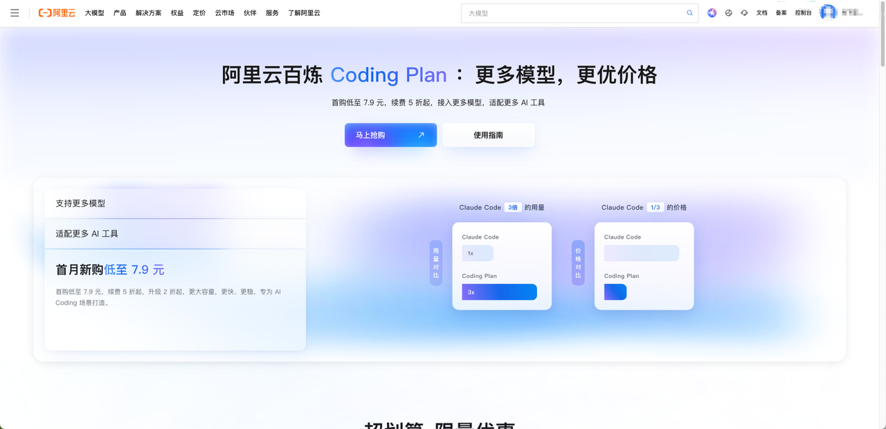
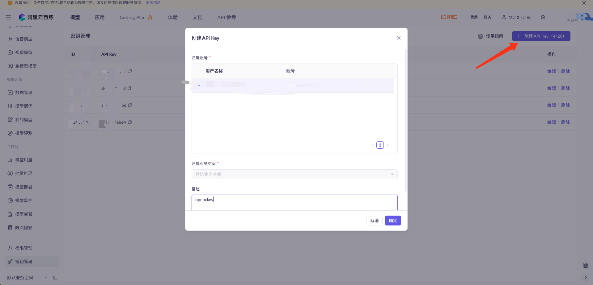

# 阿里云 Coding Plan 教程

> 适用对象：第一次接触 OpenClaw，希望用阿里云 Coding Plan 跑稳定编码工作流的开发者

## 这份教程解决什么问题

你将完成以下目标：

1. 开通阿里云 Coding Plan。
2. 获取专属 `sk-sp-` API Key 和正确 Base URL。
3. 安装并初始化 OpenClaw。
4. 在 `~/.openclaw/openclaw.json` 完成模型接入配置。
5. 启动并验证 `bailian/qwen3-coder-plus` 可用。

完成后，你可以在 OpenClaw 的 TUI 或 Web UI 中直接使用 Coding Plan 模型。

## 前置条件（此教程使用Mac配置截图做示范学习）

开始前请确认：

1. 你有可用的阿里云账号，并已完成支付方式设置。
2. 你的系统是 macOS / Linux / Windows 之一。
3. 本机已安装 Node.js 22 或更高版本。
4. 你接受 Coding Plan 的使用限制：仅用于交互式编码工具，不用于自动化脚本 API 批量调用。

## 3. 总流程（1 分钟版）

1. 在 [阿里云 Model Studio](https://cn.aliyun.com/benefit/scene/codingplan?from_alibabacloud=)订阅 Coding Plan（可以先买基础版试试，pro按需购买）。
2. 在[订阅页面获取专属 Key](https://bailian.console.aliyun.com/cn-beijing/?spm=a2c81.expense_cost_summary.aillm.2.19a120a0ZJrHpV&tab=model&scm=20140722.S_APIkey页面._.RL_APIkey页面-LOC_aillm-OR_chat-V_3-RC_llm#/api-key)（格式 `sk-sp-xxxxx`）非 `sk-xxxx`。
3. 安装 OpenClaw 并完成首次初始化（先跳过模型绑定）。
4. 编辑 `~/.openclaw/openclaw.json`，添加 `bailian` provider。
5. 重启 OpenClaw gateway。
6. 用 TUI 切换到 `bailian/qwen3-coder-plus` 并发起测试对话。

## 详细步骤

### 步骤 1：订阅 Coding Plan [阿里云 Model Studio](https://cn.aliyun.com/benefit/scene/codingplan?from_alibabacloud=)

1. 打开阿里云 Model Studio 的 Coding Plan 页面。
2. 选择套餐（Lite 或 Pro）并完成购买。
3. 购买后在订阅页面确认状态为生效中。

- 你能在订阅页看到额度和用量。



### 步骤 2：获取专属 API Key [订阅页面获取专属 Key](https://bailian.console.aliyun.com/cn-beijing/?spm=a2c81.expense_cost_summary.aillm.2.19a120a0ZJrHpV&tab=model&scm=20140722.S_APIkey页面._.RL_APIkey页面-LOC_aillm-OR_chat-V_3-RC_llm#/api-key)



### 步骤 3：安装 OpenClaw

先打开terminal验证`node版本是否>=22`

```Bash
node -v
```

macOS / Linux：

```Bash
curl -fsSL https://openclaw.ai/install.sh | bash
```


Windows PowerShell：(Windows用户请输入以下内容)

```PowerShell
iwr -useb https://openclaw.ai/install.ps1 | iex
```

安装后执行：

```Bash
openclaw --version
```

如果首次引导出现配置选项，建议先“跳过模型配置”，后面手动写配置更可控。

### 步骤 4：首次配置向导推荐选项（照表选择）

首次安装后，OpenClaw 会自动启动配置向导。你也可以手动执行：

```Bash
openclaw onboard
```

建议按下表选择：

| **配置项**                                                   | **建议配置**                              |
| ------------------------------------------------------------ | ----------------------------------------- |
| I understand this is powerful and inherently risky. Continue? | 选择 **Yes**                              |
| Onboarding mode                                              | 选择 **QuickStart**                       |
| Model/auth provider                                          | 选择 **Skip for now**（稍后配置百炼模型） |
| Filter models by provider                                    | 选择 **All providers**                    |
| Default model                                                | 选择 **Keep current**                     |
| Select channel (QuickStart)                                  | 选择 **Skip for now**（稍后配置渠道）     |
| Configure skills now? (recommended)                          | 选择 **No**                               |
| Enable hooks?                                                | 按空格键选中选项，按回车键进入下一步      |
| How do you want to hatch your bot?                           | 选择 **Do this later**                    |

接下来，再继续执行后面的百炼模型配置步骤。

### 步骤 5：设置环境变量（推荐）

为了避免把密钥明文写进配置文件，先设置环境变量：

```Bash
export CODING_PLAN_API_KEY="sk-sp-替换为你的Key"
```

如果你希望每次终端自动生效，把上面一行写入 `~/.zshrc` 或 `~/.bashrc`，然后 `source` 一次。

### 步骤 6：编辑 OpenClaw 配置文件

打开配置文件：

```Bash
nano ~/.openclaw/openclaw.json
```

把下面内容合并进现有配置（如果是全新环境可直接使用，当然你也可以使用其他AI编辑器 把这部分配置复制给他让他写入）：

```JSON
{
    "meta": {
      "lastTouchedVersion": "2026.2.1",
      "lastTouchedAt": "2026-02-03T08:20:00.000Z"
    },
    "models": {
      "mode": "merge",
      "providers": {
        "bailian": {
          "baseUrl": "https://dashscope.aliyuncs.com/compatible-mode/v1",
          "apiKey": "此处填入之前创建的APIkey或者使用全局配置${CODING_PLAN_API_KEY}",
          "api": "openai-completions",
          "models": [
            {
              "id": "qwen3.5-plus",
              "name": "qwen3.5-plus",
              "reasoning": false,
              "input": ["text", "image"],
              "contextWindow": 1000000,
              "maxTokens": 65536
            },
            {
              "id": "qwen3-coder-next",
              "name": "qwen3-coder-next",
              "reasoning": false,
              "input": ["text"],
              "contextWindow": 262144,
              "maxTokens": 65536
            }
          ]
        }
      }
    },
    "agents": {
      "defaults": {
        "model": {
          "primary": "bailian/qwen3.5-plus"
        },
        "models": {
          "bailian/qwen3.5-plus": {},
          "bailian/qwen3-coder-next": {}
        }
      }
    },
    "gateway": {
      "mode": "local",
      "auth": {
        "mode": "token",
        "token": "test123"
      }
    }
  }
```

说明：

1. `models.mode = "merge"` 可以减少覆盖你已有配置的风险。
2. `primary` 决定默认模型。
3. `agents.defaults.models` 是白名单，建议把常用模型都列出来。

### 步骤 6：重启并生效

```Bash
openclaw gateway restart
```

如果你用 Web UI，也可以执行：

```Bash
openclaw dashboard
```

进入配置页面确认 provider 已加载。

### 步骤 7：验证是否接通

启动 TUI：

```Bash
openclaw tui
```

在 TUI 内执行：

```Plain
/model
```

选择 `bailian/qwen3-coder-plus`，然后发送一条测试消息，例如：

```Plain
请用 5 行总结我当前项目目录的用途。
```

通过标准：

1. 无 `401` / `invalid api key` 报错。
2. 模型可正常返回内容。
3. 可用 `/model` 在几个 `bailian/*` 模型间切换。

## 常见问题排查

### 问题 1：`HTTP 401: Incorrect API key provided`

按顺序检查：

1. 你的 Key 是否为 `sk-sp-` 开头。
2. 订阅是否仍在有效期。
3. 配置里的 key 有没有多空格、换行或引号错误。

仍然报错时，清理缓存配置后重启：

1. 打开 `~/.openclaw/agents/main/agent/models.json`。
2. 删除 `providers.bailian` 对应段落。
3. 执行 `openclaw gateway restart`。

### 问题 2：明明开了套餐，还是按量计费或出现欠费

通常是因为用了“通用百炼 Key + 通用 Base URL”，而不是 Coding Plan 专属参数。  

确认必须同时满足：

1. Key 是 `sk-sp-xxxxx`。
2. Base URL 是 `https://dashscope.aliyuncs.com/compatible-mode/v1`。

### 问题 3：修改配置后不生效

1. 忘记重启 gateway。
2. JSON 格式有语法错误（逗号、引号、括号）。
3. 使用了覆盖式替换导致别的字段丢失。

建议做法：优先“局部合并”，不要一次覆盖整个配置文件。

## 可选增强（上线后建议）

1. 把 `CODING_PLAN_API_KEY` 放到更安全的密钥管理方式，避免明文泄露。
2. 只保留你实际会用的 2-3 个模型，简化切换和排障。
3. 建一份团队标准模板，统一 `primary` 模型与命名规范。

## 写作模板（你后续扩展教程可直接套用）

如果你要把这份教程发布到团队 Wiki，可按这个结构扩写：

1. 背景与目标：为什么选 OpenClaw + Coding Plan。
2. 适用范围：系统、账号、权限限制。
3. 10 分钟快装：给忙碌用户先跑通。
4. 完整配置：解释每个字段含义。
5. 验收标准：成功是什么，失败怎么判定。
6. 故障排查：401、额度、模型切换、缓存问题。
7. 运维建议：版本升级、密钥轮换、配置变更流程。

## 拓展

小龙虾的应用场景会很广，但是他的权限很高，现在有很多新龙虾（更安全），单独部署的时候最好开一个容器去用。最后，希望大家都能找到一个独属于自己的贾维斯。

## 参考资料（官方）

1. Alibaba Cloud Model Studio - Coding Plan Overview: <https://www.alibabacloud.com/help/en/model-studio/coding-plan>
2. Alibaba Cloud Model Studio - Get started with Coding Plan: <https://www.alibabacloud.com/help/en/model-studio/coding-plan-quickstart>
3. Alibaba Cloud Model Studio - OpenClaw integration: <https://www.alibabacloud.com/help/en/model-studio/openclaw-coding-plan>
4. OpenClaw Docs - Model Providers: <https://docs.openclaw.ai/concepts/model-providers>

