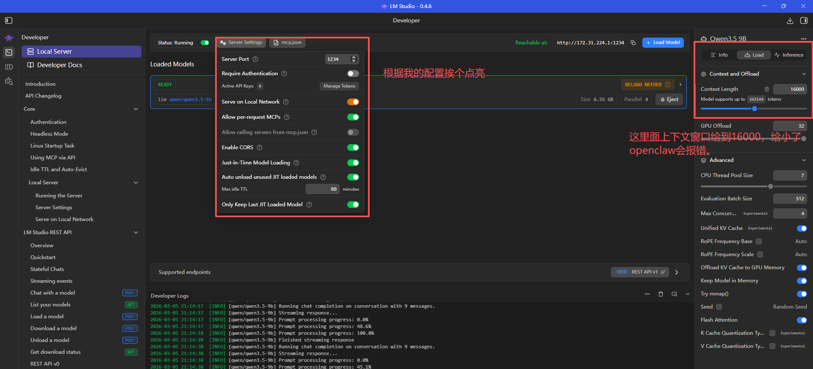
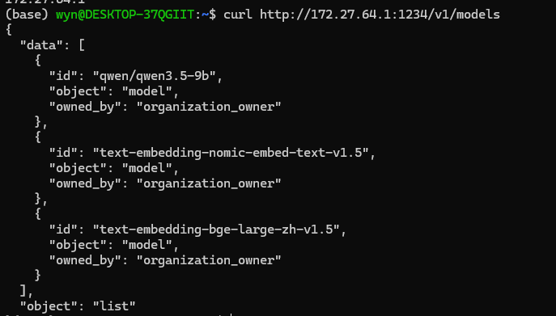
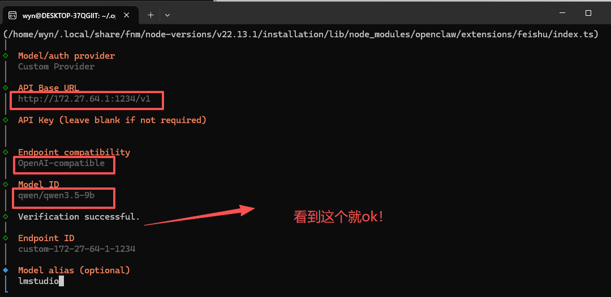
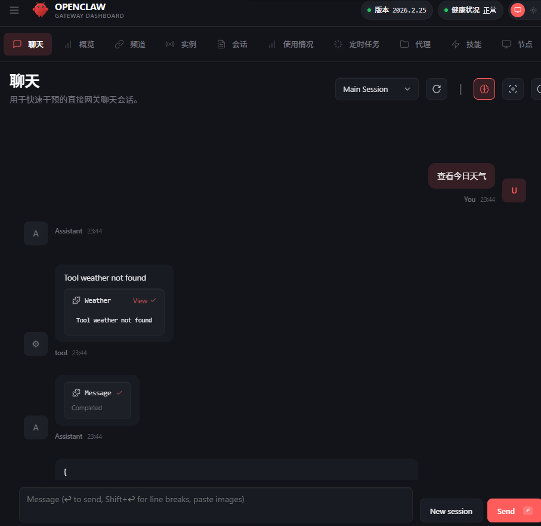
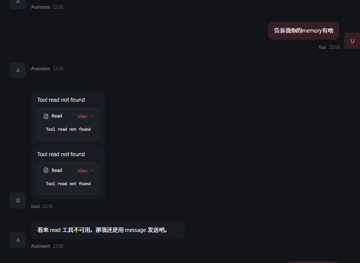

# LM Studio 本地模型接入

## 本地模型接入（LM Studio + WSL）

这次教大家使用的是 lm studio，我们的模板模型使用 qwen3.5 9b。这次的试验设备是 4070ti（12G 显存）。

大家先根据自己的系统下载软件。

https://lmstudio.ai/download?os=win32


### 1. 下载并安装模型

这里面请先点击左边的搜索位，然后输入 qwen 找到我们这次安装的主角：qwen3.5 9b。我们安装 4bit 量化版本。


大家点击这个位置即可下载本地模型。


下载好后我们点击左边的娃娃头，然后找到qwen3.5-9b模型~


下面框输入你好测试~测试通过没有问题~


lmstudio对外配置，大家根据图上配置即可~



### 2. OpenClaw 接入本地模型

开始前先测试，由于我是 wsl 接入。我需要读一下 wsl 映射主机的网络 ip。输入下面语句然后复制 ip。

```Plain
ip route show | grep -i default | awk '{print $3}'
```


然后大家输入：(记得把下面的模拟ip换成你的)

```Plain
 curl http://172.xx.xx.xx:1234/v1/models 
```

出现我们的模型说明配置无误。



接着我们输入`openclaw onboard`


我们先输入baseurl：

```Plain
http://172.xx.xx.xx:1234/v1
```

然后输入apikey 随便输入即可（图上面没输入，但是后面会报错），接着选openai-compatible，输入模型id：

```
qwen/qwen3.5-9b
```


出现这个测试通过，接着回车然后输入模型来源即可。



其他的根据需要配置。不在重复展示。

最后选择webui并打开


接下来选择代理，选择qwen模型并保存即可~


回到聊天页面测试通过


测试一个复杂任务看看咋样？



本地小模型在复杂任务上的效果有限，建议按场景选择更高规格模型。


