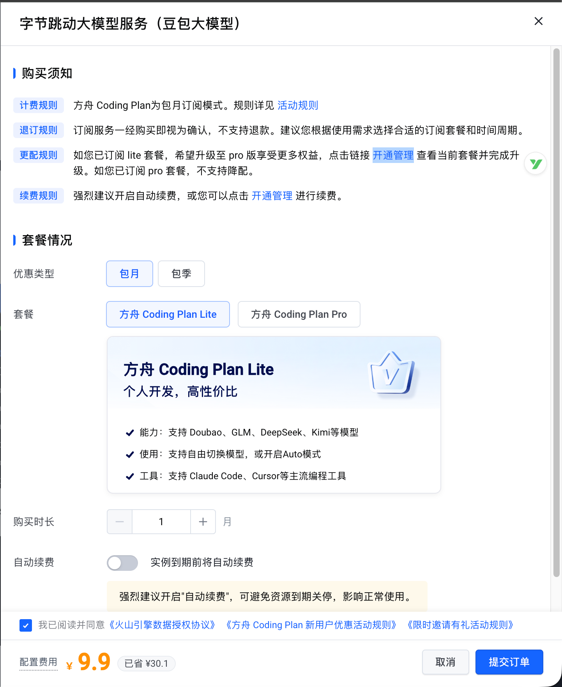
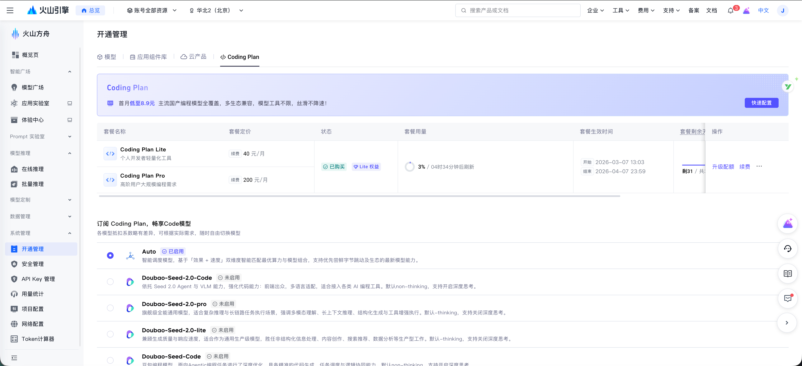
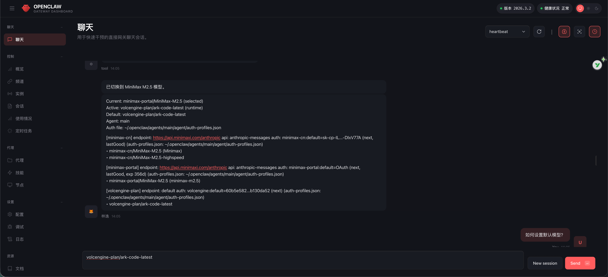
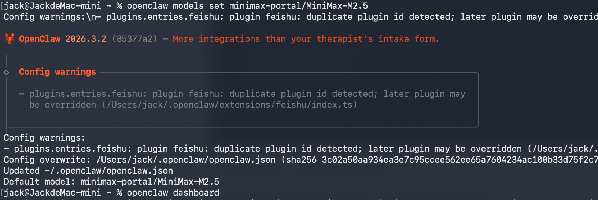

# 火山 Coding Plan 教程

## 零基础 Coding Plan 配置教程

### 写在前面

这篇文章是写给**完全零经验/零基础**的朋友看的。 不用担心看不懂，我会把每个步骤都截图展示，你只需要照着点就行。

## 先回答一个问题：这是做什么的

> 简单说：让你的电脑拥有一个私人的AI助理，可以用豆包、DeepSeek、Kimi 等国产 AI 模型。

你可以理解为：

- **OpenClaw** = 一个帮你调用 AI 的"中枢"
- **Coding Plan** = 火山引擎卖的"AI 套餐卡"
- **AI 模型** = 豆包、DeepSeek、Kimi 这些"大脑"
- **Api key =** 门锁的密码，拿着它才能开门用里面的 AI 服务

## 第一步：准备工作

在配置之前，你需要先有两个"门票"：

### 1.1 开通 Coding Plan 套餐

1. 打开这个链接：[方舟Coding Plan](https://www.volcengine.com/activity/codingplan)
2. 点击"立即订阅"，使用手机号登录

1. 填入邀请码：CXWFCWZ5 可享受9折

1. 根据提示完成支付

> 💡 **疑问解答**：这个套餐比单独买 API 更便宜，适合长期使用。

1. 套餐用量说明

| 套餐     | 适用场景                               | 用量限制                                                     |
| -------- | -------------------------------------- | ------------------------------------------------------------ |
| Lite套餐 | 中等强度的开发任务，适合大多数开发者。 | 每5小时：最多约 1,200 次请求。每周：最多约 9,000 次请求。每订阅月：最多约 18,000 次请求。 |
| Pro套餐  | 复杂项目开发，适合高强度工作的开发者。 | Lite套餐的5倍用量。每5小时：最多约 6,000 次请求。每周：最多约 45,000 次请求。每订阅月：最多约 90,000 次请求。 |

请求次数为模型调用次数预估值，通常一次用户提问会触发多次模型调用，且每次模型调用均会计入一次额度消耗，因此实际消耗的请求次数一般会多于用户提问次数。

- 简单问答或代码生成：单次提问通常触发 5-15 次模型调用。
- 代码重构或复杂任务：单次提问通常触发 15-30 次或更多的模型调用。

笔主测试下来Lite套餐是完全够用的，平常使用的话5小时连套餐一半的用量都用不了。

### 1.2 获取 API Key

1. 打开：[API KEY管理](https://console.volcengine.com/ark/region:ark+cn-beijing/apikey)
2. 点击"创建 API Key"

1. 复制这串字符（类似 `ark-xxxxx`），保存好，后面要用

> ⚠️ **注意**：这个Key就像密码，不要发给别人！

## 第五步：切换模型（可选）

### 5.1 火山引擎 Coding Plan 模型切换

Coding Plan 支持很多 AI 模型，默认推荐auto就可以了，如果有需要你可以随时切换：

火山方舟->[开通管理](https://console.volcengine.com/ark/region:ark+cn-beijing/openManagement?LLM={}&advancedActiveKey=model)

| 模型                 | 特点                   |
| -------------------- | ---------------------- |
| Auto                 | 自动选最优版本（推荐） |
| doubao-seed-2.0-code | 豆包旗舰代码模型       |
| doubao-seed-code     | 豆包代码版             |
| minimax-m2.5         | MiniMax 出品           |
| glm-4.7              | 智谱 GLM-4.7           |
| deepseek-v3.2        | DeepSeek V3.2          |
| kimi-k2.5            | 月之暗面 Kimi          |

### 5.2 切换其他 Coding Plan / 模型（当前对话）

1. 输入/model status，展示当前使用的Coding Plan / 模型。以及其他可选Coding Plan / 模型。

1. 输入/model <provider/model> 如 /model minimax-portal/MiniMax-M2.5，切换当前会话模型。

### 5.3 切换其他 Coding Plan / 模型（默认设置）

1. 需要打开终端输入 openclaw models set <provider/model>， 如 openclaw models set minimax-portal/MiniMax-M2.5 可将其设置为openclaw默认模型。

## 常见问题

**Q：Coding Plan会有额外的收费吗？** A：不额外收费，包含在 Coding Plan 套餐里。

**Q：能同时用多个模型吗？** A：可以，每次对话可以选不同的模型。

**Q：如何查看我Coding Plan的用量情况？**

A：可通过官方[管理页面](https://console.volcengine.com/ark/region:ark+cn-beijing/openManagement?LLM={}&advancedActiveKey=subscribe)查阅用量情况。

## 其他支持

如果遇到问题，可以查看官方文档： https://www.volcengine.com/docs/82379/2183190

