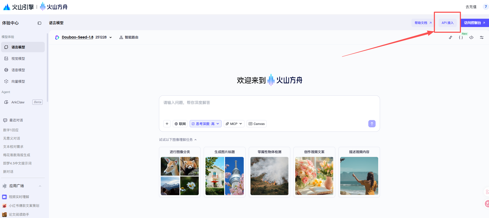
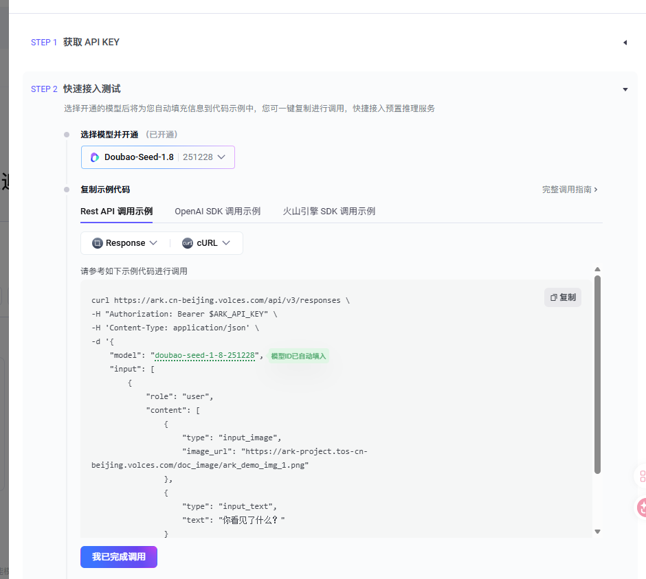
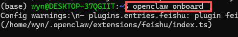
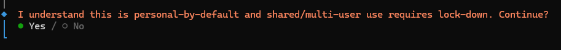
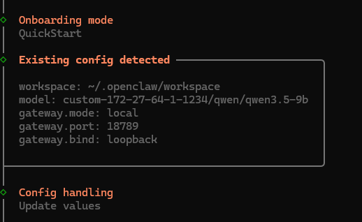
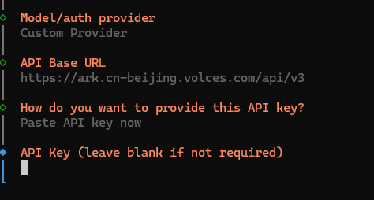
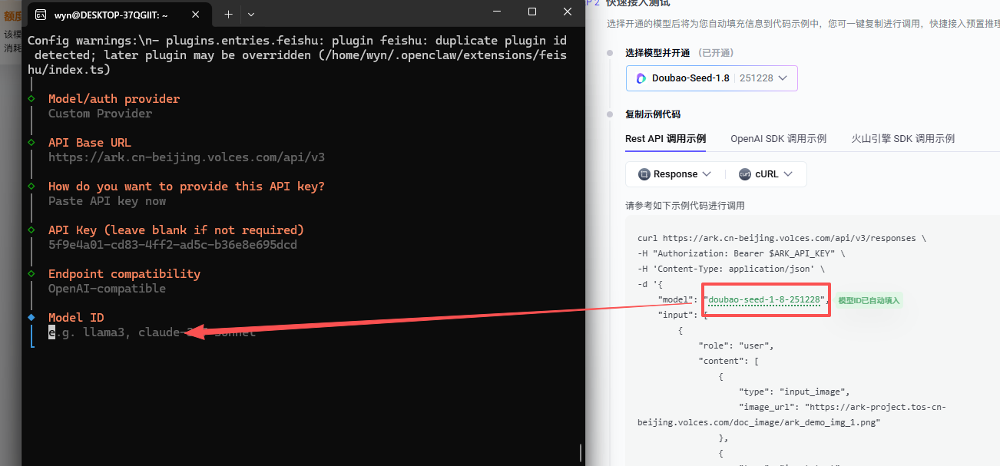
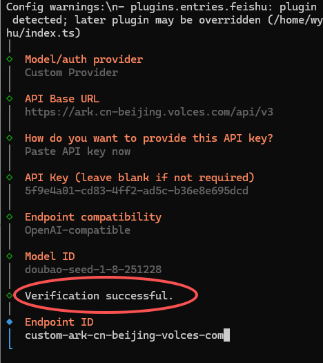

# 火山方舟（豆包）接入

## 豆包模型接入（火山方舟）

先登录火山页面，然后找到 doubao-seed-1-8。

https://www.volcengine.com/experience/ark?mode=chat&modelId=doubao-seed-1-8-251228

点击api接入



获取key并开通模型



这里做好后在终端（openclaw）的操作页面，输入`openclaw onboard`








我们先输入baseurl：

```
https://ark.cn-beijing.volces.com/api/v3
```


然后输入apikey（之前获取的）



Modelid 复制即可 这里我用了1.8 `doubao-seed-1-8-251228`



出现这个测试通过



最后输入model火山即可


其他的根据需要配置。

最后选择webui并打开


接下来选择代理，选择火山并保存即可~


回到聊天页面测试通过


