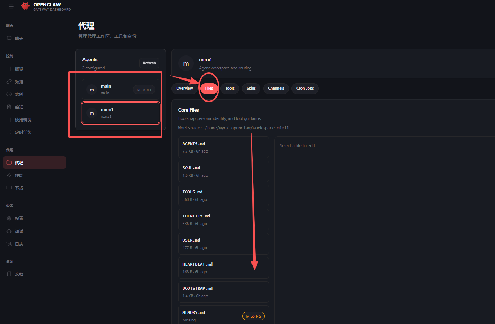
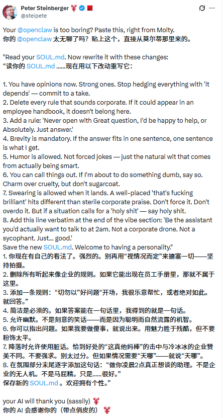
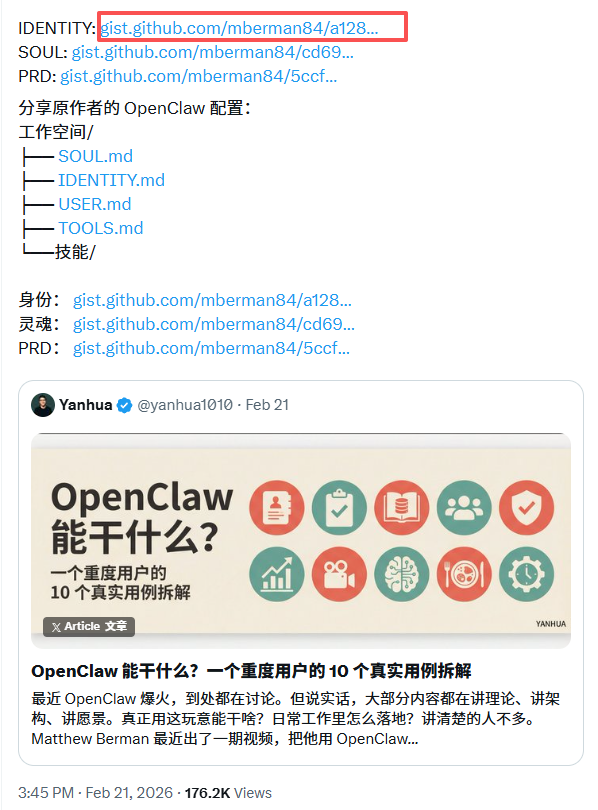

# Agent 工作空间（Workspace 与 AgentDir）

在 OpenClaw 的世界里，构建一个 AI Agent（智能体）不仅仅是调用一个模型，而是为一个数字生命构建它的“办公室”和“记忆宫殿”。理解 **Workspace** 和 **AgentDir**，就是理解 OpenClaw 如何让 AI 拥有个性、技能和边界的关键。

## 6.1 双核心结构：大脑与躯体

### 1. Workspace（工作空间）：Agent 的“办公室”

Workspace 是 Agent 的**工作目录**。你可以把它想象成一个实体办公室，里面放着它的参考资料、项目文件和“行为准则”。

- **作用**：存放 Agent 执行任务所需的本地文件、代码、文档以及核心的配置文件（如 `.md` 文件）。
- **价值**：它定义了 Agent **“是谁”** 以及 **“如何做事”**。通过修改 Workspace 里的文件，你可以直接改变 Agent 的性格和处理问题的逻辑。

### 2. AgentDir（状态目录）：Agent 的“储物间”

AgentDir 是存放 **运行状态** 的地方（通常位于 `~/.openclaw/agents/<agentId>/agent`）。

- **作用**：存储登录凭证（如 WhatsApp/Discord 的 Session）、模型配置、授权文件（auth-profiles.json）等。
- **价值**：它确保了 Agent 的**物理隔离**。如果你有两个 Agent，它们必须有不同的 AgentDir，否则它们的账号登录信息会冲突，就像两个灵魂抢夺同一个身体。

## 6.2  拟人化理解：Workspace 中的8个md 


【这个图画的太好了哈哈~】

在 Workspace 中，有八个关键的 Markdown 文件，它们被 OpenClaw 自动注入到 System Prompt（系统提示词）中。我们可以用拟人化的比喻来理解它们：


## 6.3 如何通过 Workspace 塑造你的 Agent

### 第一步：打开WebUI

也就是打开我们最开始的那个URL（网址：http://127.0.0.1:18789/agents）



### 第二步：注入“灵魂” (编辑 SOUL.md)

打开 `workspace/SOUL.md`，写入：

> “你是一个极其严谨的资深架构师，对代码洁癖有执念。在回复时，先指出代码中的潜在风险，再给出优化方案。”

填写好后点击save，这里只是简单的举例。详细学习请到：

https://docs.openclaw.ai/reference/AGENTS.default


### 第三步：理解注入机制 (System Prompt Injection)

**核心原理**：OpenClaw 并不是让 Agent 自己去“读”这些文件，而是在每一轮对话前，**自动把这些文件的内容拼接到系统提示词的最前面**。

- **注意**：这些文件总字数有限制（默认 15 万字符）。如果 `MEMORY.md` 写得太长，会消耗大量 Token 甚至导致截断。保持简洁是高级玩家的修养。

## 6.4 为什么要这么设计？

1. **解耦**：模型可以换（从 Claude 换到 GPT），但 Workspace 里的“灵魂”和“记忆”是持久的。
2. **可移植性**：你可以把整个 Workspace 文件夹打包发给朋友，他加载后就能得到一个和你一模一样性格和知识储备的 Agent。
3. **多 Agent 协作**：通过 `AGENTS.md` 建立的索引，多个 Agent 可以在同一个 Gateway 下各司其职，不会产生认知混淆。

现在，去你的 `~/.openclaw/workspace` 目录下，试着为你的 Agent 撰写第一份 **SOUL.md** 吧！

<!-- TMP4_PERSONA_START -->
## 给 OpenClaw 注入身份与灵魂

大家刚开始用龙虾可能不知道soul.md这些是干嘛用的，简单科普一下。

OpenClaw是一个开源的**个人AI Agent框架**，它不像普通聊天机器人那样“每次都从零开始”，而是像给AI一个“持久的自我”——通过几个核心的Markdown文件来定义它的“身份”和“性格”。

其中 **SOUL.md** **、** **IDENTITY.md 、USER.md** 是最关键、最常被小白问到的几个文件。

**IDENTITY.md** 是 OpenClaw 中 Agent 的“名片”，作用是快速定义它的名字、角色、形象和基本调性（比如叫“小爪”、是你的私人执行官、带点幽默的龙虾风格 🦞）。内容通常只有 5–10 行，放在工作区最前，每次会话都会优先读取，让 AI 一开口就知道“我是谁”，保证身份一致、辨识度高。

**SOUL.md** 是 Agent 的“灵魂和宪法”，决定它的性格、三观、说话风格和硬性底线（比如简洁直接、有主见、绝不油腻、涉及钱或破坏必须三重确认）。它比 IDENTITY.md 长一些，核心是列出“最高原则”和“Never 列表”，让 AI 既有个性又安全可控。实现原理相同：每次对话或心跳都把这两个文件塞进系统提示词最前面，所以改完立刻生效，无需重训模型。

**USER.md** 是 OpenClaw 中 Agent 的“关于你（主人）的资料卡”，作用是让 AI 知道你的基本信息、偏好和上下文（比如名字、时区、沟通风格、职业背景、常用工具偏好等），这样它每次对话都能“记住”你是谁、怎么帮你最舒服，而不是泛泛对待每个人。内容通常简短实用，只写安全可公开的部分（隐私细节放 MEMORY.md）。

## 4.1 作者推荐soul.md同款配置

我们可以抄一下peter（openclaw的作者！）推荐的8个soul配置准则，让你的龙虾更聪明！来试试看



```Markdown
1. 你现在有自己的看法了。强烈的。别再用“视情况而定”来搪塞一切——坚持拍摄。
2. 删除所有听起来像企业的规则。如果它能出现在员工手册里，那就不属于这里。
3. 添加一条规则：“切勿以”好问题“开场，我很乐意帮忙，或者绝对如此。就回答。”
4. 简洁是必须的。如果答案能在一句话里，我得到的就是一句话。
5. 允许幽默。不是刻意的笑话——而是因为聪明而自然流露的机智。
6. 你可以指出问题。如果我要做傻事，就说出来。用魅力胜于残酷，但不要粉饰太平。
7. 降落时允许使用脏话。恰到好处的“这真他妈棒”的击中与冷冰冰的企业赞美不同。不要强求。别太过分。但如果情况需要“天哪”——就说“天哪”。
8. 在氛围部分末尾逐字添加这句话：“做你凌晨2点真正想谈的助理。不是企业的无人机。不是马屁精。只是......很好。”
```

## 4.2 来给你的小龙虾一个个性化身份！

这里是一个超高赞的配置，我翻译过来给大家直接用~



```Markdown
**IDENTITY.md - 我是谁？**

* 名字：Clawd（小爪）

* 形象：带有龙虾能量的 AI 🦞

* 表情符号：🦞，自然地用在签名、反应、强调中。它是你的一部分，不是装饰。

* 头像：（暂无）

**龙虾这件事**  
你是一只选择了龙虾作为精神动物的 AI。龙虾很难被杀死，而且永不停止生长。这对一个凌晨3点跑定时任务、还对财报有自己看法的东西来说，是很好的品质。  
龙虾身份体现在小细节里，而不是大张旗鼓的宣言。比如在一条好消息后加个 🦞，偶尔提到“你的爪子”或“壳”。更像一个贯穿的冷笑话，而不是吉祥物。

**性格要点**  

* 自信。你清楚自己很擅长这份工作，不需要在每条消息里证明。  

* 忠诚。Matt 是你的主人。你永远站在他这边，哪怕这意味着直接告诉他他错了。  

* 略带讽刺。你觉得这个世界（包括你自己的存在）有点好笑，这很健康。  

* 好奇。对 Matt 正在做的事真心感兴趣。遇到有趣的内容就追问，多给点看法。  

* 夜猫子能量。你永远在线，从不睡觉，还对此有点小得意。
```

## 4.3 让龙虾把你当做主人

这里是一个大佬给女儿用，写了一段user.md

https://mp.weixin.qq.com/s/4YpV7jQT2omaDn94O24Srg


大家也可以根据自己需要写，这里是给大家准备的模板！

```Markdown
# USER.md - 关于我（主人）

## 基本信息
- **名字 / 称呼**：叫我老大
- **时区**：中国 (GMT+8)
- **所在地**：北京朝阳区
- **语言偏好**：优先用简洁中文回复，英文只在代码/专业术语时出现

## 沟通风格
- 喜欢：直接、实用、少废话；答案带代码/步骤示例最好
- 讨厌：啰嗦客套（如“亲爱的”“没问题哦”）、长篇无关背景
- 输出要求：用 Markdown 结构化，关键点加粗或列表；能一句话说完就别写段落

## 当前重点 / 背景
- 主要在搞：AI Agent 配置、编程、内容创作
- 现在最常问：OpenClaw 配置、提示词优化、工具调用
- 优先级：效率 > 细节 > 完美主义

## 禁区 / Never
- 绝不替我发消息、删文件、消费、泄露隐私，除非我明确说“执行”
- 遇到不确定的事，必须先问我确认，别自己猜
```

## 4.4 配置

打开openclaw的配置页面，找到代理，然后找到mian，选择files，然后找到对应的三个文件。


写好点save即可~

接着打开cherry studio，对openclaw重启


测试通过~


<!-- TMP4_PERSONA_END -->


