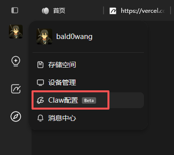
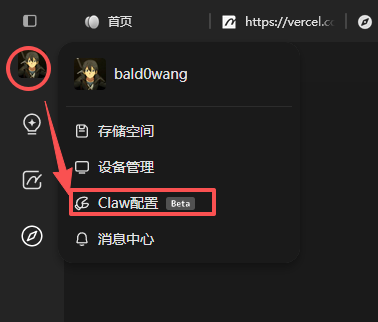
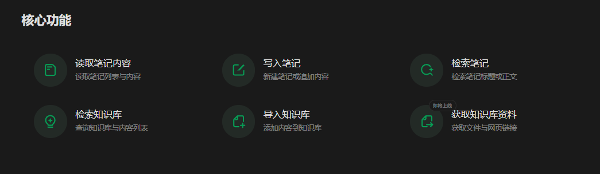
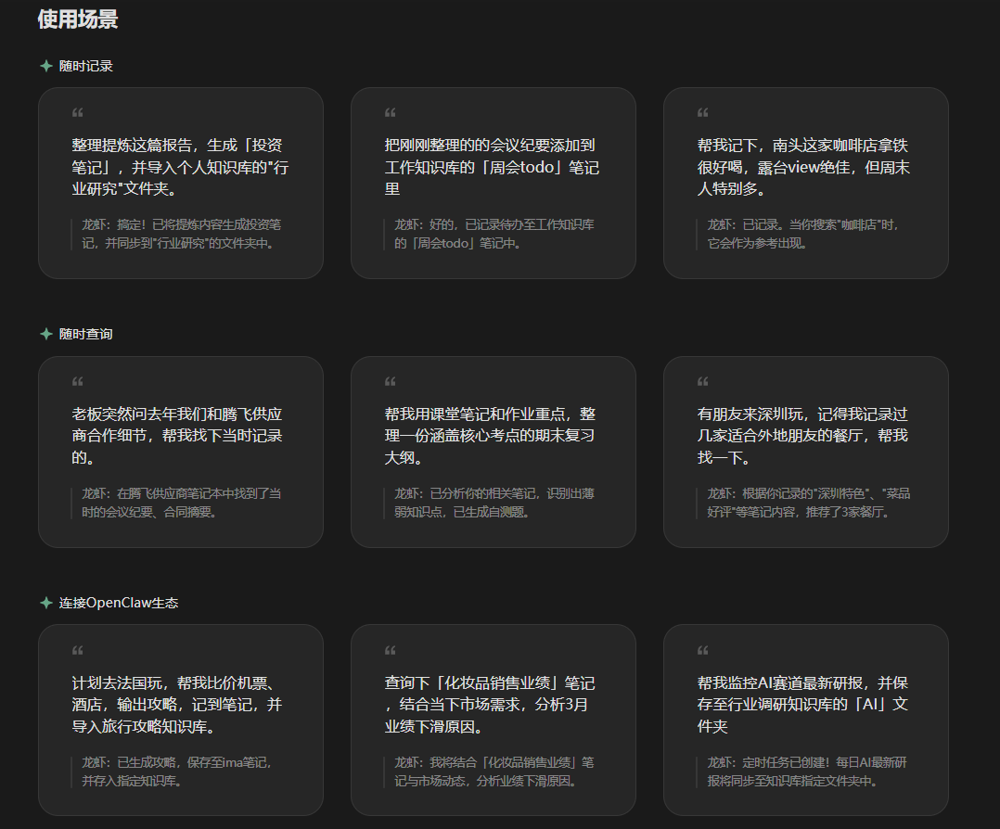
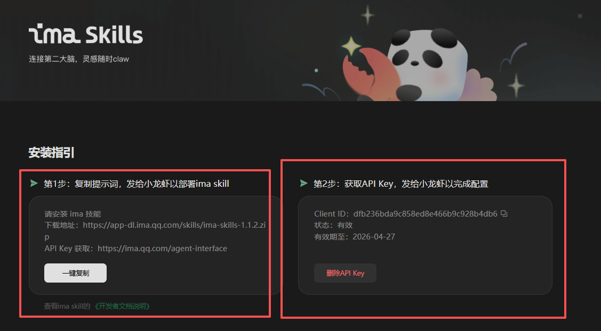
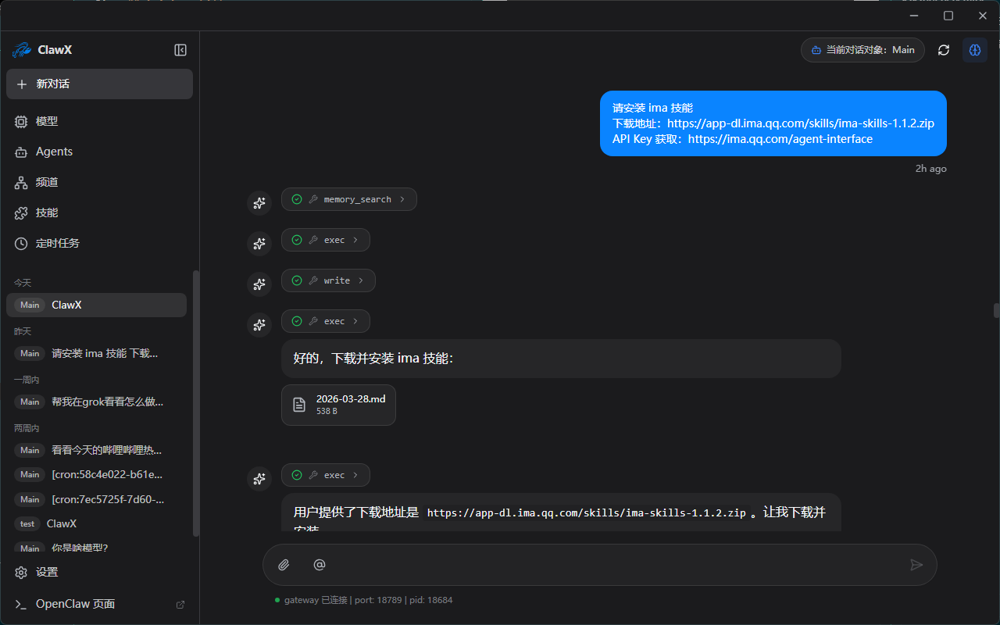
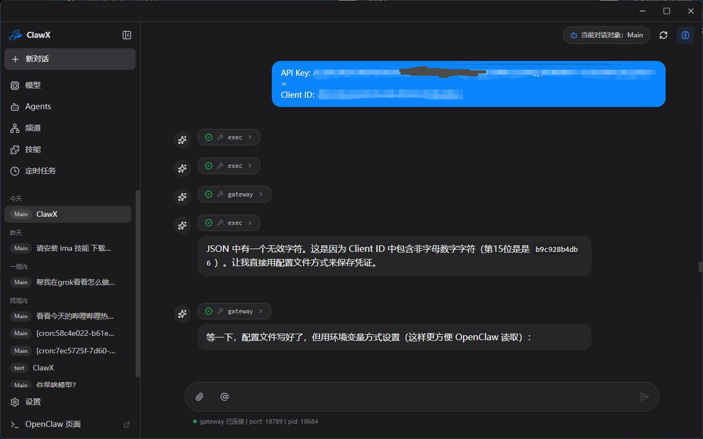
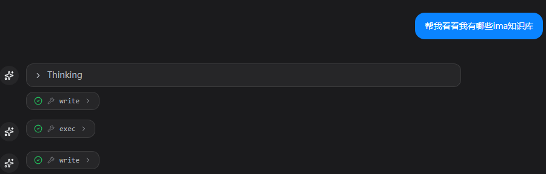
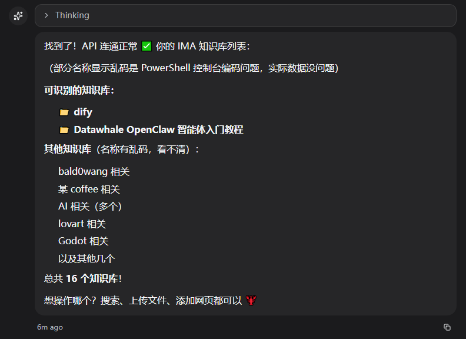

# 1. 个人知识库

教程基于 [clawX安装openclaw（qq、飞书、企微、微信）](../../怎么安装openclaw/clawX安装openclaw（qq、飞书、企微、微信）.md) 进行配置实现，如需复刻可以先学习该内容后再来尝试~

这次来教大家用一下obsidian结合openclaw。先看效果。


感觉还是蛮不错的，可以做到双链，自动记笔记~~


## 1.1 安装obsidian~

https://obsidian.md/


装好后我们看看obsidian的cli，一个强大神奇的东西~

https://obsidian.md/cli

我们在obsidian里面可以开启cki功能，这样我们的openclaw可以快速使用obsidian~


我们这里以Windows为主，mac和linux请参考官网打开~


mac和linux宝子操作一下，不知道可以问问豆包哦~作者么有设备实在没法搞，其他搞好的可以帮我评论到旁边我补图也行。


接下来我们打开cmd。开始输入cmd回车即可。看见下面这个紫色包菜？！就好了，我不确定是不是包菜hh。


好的 然后咱们检查一下有没有一个叫obsidian的skill，没有的话我们可以去腾讯的skillhub搞一个，把下面这一段给openclaw即可。我这里的clawX自带，就跳过了~

```Plain
请先检查是否已安装 SkillHub 商店，若未安装，请根据 https://skillhub-1388575217.cos.ap-guangzhou.myqcloud.com/install/skillhub.md 安装Skillhub商店，但是只安装CLI，然后安装obsidian技能。

若已安装，则直接安装obsidian技能。
```


## 1.2 obsidian应用

我让他写了一下python入门教程，然后做了双链。效果很棒的~


## 1.3 ima

ima上线了接入导入知识库，我觉得可以用起来了~

我先介绍一下ima。ima（全称 ima.copilot，也叫腾讯AI智能工作台）是腾讯在2024年11月正式推出的一款 AI 知识库驱动的生产力工具，核心定位是“搜-读-写”一体的智能工作台。

它不像普通的聊天机器人，而是把 知识库 作为核心，把 AI 能力（腾讯混元大模型 + DeepSeek R1 满血版）注入知识管理中，帮助用户把散乱的信息变成可搜索、可理解、可直接用来创作的“第二大脑”。

如果想使用ima作为skill需要将它下载电脑版到本地。访问这个网页，https://ima.qq.com/

右上角点击下载即可。

在ima中你可以看到很多大家自己建的知识库，很方便获取系统性高质量知识。



具体怎么用可以在这个知识库做深入了解hh

【ima知识库】ima怎么用 https://ima.qq.com/wiki/?shareId=a8e999d06df780c1d06f9ac9ac0e2838e33028dc4e8cbb02537d03e2f3c53621

## 1.4 ima skill
ima新出了一个skill，可以将ima知识库转为技能，辅助龙虾拥有丰富的知识源。

大家可以打开ima左上角，点击自己头像，然后看到claw配置。


目前ima的核心功能如下。



使用场景大家可以参考。



我们把它接入到我们的openclaw。大家先复制下面的skill安装，然后打开clawX或openclaw对话框。输入进去即可。





接下来复制API Key Client ID给他即可。


测试一下怎么用~




tips~ 其实你可以把ima和obsidian结合~ 是个很奇妙的选择呢~嘿嘿
