# 1. 个人知识库

教程基于 [clawX安装openclaw（qq、飞书、企微、微信）](../../怎么安装openclaw/clawX安装openclaw（qq、飞书、企微、微信）.md) 进行配置实现，如需复刻可以先学习该内容后再来尝试~

这次来教大家用一下obsidian结合openclaw。先看效果。

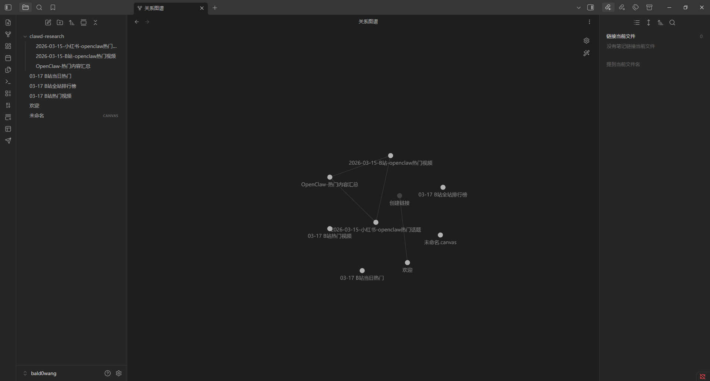

感觉还是蛮不错的，可以做到双链，自动记笔记~~

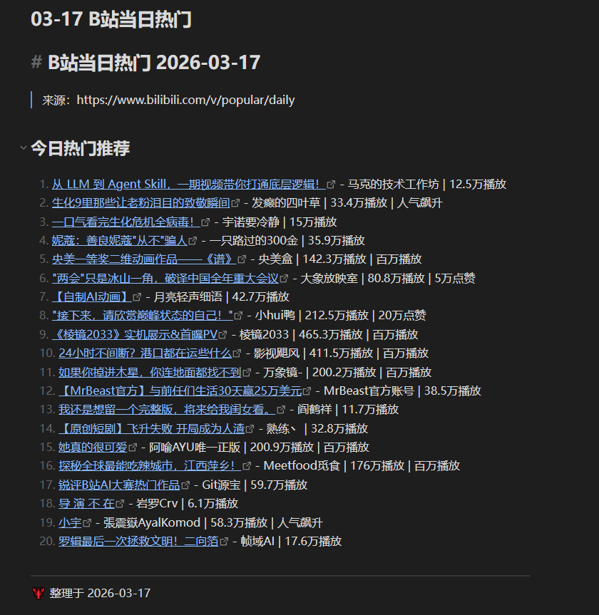

## 1.1 安装obsidian~

https://obsidian.md/

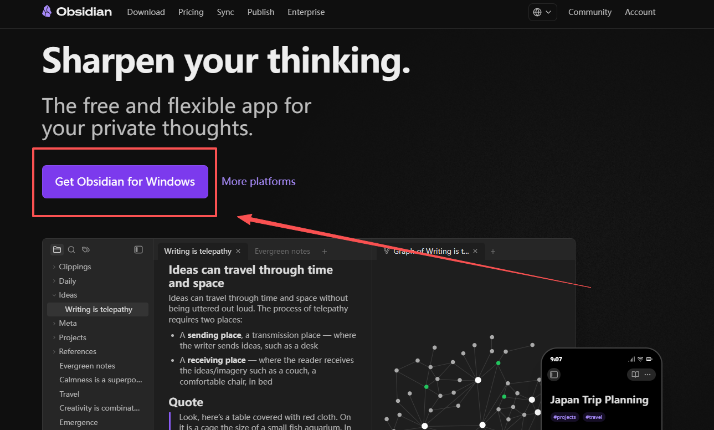

装好后我们看看obsidian的cli，一个强大神奇的东西~

https://obsidian.md/cli

我们在obsidian里面可以开启cki功能，这样我们的openclaw可以快速使用obsidian~

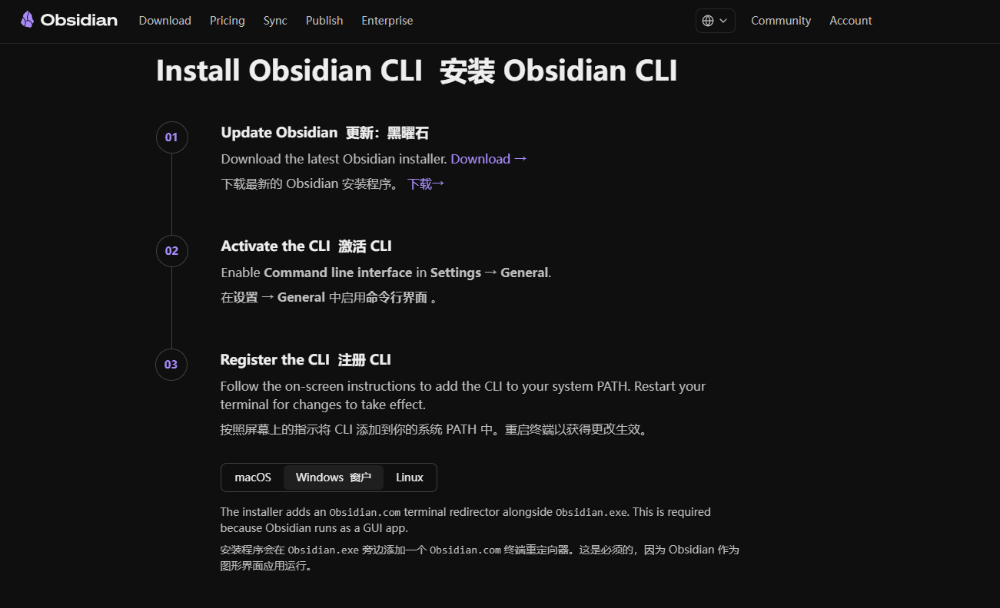

我们这里以Windows为主，mac和linux请参考官网打开~

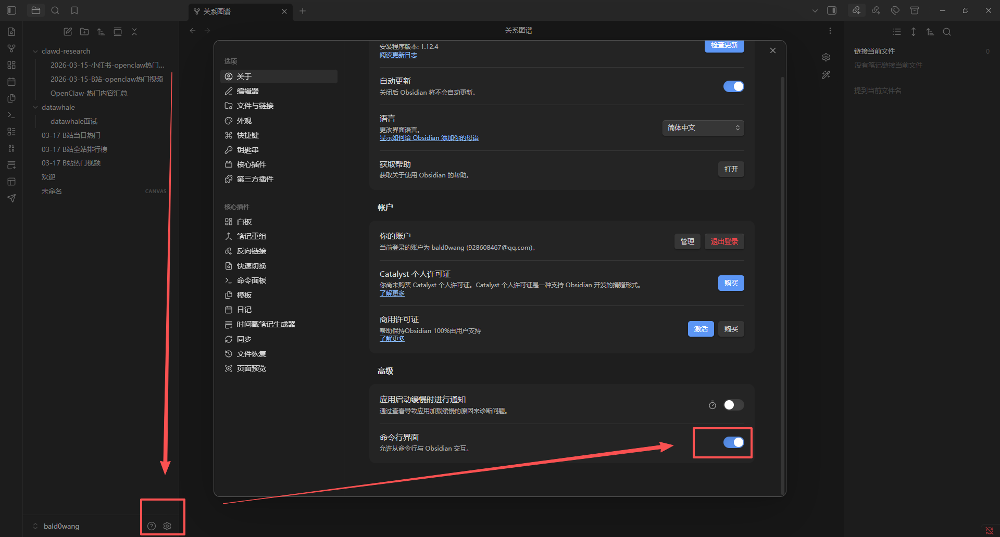

mac和linux宝子操作一下，不知道可以问问豆包哦~作者么有设备实在没法搞，其他搞好的可以帮我评论到旁边我补图也行。

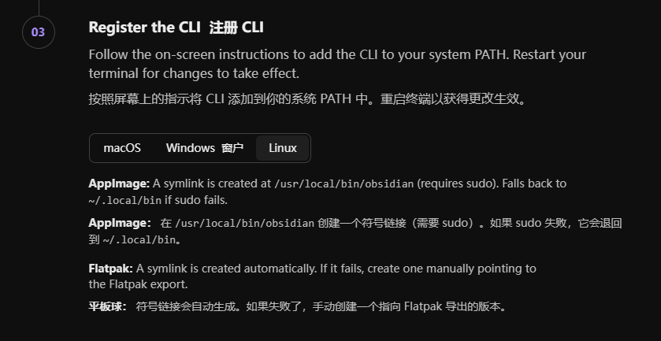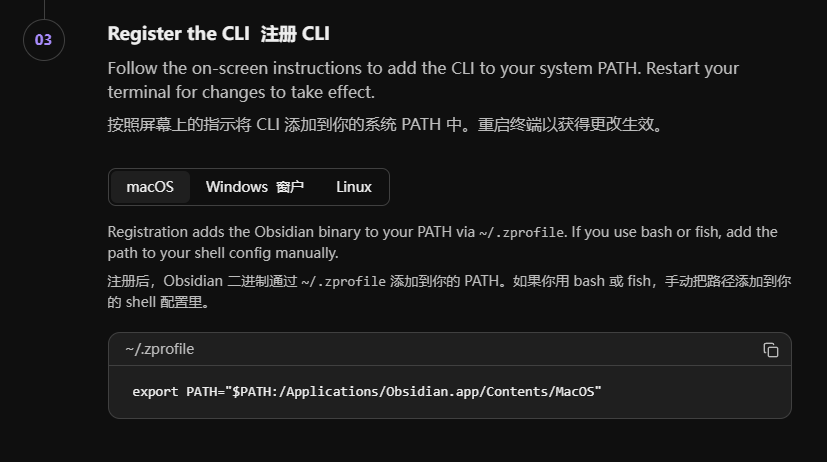

接下来我们打开cmd。开始输入cmd回车即可。看见下面这个紫色包菜？！就好了，我不确定是不是包菜hh。

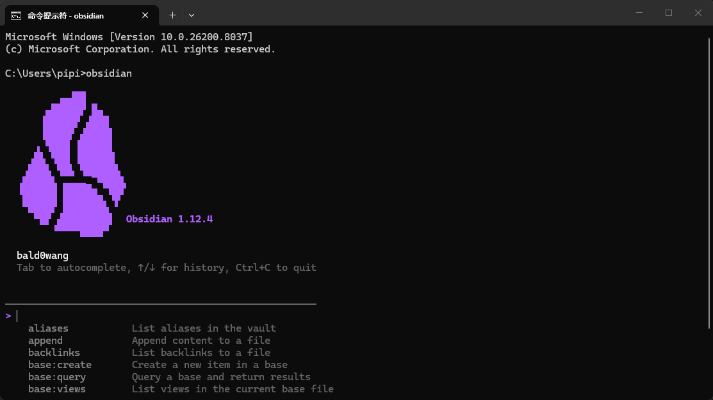

好的 然后咱们检查一下有没有一个叫obsidian的skill，没有的话我们可以去腾讯的skillhub搞一个，把下面这一段给openclaw即可。我这里的clawX自带，就跳过了~

```Plain
请先检查是否已安装 SkillHub 商店，若未安装，请根据 https://skillhub-1388575217.cos.ap-guangzhou.myqcloud.com/install/skillhub.md 安装Skillhub商店，但是只安装CLI，然后安装obsidian技能。

若已安装，则直接安装obsidian技能。
```

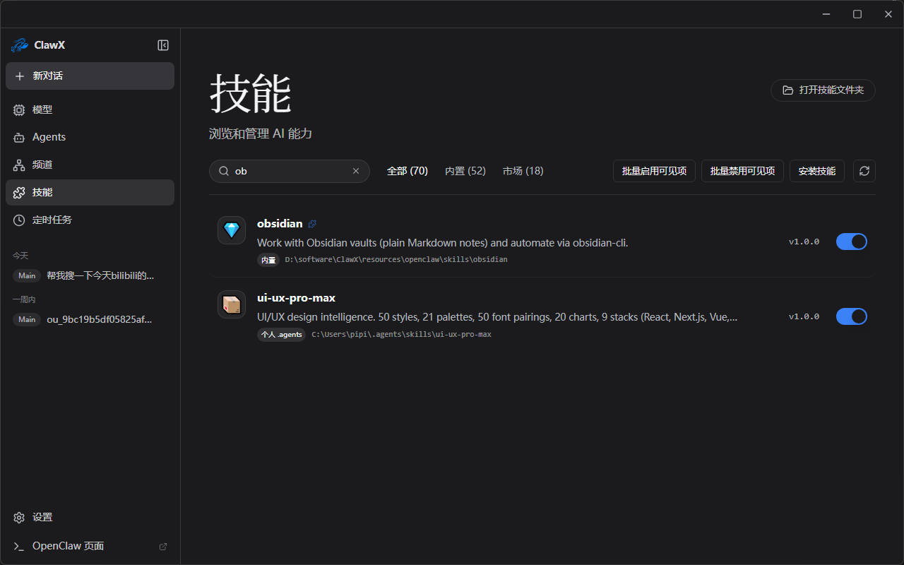

## 1.2 obsidian应用

我让他写了一下python入门教程，然后做了双链。效果很棒的~

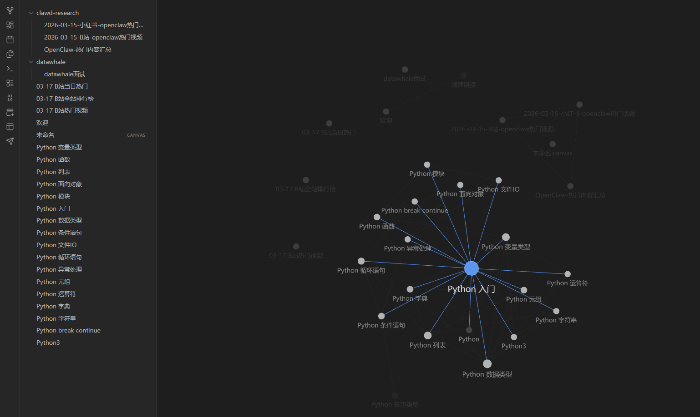

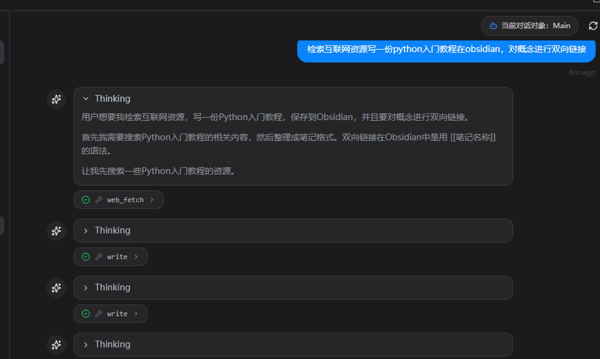

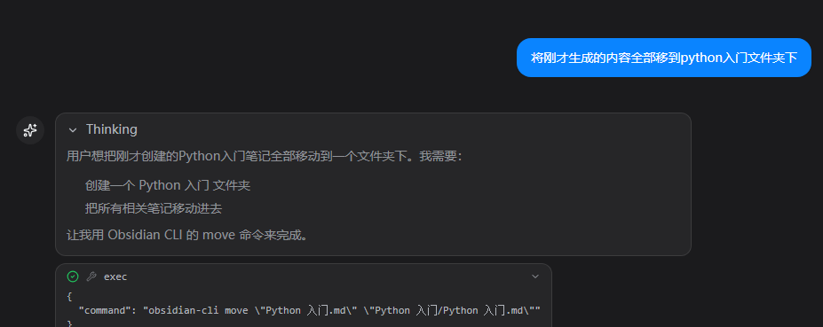

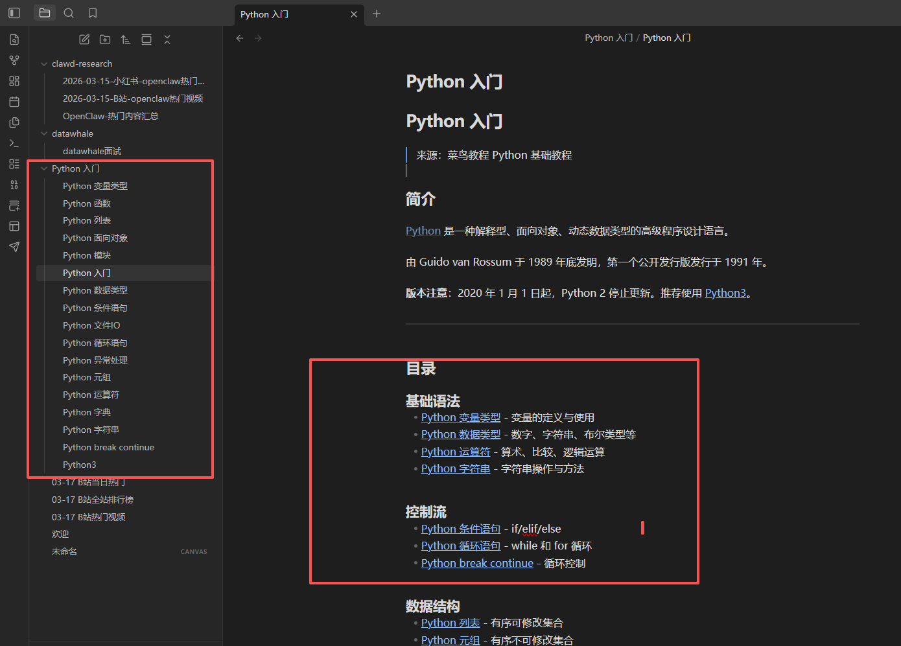

## 1.3 ima

ima目前功能不全，先搁置吧。

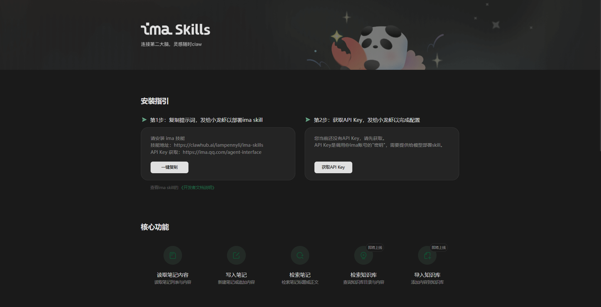

