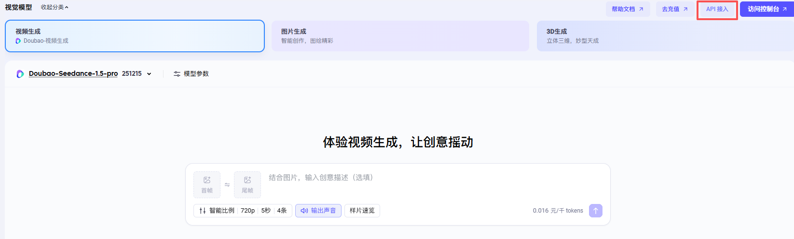
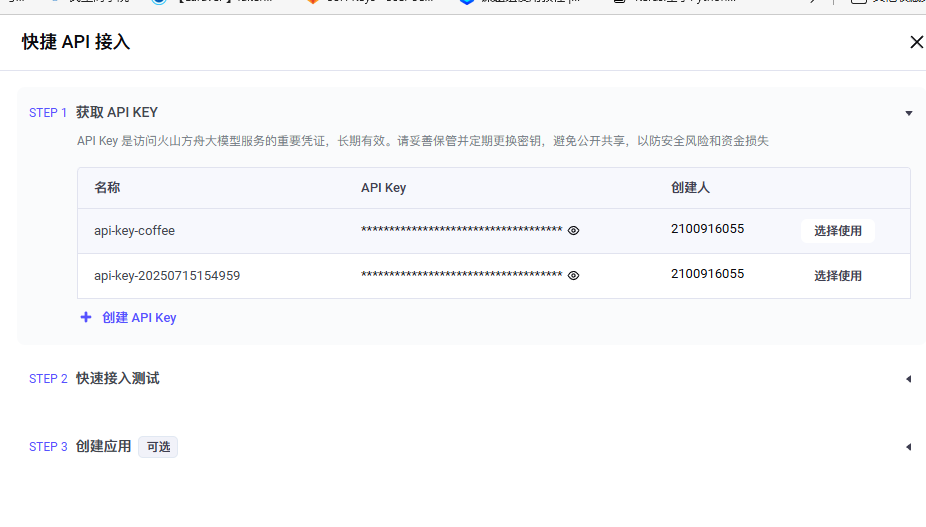
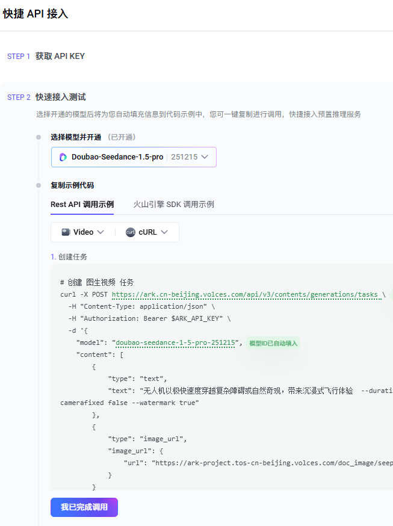
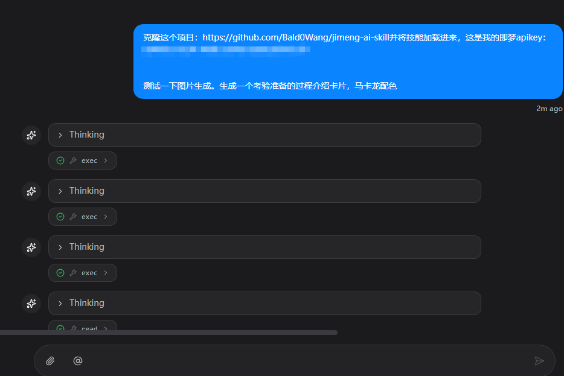
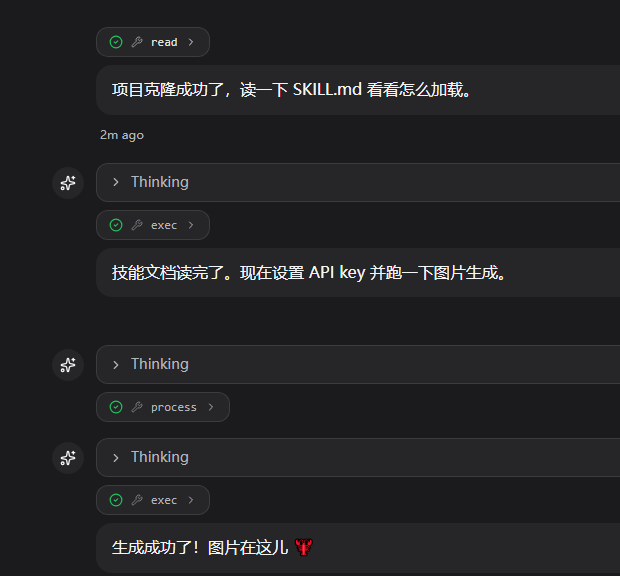
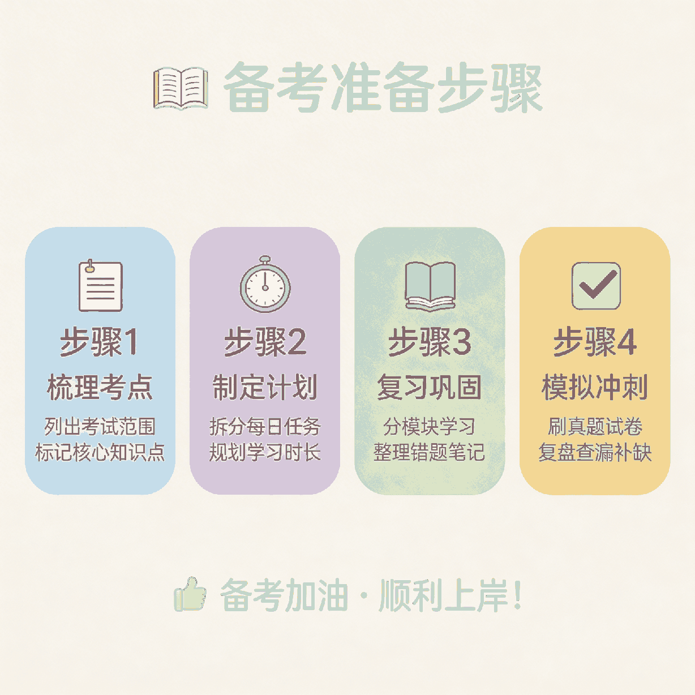

# 5. 图片、视频生成

教程基于 [clawX安装openclaw（qq、飞书、企微、微信）](../../怎么安装openclaw/clawX安装openclaw（qq、飞书、企微、微信）.md) 进行配置实现，如需复刻可以先学习该内容后再来尝试~

这里我对在clawhub中已有的一个即梦skill进行修改调整，支持即梦5.0图像模型生成图片。效果还不错。在这里分享给大家~文生视频的模型是doubao-seedance-1-5-pro-251215。而且目前俩模型对于新用户都有免费额度~可以玩一段时间。

https://exp.volcengine.com/ark/vision?mode=vision&modelId=doubao-seedream-5-0-260128&tab=GenVideo

https://exp.volcengine.com/ark/vision?mode=vision&modelId=doubao-seedance-1-5-pro-251215

大家需要到上面两个模型的位置点击api



获取apikey并接入测试，接入测试里面需要大家开通模型~



接下来拿着apikey~

```Plain
克隆这个项目：https://github.com/Bald0Wang/jimeng-ai-skill并将技能加载进来，这是我的即梦apikey：XXXXXXXXXXXXXXXXXXXXXXX

测试一下图片生成。生成一个考验准备的过程介绍卡片，马卡龙配色
```



然后测试通过搞定  现在openclaw具备了国产即梦的视频、图片生成能力！



