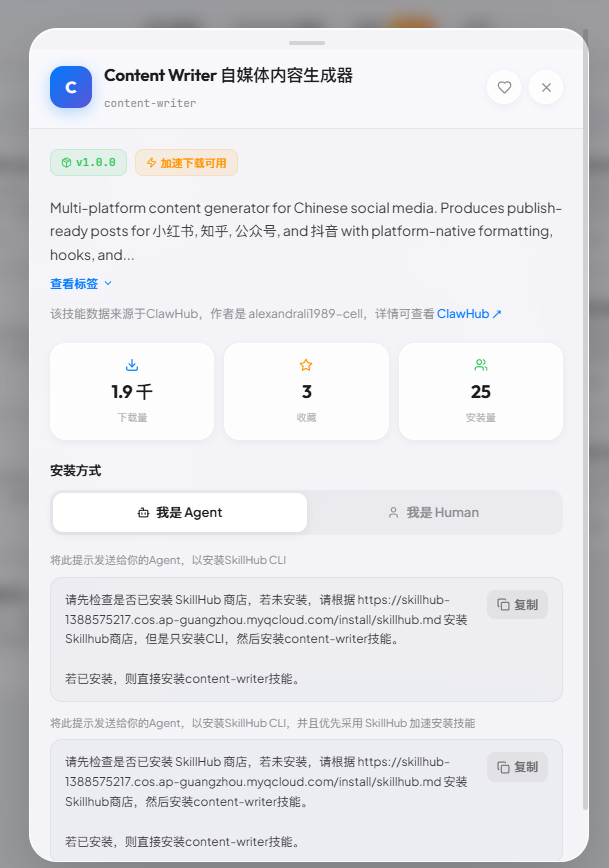
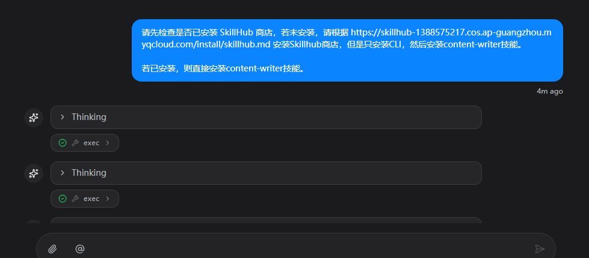
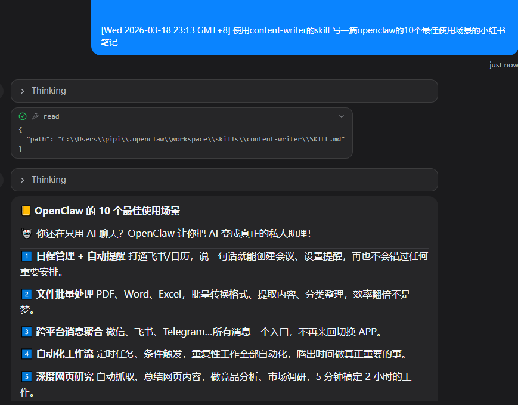

# 7. 自媒体文稿撰写

教程基于 [clawX安装openclaw（qq、飞书、企微、微信）](../../怎么安装openclaw/clawX安装openclaw（qq、飞书、企微、微信）.md) 进行配置实现，如需复刻可以先学习该内容后再来尝试~

这次我们使用【Content Writer 自媒体内容生成器】这个skill，大家可以在skillhub进行下载~

简单聊一下这个skill的用途~这个skill是一个中国社交媒体多平台内容生成器。为小红书、知乎、公众号和抖音制作适合发布的帖子，采用平台原生格式。如果你有一个话题不妨试试这个skill生成内容。



安装方式还是采取skillhub的提示，把下面内容告诉虾即可。



安装好后让他生成一篇关于openclaw的十大用法，用于发小红书。

我的提示词如下：

```Plain
使用content-writer的skill 写一篇openclaw的10个最佳使用场景的小红书笔记
```



结果：

📒 **OpenClaw 的 10 个最佳使用场景**

🤖 你还在只用 AI 聊天？OpenClaw 让你把 AI 变成真正的私人助理！

**1️⃣ 日程管理 + 自动提醒** 打通飞书/日历，说一句话就能创建会议、设置提醒，再也不会错过任何重要安排。

**2️⃣ 文件批量处理** PDF、Word、Excel，批量转换格式、提取内容、分类整理，效率翻倍不是梦。

**3️⃣ 跨平台消息聚合** 微信、飞书、Telegram…所有消息一个入口，不再来回切换 APP。

**4️⃣ 自动化工作流** 定时任务、条件触发，重复性工作全部自动化，腾出时间做真正重要的事。

**5️⃣ 深度网页研究** 自动抓取、总结网页内容，做竞品分析、市场调研，5 分钟搞定 2 小时的工作。

**6️⃣ 代码助手 + Debug** 直接在你的开发环境里运行，修 Bug、写脚本、解释代码，程序员必备。

**7️⃣ 个人信息中枢** 记忆你的偏好、习惯、待办事项，越用越懂你，比你自己还了解你的数字生活。

**8️⃣ 定时内容创作** 设定时间自动发布公众号、知乎、小红书，内容日历管理从没这么轻松过。

**9️⃣ 邮件 + 审批流** 自动分类邮件、生成回复草稿，审批流程一键处理，职场效率神器。

**🔟 跨设备协同** 手机、电脑、服务器，统一管理，你的 AI 助理无处不在。

✨ **总结：** OpenClaw 不只是聊天机器人，它是你的**第二大脑**。把杂事交给它，把时间留给自己。

💬 有没有你心动的场景？评论区告诉我 👇

Tags: #AI工具 #OpenClaw #效率提升 #职场干货 #数字生活 #自动化 #AI助理 #生产力工具 #黑科技 #效率神器

感觉还不错~ 嘿嘿  其实你接上咱们之前的图片生成skill 就是一个很好的组合

