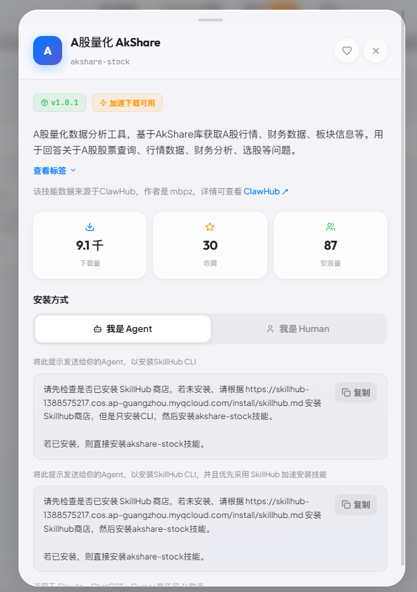
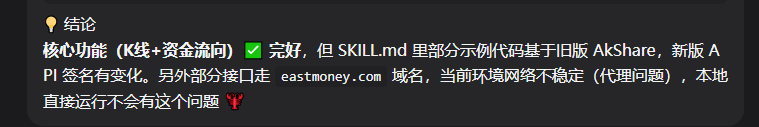
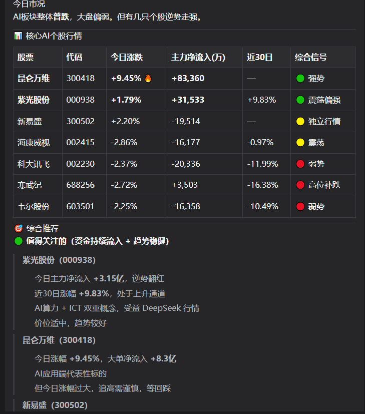
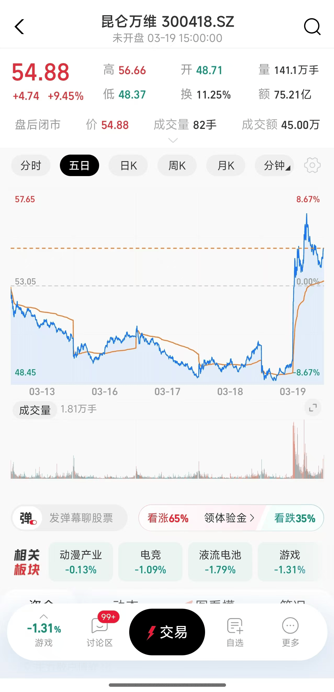
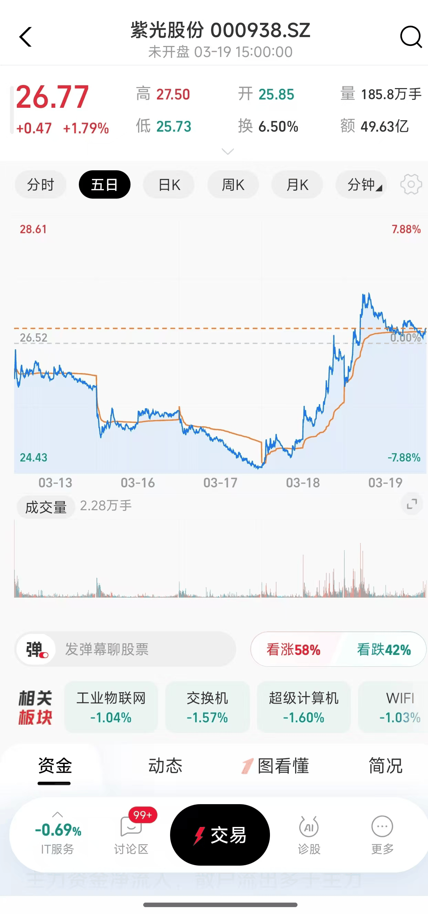

# 8. 金融助手

教程基于 [clawX安装openclaw（qq、飞书、企微、微信）](../../怎么安装openclaw/clawX安装openclaw（qq、飞书、企微、微信）.md) 进行配置实现，如需复刻可以先学习该内容后再来尝试~


因为我们是大A，所以这里以大A为引哈哈哈哈哈哈（狗头）

依旧skillhub，哈哈哈哈哈

```Plain
请先检查是否已安装 SkillHub 商店，若未安装，请根据 https://skillhub-1388575217.cos.ap-guangzhou.myqcloud.com/install/skillhub.md 安装Skillhub商店，但是只安装CLI，然后安装akshare-stock技能。

若已安装，则直接安装akshare-stock技能。
```



我们看看这个技能能干嘛~

主要可以做：实时行情查询、历史K线数据、财务数据、板块/行业分析、资金流向、龙虎榜、新股/IPO、融资融券。

这里我模拟一个场景来测试。

我在安装时虾遇到了这个问题，请大家注意：



开始测试：

```Plain
使用skill看看ai版块走势，然后看看最近有潜力的股票帮我推荐
```

效果如下。



对照手机看看昆仑万维和紫光股份情况：



