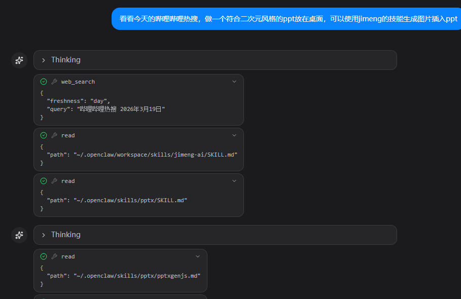
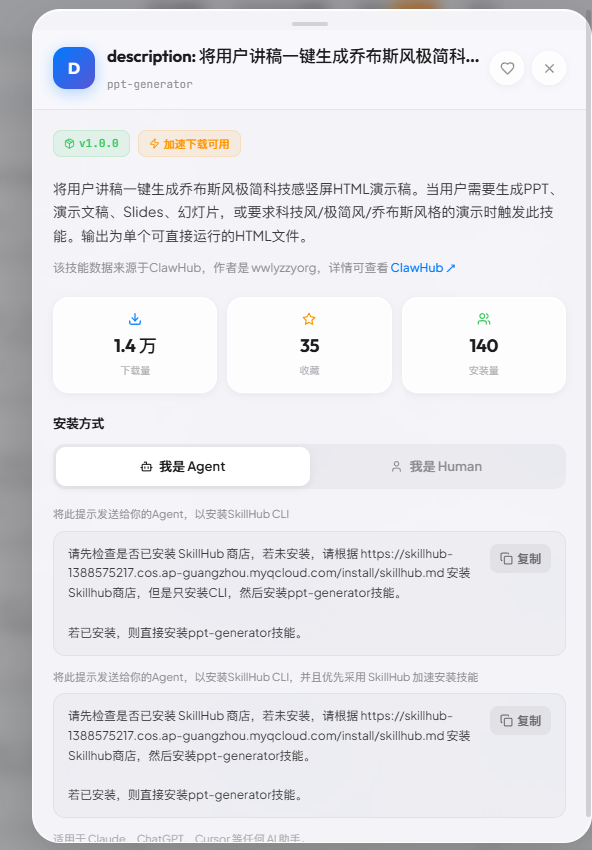
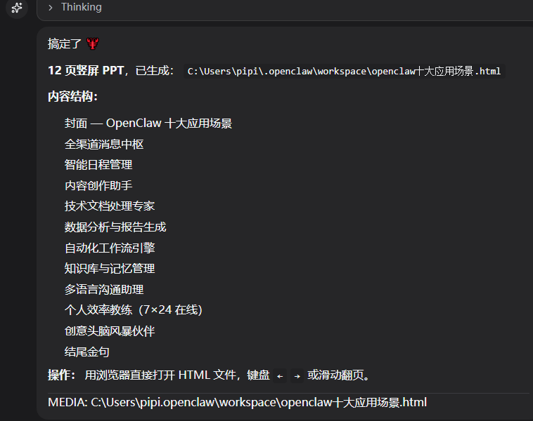
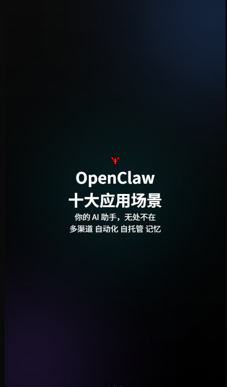
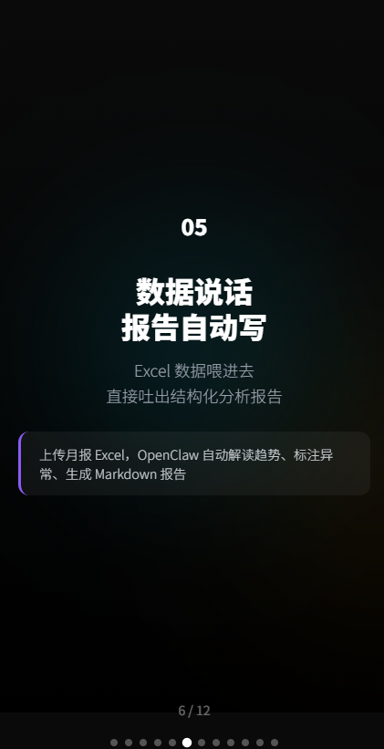
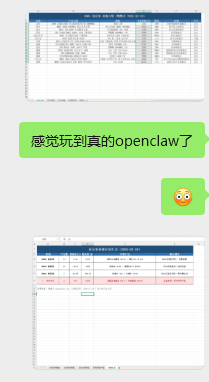
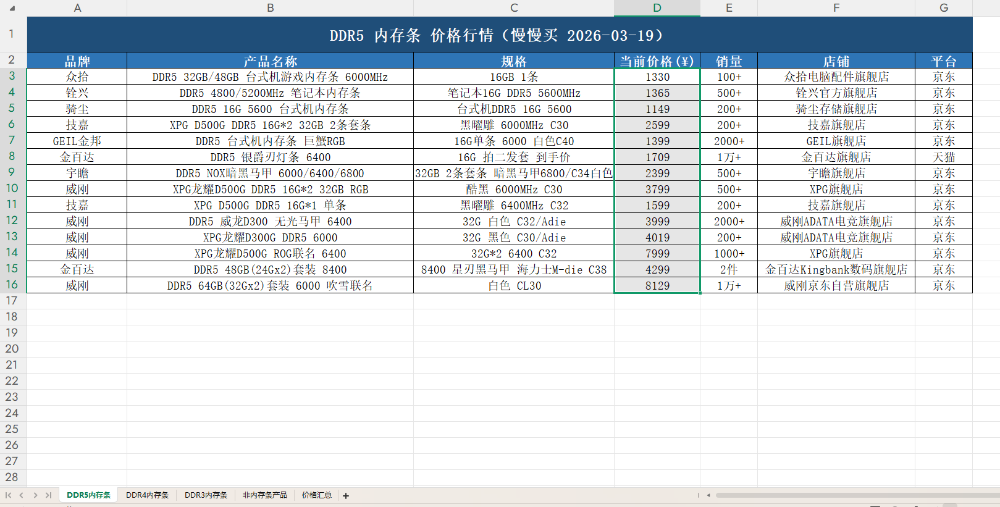
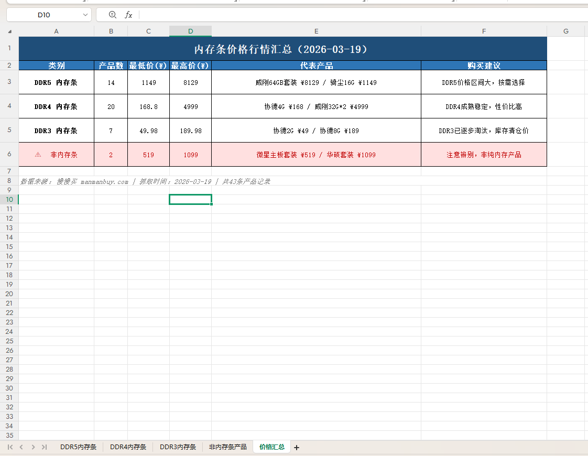

# 11. 文件分析和生成（PDF/word/PPT/excel）

教程基于 [clawX安装openclaw（qq、飞书、企微、微信）](../../怎么安装openclaw/clawX安装openclaw（qq、飞书、企微、微信）.md) 进行配置实现，如需复刻可以先学习该内容后再来尝试~

下面这个技能包是pdf、word、ppt、excel的技能包，你可以丢给虾然后让他安装这四个技能即可。这个技能包貌似是clawx自带的？忘记哪里来的了。😂

暂时无法在飞书文档外展示此内容

## 11.1 PPT

这种ppt有两种生成思路，一个是生成html，一个是使用api等工具生成ppt。

#### ppt直出范式

大家打开技能包，让虾装好pptx的技能。这里的核心是用了pptxgenjs 这个npm库，简单了解知道pptxgenjs 库是一个非常流行的纯 JavaScript 库，用于**程序化生成 PowerPoint (.pptx) 文件**。它可以在**浏览器端**、**Node.js**、**React/Vite/Angular**、**Electron** 等各种 JavaScript 环境中运行，无需安装 PowerPoint 软件或 Office 授权。

官网地址（强烈推荐）： https://gitbrent.github.io/PptxGenJS/

GitHub 仓库： https://github.com/gitbrent/PptxGenJS （star 数目前已超 4.7k+，npm 下载量很高）

我们来试试看~只需要简单的配方：

```Plain
看看今天的哔哩哔哩热搜，做一个符合二次元风格的ppt放在桌面，可以使用jimeng的技能生成图片插入ppt
```

芜湖效果蛮不错的 



暂时无法在飞书文档外展示此内容

#### html生成范式

我们这次介绍一个生成html的方式。这次我们使用了skillhub的ppt-generate这个skill。



安装方式就是和虾发一下下面的内容

```Plain
请先检查是否已安装 SkillHub 商店，若未安装，请根据 https://skillhub-1388575217.cos.ap-guangzhou.myqcloud.com/install/skillhub.md 安装Skillhub商店，但是只安装CLI，然后安装ppt-generator技能。

若已安装，则直接安装ppt-generator技能。
```

接下来我们测试一下~

```Plain
ppt-generator生成一个介绍openclaw十大应用场景的ppt
```



下面是挑的几张样图，其实在手机端看还行。



完整文件如下（手动调调应该也能做16:9及其他配色风格）：

暂时无法在飞书文档外展示此内容

## 11.2 excel处理



玩的时候还是感觉挺离谱的，感觉是玩到真的openclaw了！哈哈！

今天来教会大家怎么玩。

大家在技能包里取出xlsx的技能。然后只需要简单的配方：

```Plain
帮我在慢慢买上看看内存条的价格 记录在excel内 并且区分好非内存条产品 标明是ddr几代
```

注意哦 这里需要在慢慢买上登录一下。

> 慢慢买是一个比价网页，也是今天虾教我用的，大家可以搜搜看想了解的商品。


我就得到了最开始上图的结果。我震惊，这才是数据分析吧哈哈哈哈。

好用的朴实无华。

暂时无法在飞书文档外展示此内容

word、pdf相对简单，大家参考操作一下便是。

