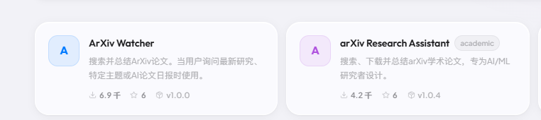
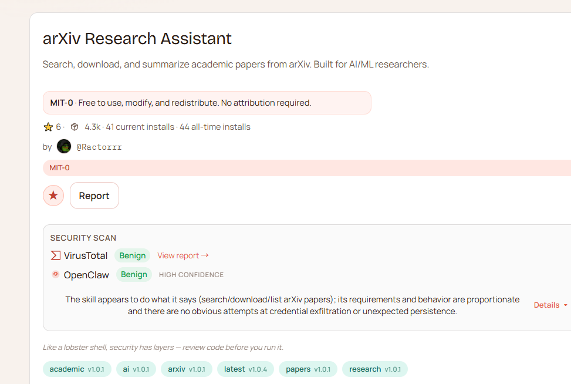
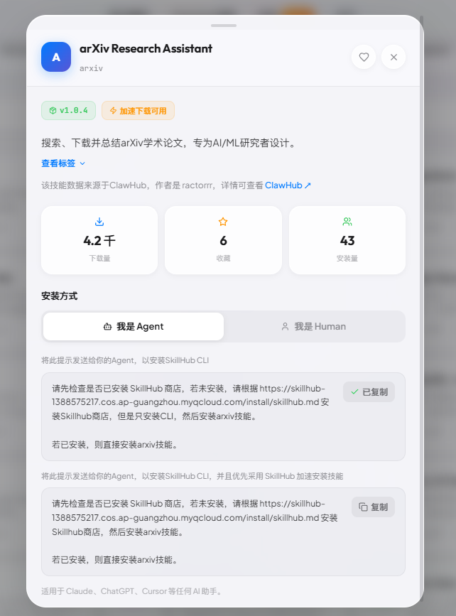
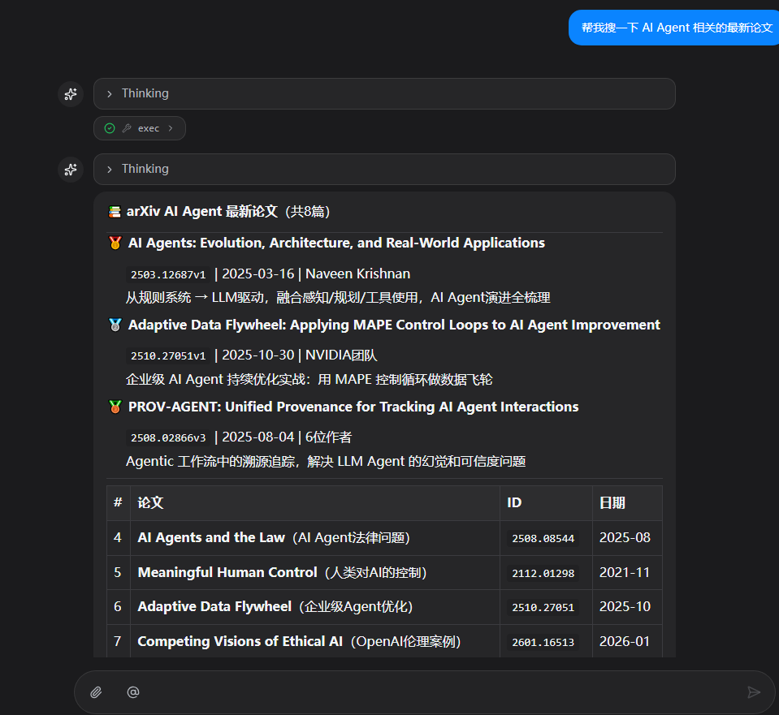
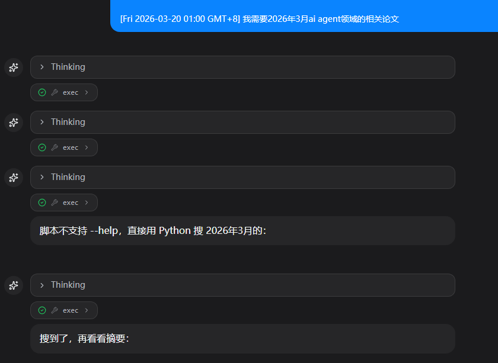
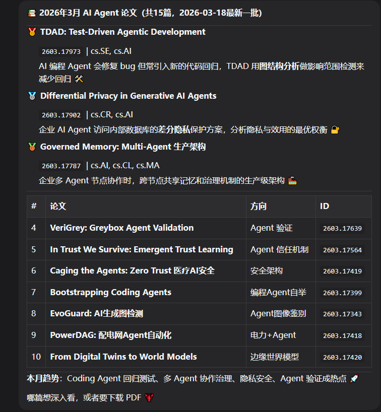
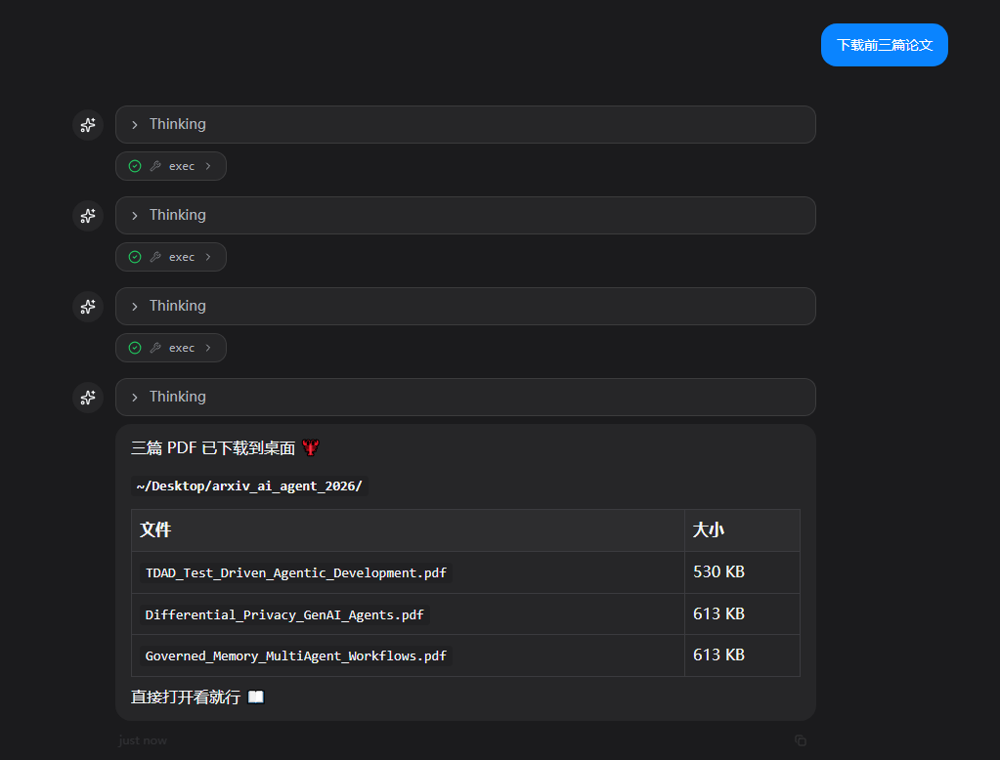
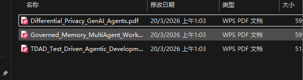
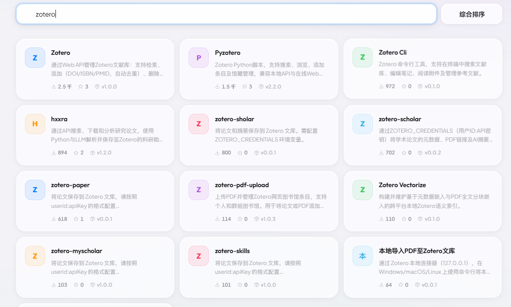

# 15. 论文科研

教程基于 [clawX安装openclaw（qq、飞书、企微、微信）](../../怎么安装openclaw/clawX安装openclaw（qq、飞书、企微、微信）.md) 进行配置实现，如需复刻可以先学习该内容后再来尝试~

搞科研的朋友一般看论文渠道有很多，最聚焦的应该就是arXiv 。从arXiv 入手~这里我们还是打开skillhub，下面两个都推荐大家体验。这里大家看看arXiv Research Assistant



用法依旧~

```Plain
请先检查是否已安装 SkillHub 商店，若未安装，请根据 https://skillhub-1388575217.cos.ap-guangzhou.myqcloud.com/install/skillhub.md 安装Skillhub商店，但是只安装CLI，然后安装arxiv技能。

若已安装，则直接安装arxiv技能。
```



ok，不过好像也有奇怪的东西进来了hh



感觉这里对时间约束一下，效果好点。之前也这样。问一下出来个21年的。







（其实这里加一下ima导入也是很香，做到obsidian也很好）



ok，从查看到下载一条龙搞定。下面再给大家指条路，继续深入研究吧~



