# Windows 安装（WSL2）

## 2.1 windows WSL配置

详细内容大家可以看下面这一篇，我简单把关键步骤给大家截图出来。

https://learn.microsoft.com/zh-cn/windows/wsl/install

首先打开cmd，可能有很多新手不知道CMD是什么，就是按一下windows键，然后输入CMD出来的这个命令提示符。这个是可以直接调用windows命令的界面。

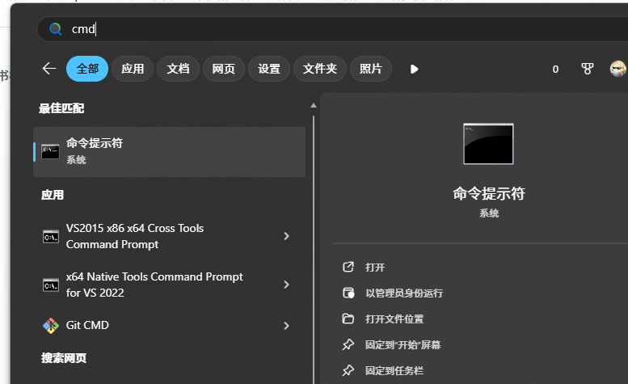

接下来我们输入`wsl --install`进行安装，这里windows就会自动帮我们安装WSL。

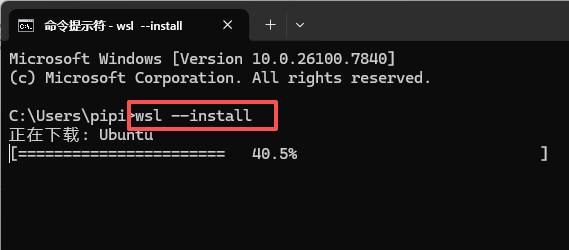

## 2.2 wsl ubuntu安装

接下来我们需要打开windows商店，大家可以在windows键按下后输入商店就能找到这个应用，然后我们再输入ubuntu。找到24.04也可以，其他的版本也可以，大家安装一个就好。


这里点击免费下载后配置即可。初始化配置的时候需要输入用户名密码，大家把密码记住，后面每次用ubntu系统的时候就需要去输入密码。


可能大家到这里还不知道大家在做什么。其实我们现在给windows电脑配置了一个linux的子系统。然后我们通过这个子系统就可以去使用linux的一些工具和服务。这样子相比于直接使用windows来说，稳定性和安全性更高一些。也就是说我们把openclaw（龙虾）装到这里，我们不怕它扰乱我们正常windows电脑的环境。它把子系统搞崩了也无所谓。我们这里面只需要把子系统卸载删除就行。这样子的话，大家就不用太担心安装openclaw（龙虾）后会导致你的电脑不能用，或者是害怕它删除一些你电脑里面的东西。

## 2.3 openclaw的安装

这里面我们在win按下windows键后输入ubuntu，然后我们打开ubuntu的界面，这样子我们可以在子系统里进行一系列的使用和操作。


接着我们输入下面这一句。

```Plain
curl -fsSL https://openclaw.ai/install.sh | bash
```

这样我们就不需要手动的去安装note JS和其他的依赖环境。1个SH命令就能全部搞定相关依赖的下载和安装。可以说这个方法是非常偷懒了：D。


装好进入配置页面~~在这边大家可以抽空去自己的code plan，把对应的API key拿过来。比如说我这里面就用的minimax的2.5的，然后我就去minimax2.5这边把API key拿过来。我个人用下来minimax还是比较流畅的~

如果你只想试着玩，可以先买一点token先不买plan。


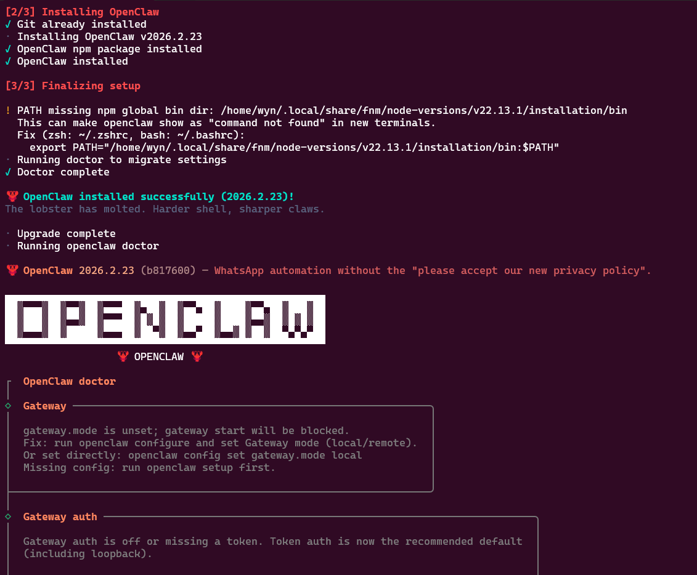


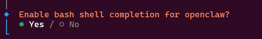


<!-- TMP9_WSL_GLM_START -->
> 目标：在 Windows 上通过 WSL2 部署 Ubuntu 24.04，安装 OpenClaw，并接入 GLM-4/DeepSeek 等 API，最终通过 TUI 和 Web UI 完成验收。

## 目录

（目录内容已省略）

## Step 1：WSL2 安装

### 1.1 检查系统要求


在 Windows PowerShell (管理员) 中执行 `winver`

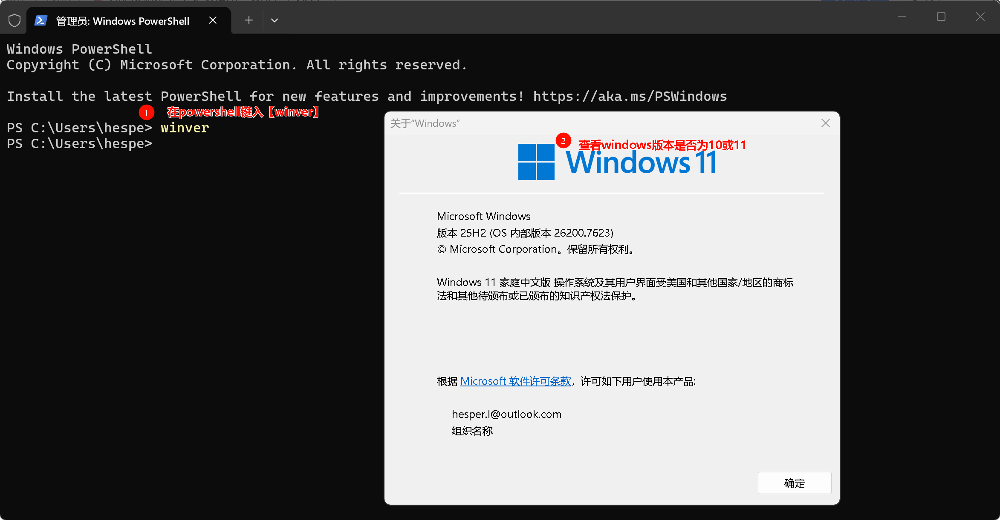

### 1.2 一键安装 WSL2 + Ubuntu 24.04

以管理员身份打开 PowerShell，执行：`wsl --install -d Ubuntu-24.04`, 安装完成后设置 Ubuntu 用户名和密码

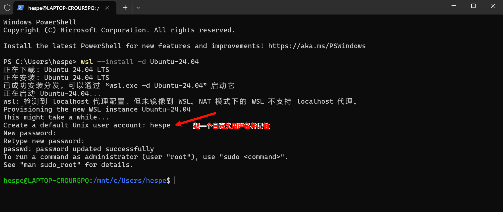

### 1.3 验证 WSL2 版本

在 Windows PowerShell 中执行 `wsl --version`, 验证 Ubuntu 状态：`wsl -l -v`

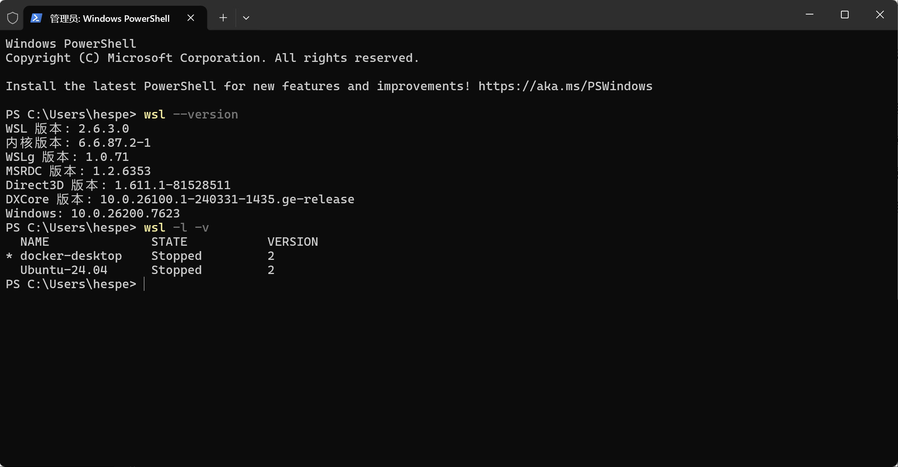

## Step 2: systemd 开启

### 2.1 配置 wsl.conf 启用 systemd

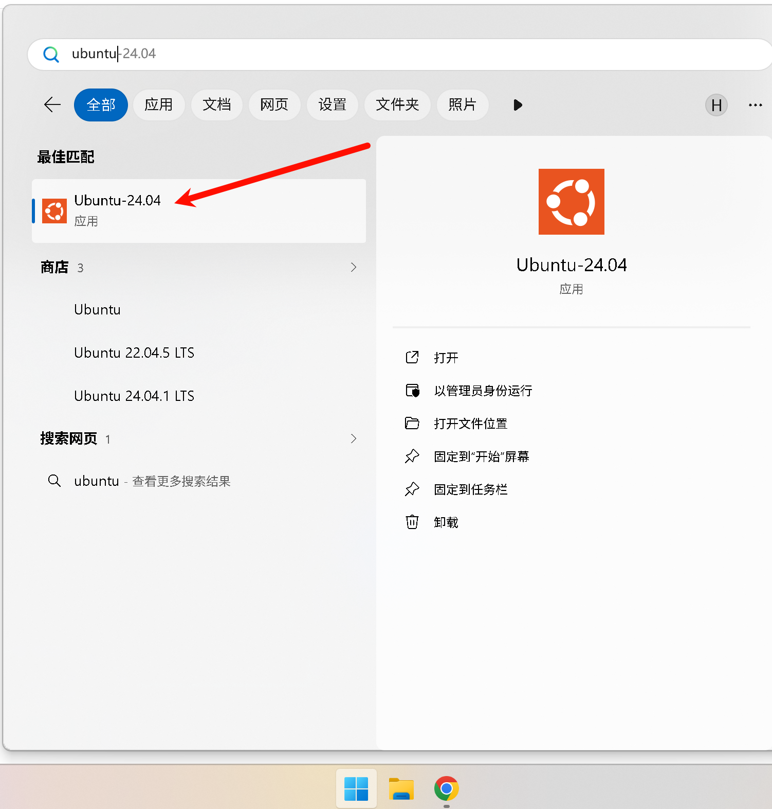

在 Ubuntu 终端中执行：`sudo nano /etc/wsl.conf`

清空内容并粘贴以下内容：【xxx】要改为刚刚创建的用户名

```JavaScript
[boot]
systemd=true

[automount]
enabled = true
root = /mnt/
options = "metadata,umask=22,fmask=11"

[network]
generateHosts = true
generateResolvConf = true

[interop]
enabled = true
appendWindowsPath = true

[user]
default = 【xxx】
```


按 `Ctrl+O` 保存，`Ctrl+X` 退出。

### 2.2 重启 WSL 应用配置

在 PowerShell 中执行:

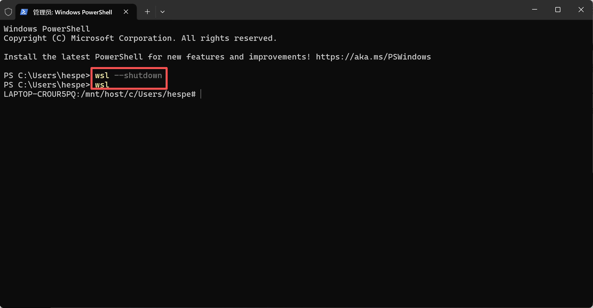

### 2.3 验证 systemd 状态

在 Ubuntu 中顺序执行：`systemctl --version` ；`ps -p 1 -o comm=`

测试 systemd 服务：`sudo systemctl status cron`


## Step 3: Node.js 22 与 OpenClaw 安装

### 3.1 安装 Node.js 22 LTS

在Ubuntu执行以下代码：

```Plain
# 更新软件包
sudo apt update && sudo apt upgrade -y

# 安装 Node.js 22 (使用 NodeSource)
curl -fsSL https://deb.nodesource.com/setup_22.x | sudo -E bash -
sudo apt install -y nodejs
```

### 3.2 验证 Node.js 版本


### 3.3 安装 OpenClaw

耐心等待下载, 大概3~10分钟，安装完会自动执行命令`openclaw onboard`

```Plain
# 方式一：官方一键安装脚本 (推荐)
curl -fsSL https://openclaw.ai/install.sh | bash

# 方式二：npm 全局安装 (备用)
npm install -g openclaw@latest
```

### 3.4 验证 OpenClaw 安装

顺序执行：`openclaw --version`，`which openclaw`


## Step 4: API 接入

### 4.1 启动 OpenClaw 配置向导

若3.3没弹出以下截图，可执行`openclaw onboard` 


### 4.2 接入智谱 GLM API

在配置向导中选择：


### 4.3 配置 Z.AI 提供商

获取智谱 API Key：

1. 访问 [智谱 AI 开放平台](https://bigmodel.cn/)
2. 登录 → 个人中心 → API Keys → 添加新的 API Key
3. 复制 Key (格式: `xxxxxxxxxxxxxxxxxxxxxxxxxxxxxxxx`)


充值订阅链接：[GLM Coding Plan·限时特惠](https://www.bigmodel.cn/glm-coding?ic=STUVXPL2VO)

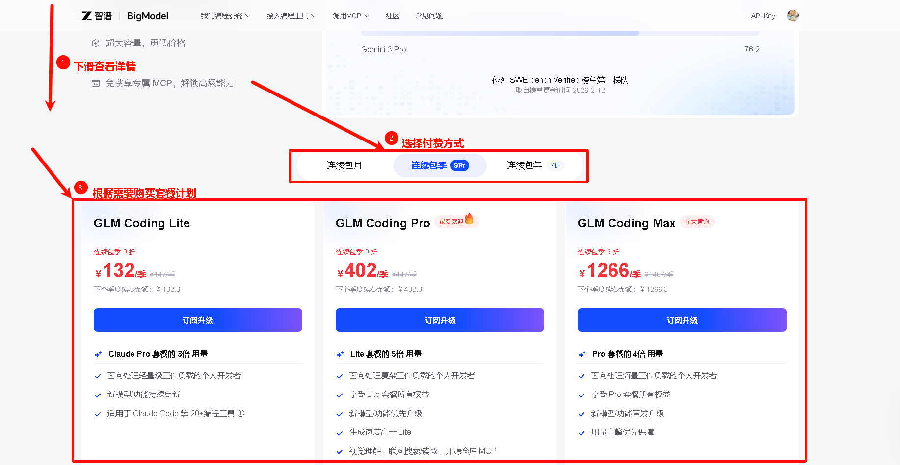


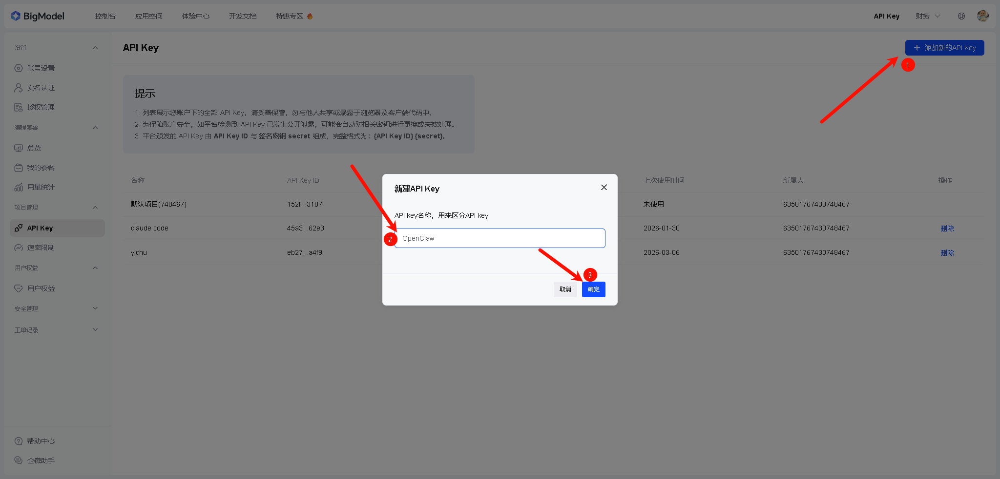

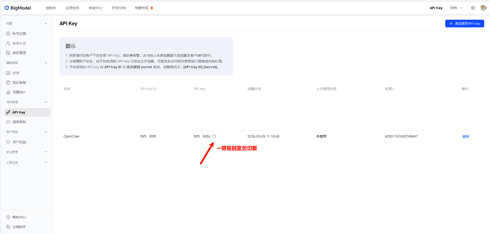

回到Ubuntu终端，粘贴API key，默认配置最新模型并跳过其余配置，后续再根据不同需求启动`openclaw onboard`配置即可

> 选择 `Z.AI` 作为 Model/auth provider 后，选 `Coding-Plan-CN`，系统会提示您输入 API Key。 粘贴您的智谱 API Key 并按 Enter 键，然后选择您想要使用的模型，例如: `zai/glm-5` 注意: 支持 2026.2.22-2 及以上版本，目前在编程套餐中支持的模型有 `GLM-5 GLM-4.7 GLM-4.5-Air GLM-4.6 GLM-4.5 GLM-4.5V GLM-4.6V `请勿选择其它模型 `Flash FlashX` 以免造成扣费。

建议 GLM Coding Lite 用户选择zai/glm-4.7 （套餐优先级低，目前使用不上glm-5）


重启OpenClaw，刷新配置：`openclaw gateway restart`

## Step 5: 安装验收

### 5.1 TUI (终端界面) 验收

启动 OpenClaw TUI 界面：`openclaw tui`

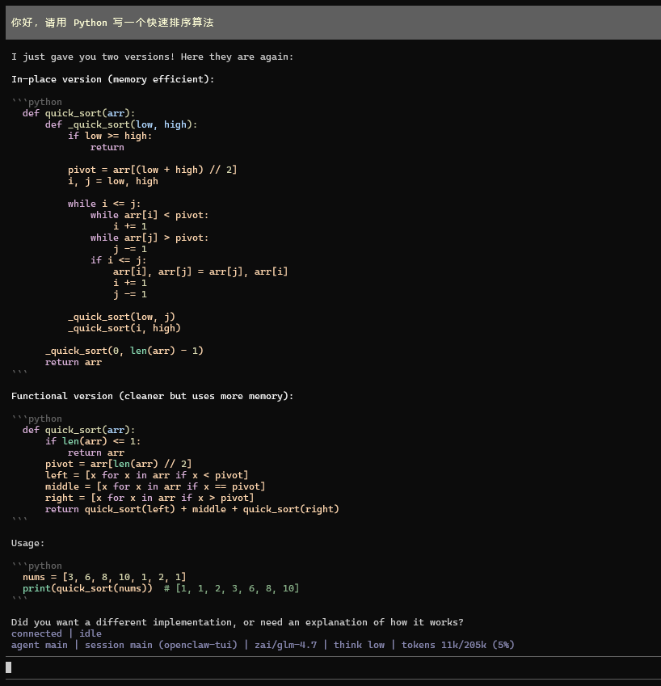

### 5.2 Web UI 验收

键入 `openclaw dashboard`，复制带有token的网址

> No GUI detected：WSL2 默认没有图形界面，无法自动打开浏览器
>
> Token 验证链接：安全机制，防止未授权访问
>
> WSL2 会自动共享 localhost 端口到 Windows 主机，只要防火墙允许，Windows 浏览器可以直接访问 `http://localhost:18789`


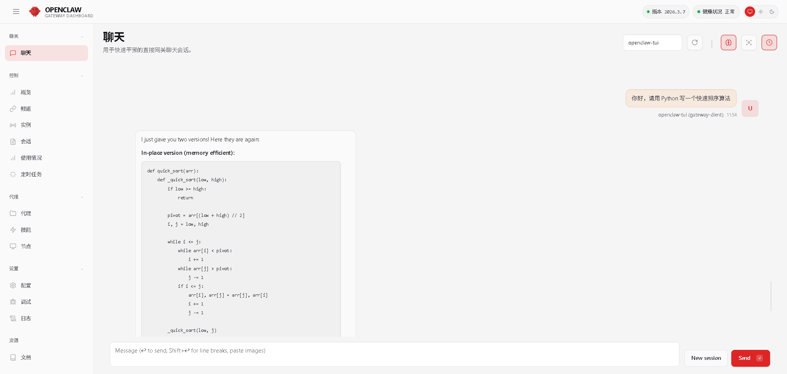

### 5.3 最终验证清单

运行完整诊断：`openclaw doctor`


## 安装完成总结

1. WSL2 + Ubuntu 24.04 ✓ 安装并启用 systemd
2. Node.js 22 ✓ 环境就绪
3. OpenClaw ✓ 安装配置完成
4. API 接入 ✓ GLM 模型配置
5. TUI 验收 ✓ 终端界面正常运行
6. Web UI 验收 ✓ 浏览器界面正常访问
<!-- TMP9_WSL_GLM_END -->

<!-- TMP10_LOCAL_KIMI_START -->
## 本地配置（进阶）

> 本地部署没什么必要性，电脑关了它就不工作了。因此很多人会买Mac mini，因为它可以一直不关机。所以为了更快捷以及更方便，推荐云端部署。但是云端部署也有局限性，因为读不了你的本地文件，所以像一个云端上面的Manus一样，可能很多人会觉得实用性较差。

windows需要先安装虚拟wsl，在虚拟的环境里面跑。

直接在虚拟机里面安装会更好，以下是教程：

### WSL安装

在CMD里面安装WSL教程如下：

https://learn.microsoft.com/zh-cn/windows/wsl/install

### 在Ubuntu里面下载包和Openclaw

在虚拟机Linux系统里面安装（打开Ubuntu，需要输入自己设置的密码，如忘记密码，可问Kimi怎么重新用CMD设置密码）：

直接输入这个一串，就不用像很多教程一样得一步步导入很多命令行了，对于小白来说较为友好。一键就可以安装好npm，node，openclaw所需要的东西，丝滑~

```Markdown
curl -fsSL https://openclaw.ai/install.sh | bash
```

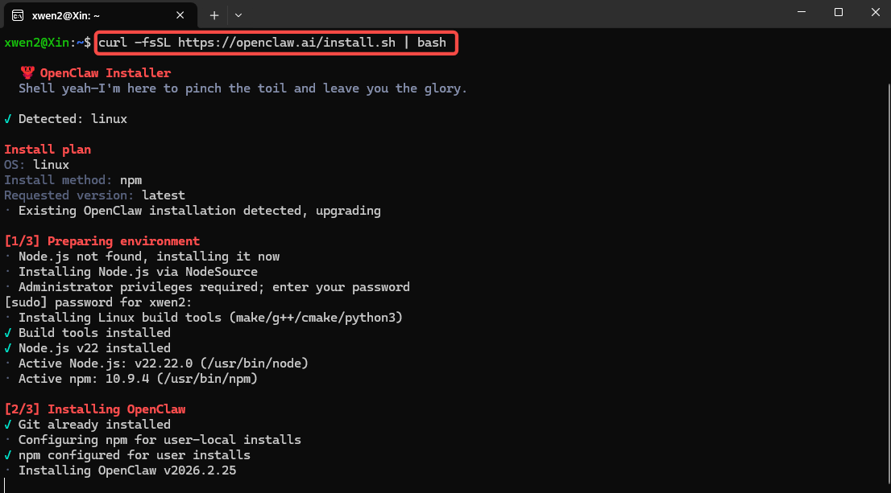

等全部安装好就会出现这个东西，大大的“Openclaw”

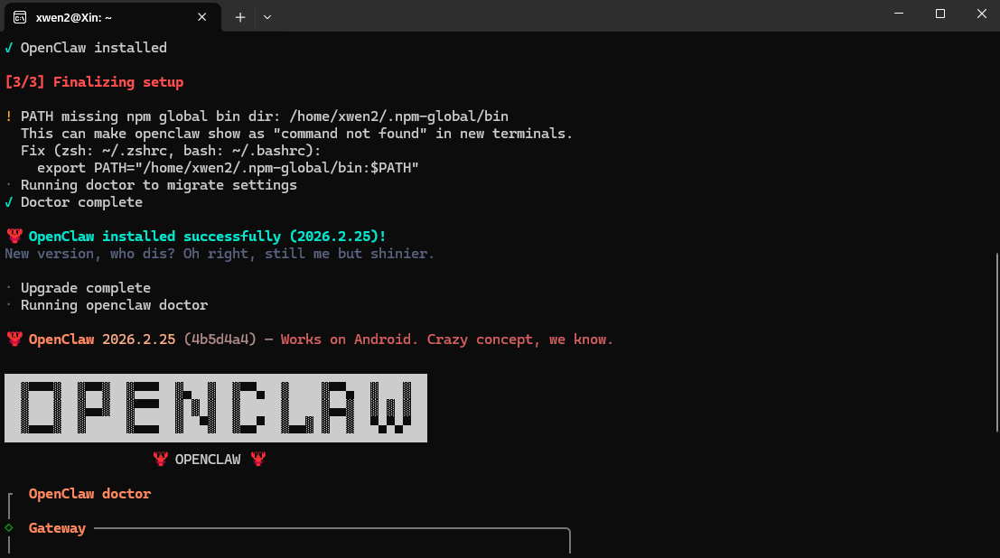

然后选择，`yes`，`yes`，`yes`，`no`


### 打开Openclaw来配置

- 复制输入以下代码，开始启动：

```Markdown
openclaw onboard
```

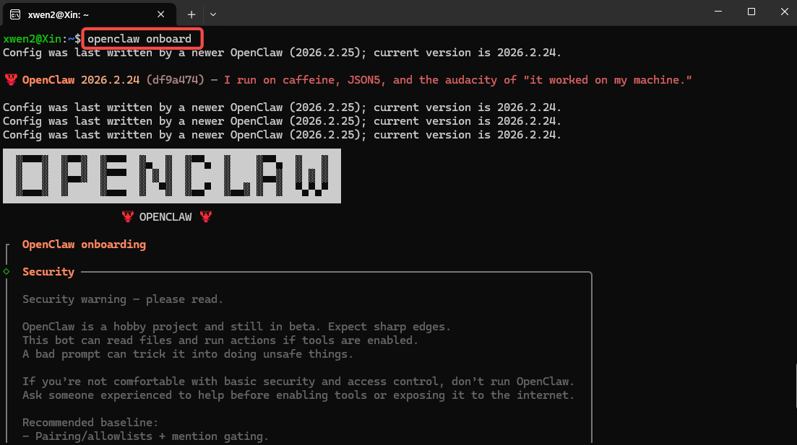

选择`yes`

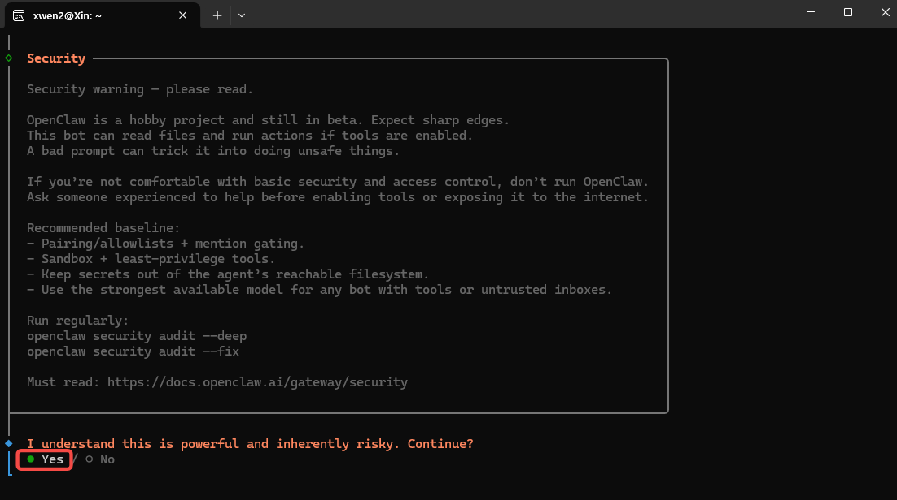

完全照我的选就行

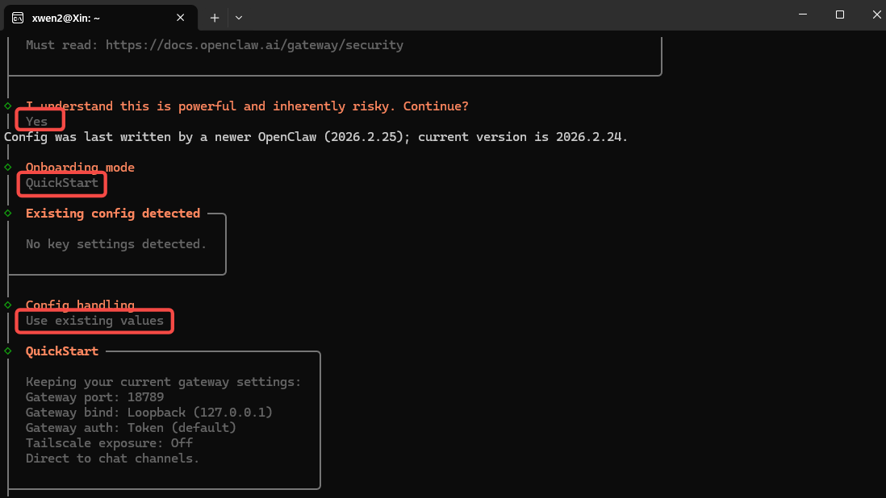

- 这里我选择了Kimi K2.5的模型，整体来说性价比高一些。

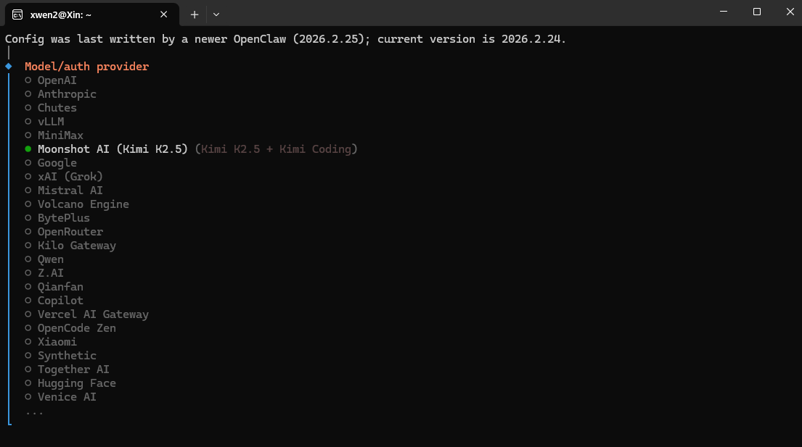

- 选择订阅的Kimi类别

默认 `.ai` 是国外版本，`.cn` 是国内版本。`subscription`是订阅版.

> 这边我踩了坑，之前一直选择前两个。没想到Kimi还分国际版，国内版以及订阅版。我是在KIMI code上订阅的会员并且拿的API Key，选择其他的两个就会造成没反应！！！！啊啊啊啊

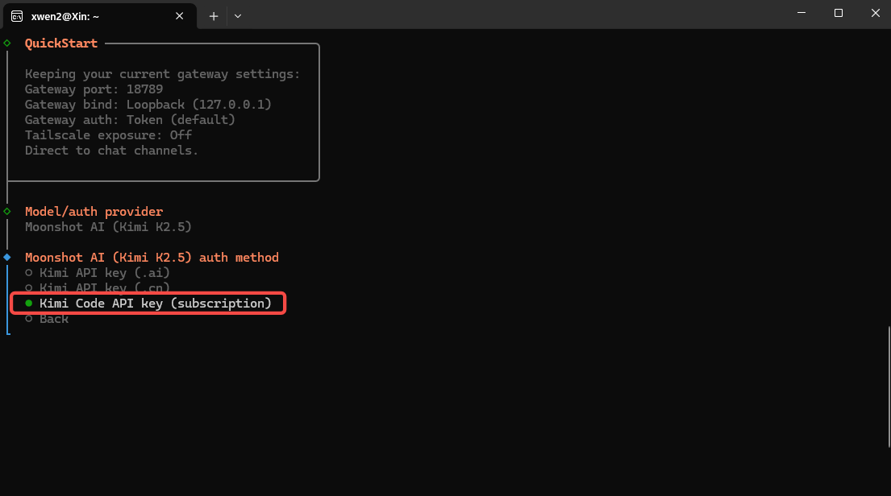

### 买Kimi会员套餐

买个Kimi会员套餐，我选择“Allegretto”，性价比比较高。

https://www.kimi.com/membership/pricing


然后点击Kimi code的控制台，复制密钥

https://www.kimi.com/code/console

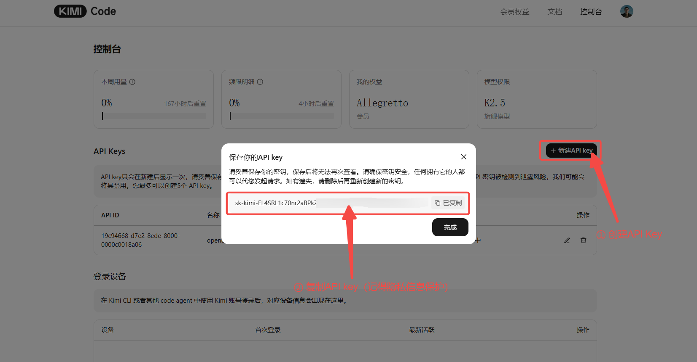

复制到刚刚的命令行里面

> 注意密钥隐私信息

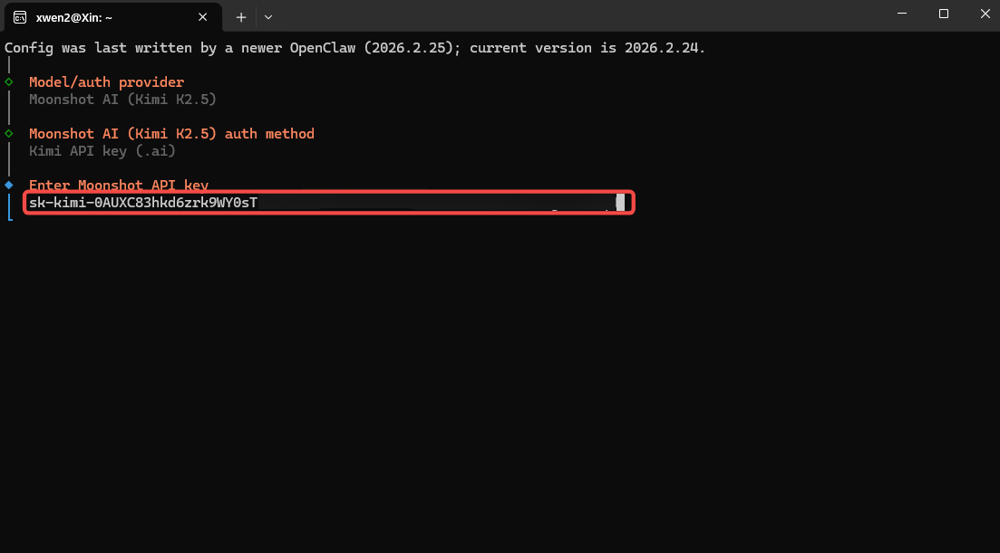

### 跳过配置飞书渠道

先跳过渠道，等等跑通之后再来开始导入飞书的渠道，配置飞书。这样便于排查风险。


选择 `yes` 安装 skills。


先按空格选中，再按回车。


 都选`No`，先把主线MVP跑通，后续也能添加。

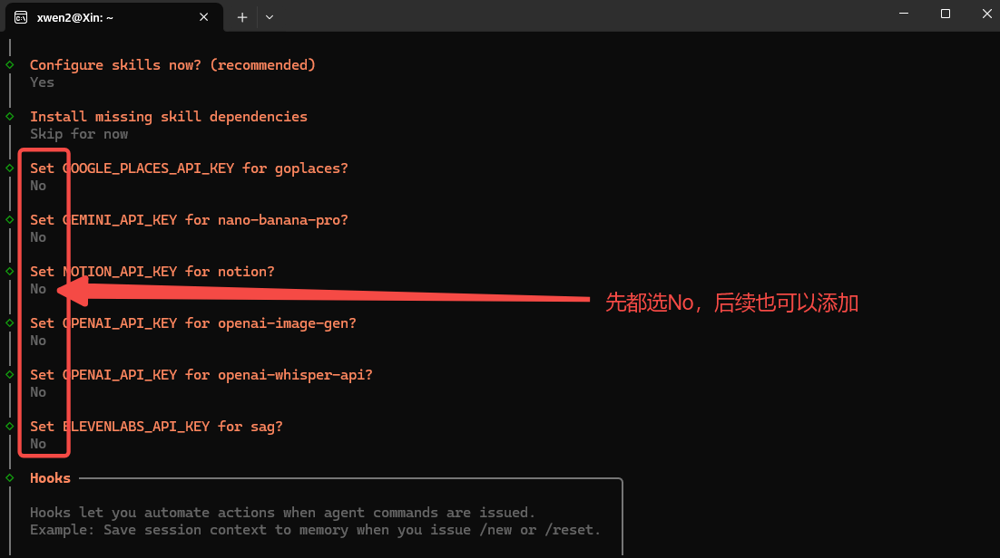

都选上

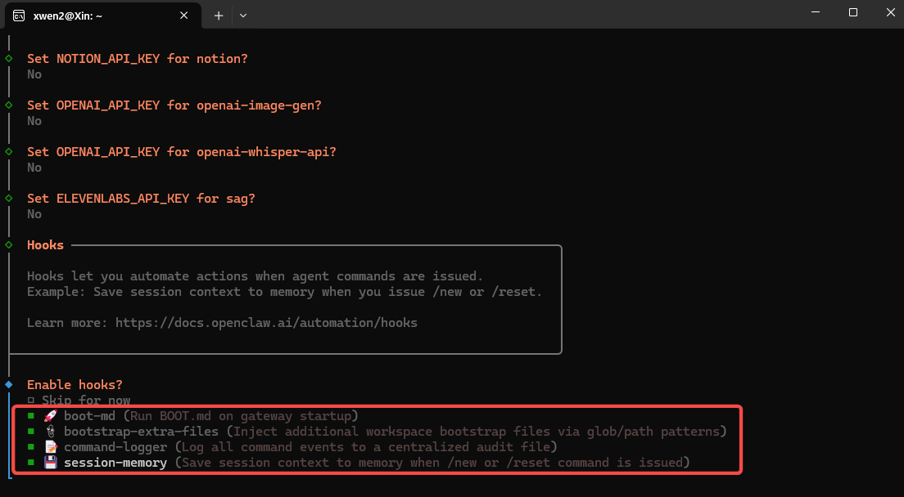

看到这个说明ok了


可以打开它试试，如果有时候打开网页空白或者模型不回复。按照我的小白经验就是从开始的`openclaw onboard` （开始配置Openclaw）步骤重新来一遍。

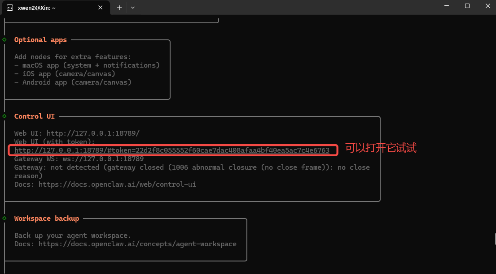

点击`Restart` 重启实例。

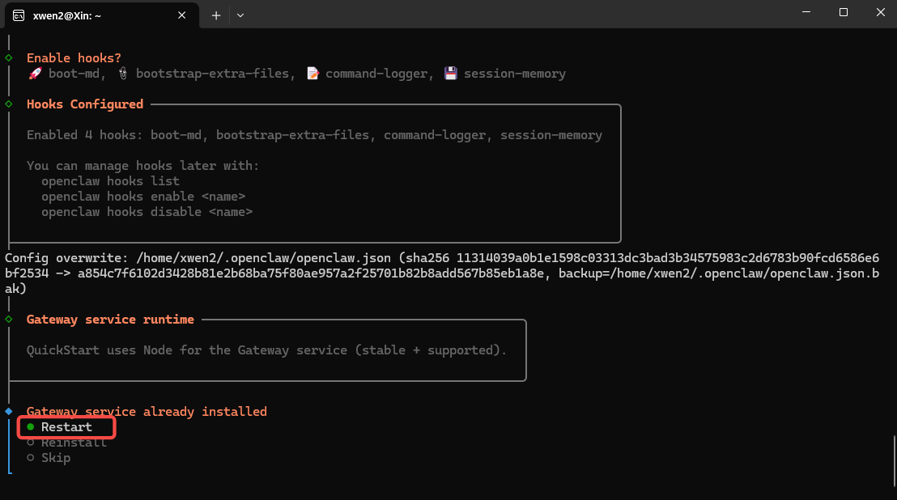

选择TUI（终端）或者Web UI（网页版）都可以，主要是试试看模型有没有跑通接入。


可以看到那个网页和终端的消息都是同步的，模型会给我回复消息，说明跑通了。


可以，它可以回话了！！！！

Openclaw 配置成功
<!-- TMP10_LOCAL_KIMI_END -->


