# 搭建团队协作机器人

## 5.2 飞书多agents配置

这里请参考飞书配置部分，再配置1个或多个机器人。大家可以用我做好的权限配置导入即可。然后我们拿到对应的id和密钥。

### 详细步骤

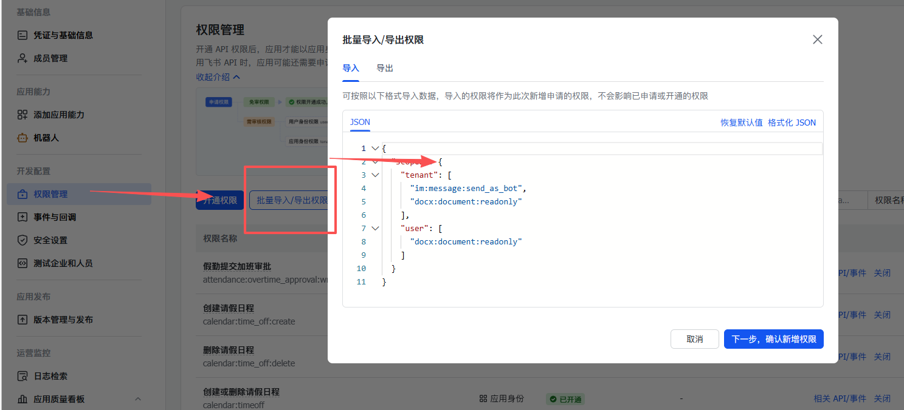

```JSON
{
  "scopes": {
    "tenant": [
      "attendance:overtime_approval:write",
      "calendar:time_off:create",
      "calendar:time_off:delete",
      "calendar:timeoff",
      "contact:user.base:readonly",
      "corehr:person.entry_leave_time:read",
      "directory:employee.base.background_image:read",
      "directory:employee.base.is_primary_admin:read",
      "directory:employee.base.resign_time:read",
      "docs:doc",
      "docs:doc:readonly",
      "docs:document.comment:create",
      "docs:document.comment:read",
      "docs:document.comment:update",
      "docs:document.comment:write_only",
      "docs:document.content:read",
      "docs:document.media:download",
      "docs:document.media:upload",
      "docs:document.subscription",
      "docs:document.subscription:read",
      "docs:document:copy",
      "docs:document:export",
      "docs:document:import",
      "docs:event.document_deleted:read",
      "docs:event.document_edited:read",
      "docs:event.document_opened:read",
      "docs:event:subscribe",
      "docs:permission.member",
      "docs:permission.member:auth",
      "docs:permission.member:create",
      "docs:permission.member:delete",
      "docs:permission.member:readonly",
      "docs:permission.member:retrieve",
      "docs:permission.member:transfer",
      "docs:permission.member:update",
      "docs:permission.setting",
      "docs:permission.setting:read",
      "docs:permission.setting:readonly",
      "docs:permission.setting:write_only",
      "hire:ehr_import",
      "im:app_feed_card:write",
      "im:biz_entity_tag_relation:read",
      "im:biz_entity_tag_relation:write",
      "im:chat",
      "im:chat.access_event.bot_p2p_chat:read",
      "im:chat.announcement:read",
      "im:chat.announcement:write_only",
      "im:chat.chat_pins:read",
      "im:chat.chat_pins:write_only",
      "im:chat.collab_plugins:read",
      "im:chat.collab_plugins:write_only",
      "im:chat.managers:write_only",
      "im:chat.members:bot_access",
      "im:chat.members:read",
      "im:chat.members:write_only",
      "im:chat.menu_tree:read",
      "im:chat.menu_tree:write_only",
      "im:chat.moderation:read",
      "im:chat.tabs:read",
      "im:chat.tabs:write_only",
      "im:chat.top_notice:write_only",
      "im:chat.widgets:read",
      "im:chat.widgets:write_only",
      "im:chat:create",
      "im:chat:delete",
      "im:chat:moderation:write_only",
      "im:chat:operate_as_owner",
      "im:chat:read",
      "im:chat:readonly",
      "im:chat:update",
      "im:datasync.feed_card.time_sensitive:write",
      "im:message",
      "im:message.group_at_msg:readonly",
      "im:message.group_msg",
      "im:message.p2p_msg:readonly",
      "im:message.pins:read",
      "im:message.pins:write_only",
      "im:message.reactions:read",
      "im:message.reactions:write_only",
      "im:message.urgent",
      "im:message.urgent.status:write",
      "im:message.urgent:phone",
      "im:message.urgent:sms",
      "im:message:readonly",
      "im:message:recall",
      "im:message:send_as_bot",
      "im:message:send_multi_depts",
      "im:message:send_multi_users",
      "im:message:send_sys_msg",
      "im:message:update",
      "im:resource",
      "im:tag:read",
      "im:tag:write",
      "im:url_preview.update",
      "im:user_agent:read",
      "optical_char_recognition:image",
      "search:dataset.docs:create",
      "search:dataset.docs:delete"
    ],
    "user": []
  }
}
```

## 5.3 openclaw配置agents

核心文档如下，但是实际操作起来还是比较麻烦的。我们配置agents可能需要有不同的任务，不同的技能，不同的记忆及工作空间，怎么合理的分配和调用这些agents呢？

https://docs.openclaw.ai/channels/feishu

一般情况下我们需要不同的agent我们需要有不同的人设、不同的用途、不同的记忆。那么在openclaw使用workspace与agentDir来控制工作区和agent的配置区。

**workspace默认位置：** `~/.openclaw/workspace` 

**agentDir默认位置：** `~/.openclaw/agents/<agent-id>`

所以我们需要把位置与其他agent区分开，方便我们管理~做到隔离。这样才会像控制不同的角色一样控制大家。

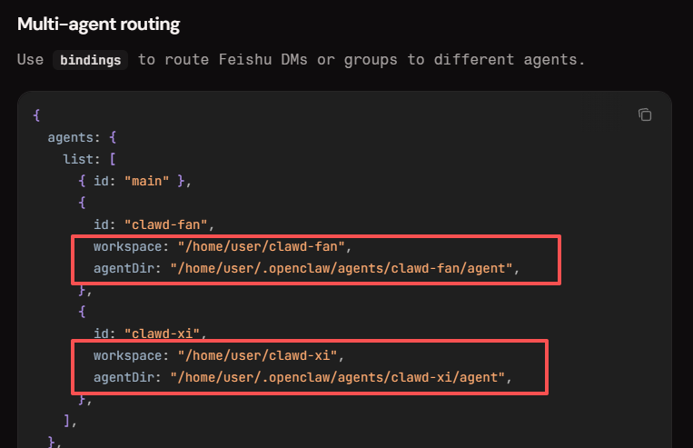

### 知识补充

**channels** 是 OpenClaw 配置中（openclaw.json 文件的根级别字段）的一个核心部分，它专门用来定义和管理**外部通信平台（聊天渠道）的集成**。简单说，**channels 就是告诉 OpenClaw “我要连接哪些聊天App/平台（如****飞书****、****Telegram****、Discord 等），用什么账号/凭证去连，以及怎么控制谁能发消息给** **bot****”**。

**bindings** 是 OpenClaw 配置中一个非常重要的字段（位于 JSON 的根级别 "bindings": [...]），它的作用是**路由规则**（routing rules），用来决定：**当****飞书****（或其他** **channel****）收到一条新消息时，应该交给哪个 agent（****智能体****）来处理**。

简单来说，就是“把这个消息发给谁处理”的匹配规则。OpenClaw 支持多 agent（比如你有 main 和 mimi1 两个），每个 agent 有独立的 workspace、记忆、模型、文件等。**bindings 就是连接** **channel** **→ account → agent 的桥梁**，防止所有消息都挤到同一个 agent 里。

### JSON直接配置

请跟着我按下面的描述配置~

我们现在飞书的channels里面配置了mimi1这个账号


然后定义mimi1的工作区和agent工作目录

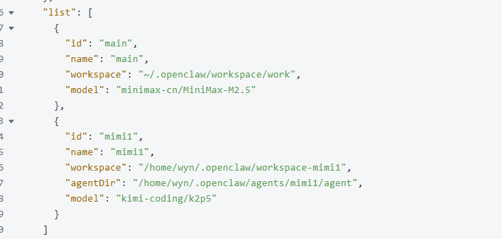

最后建立bindings建立mimi1的飞书agent路由通路


完整配置参考~

```JSON
{
  "meta": {
    "lastTouchedVersion": "2026.2.23",
    "lastTouchedAt": "2026-02-25T06:23:21.988Z"
  },
  "wizard": {
    "lastRunAt": "2026-02-25T02:21:40.503Z",
    "lastRunVersion": "2026.2.23",
    "lastRunCommand": "onboard",
    "lastRunMode": "local"
  },
  "auth": {
    "profiles": {
      "minimax-cn:default": {
        "provider": "minimax-cn",
        "mode": "api_key"
      },
      "kimi-coding:default": {
        "provider": "kimi-coding",
        "mode": "api_key"
      }
    }
  },
  "models": {
    "mode": "merge",
    "providers": {
      "minimax-cn": {
        "baseUrl": "https://api.minimaxi.com/anthropic",
        "api": "anthropic-messages",
        "models": [
          {
            "id": "MiniMax-M2.5",
            "name": "MiniMax M2.5",
            "reasoning": true,
            "input": [
              "text"
            ],
            "cost": {
              "input": 0.3,
              "output": 1.2,
              "cacheRead": 0.03,
              "cacheWrite": 0.12
            },
            "contextWindow": 200000,
            "maxTokens": 8192
          }
        ]
      },
      "kimi-coding": {
        "baseUrl": "https://api.kimi.com/coding/",
        "api": "anthropic-messages",
        "models": [
          {
            "id": "k2p5",
            "name": "Kimi for Coding",
            "reasoning": true,
            "input": [
              "text",
              "image"
            ],
            "cost": {
              "input": 0,
              "output": 0,
              "cacheRead": 0,
              "cacheWrite": 0
            },
            "contextWindow": 262144,
            "maxTokens": 32768
          }
        ]
      }
    }
  },
  "agents": {
    "defaults": {
      "model": {
        "primary": "minimax-cn/MiniMax-M2.5"
      },
      "models": {
        "minimax-cn/MiniMax-M2.5": {
          "alias": "Minimax"
        },
        "kimi-coding/k2p5": {
          "alias": "Kimi for Coding"
        }
      },
      "workspace": "/home/wyn/.openclaw/workspace",
      "compaction": {
        "mode": "safeguard"
      },
      "maxConcurrent": 4,
      "subagents": {
        "maxConcurrent": 8
      }
    },
    "list": [
      {
        "id": "main",
        "name": "main",
        "workspace": "~/.openclaw/workspace/work",
        "model": "minimax-cn/MiniMax-M2.5"
      },
      {
        "id": "mimi1",
        "name": "mimi1",
        "workspace": "/home/wyn/.openclaw/workspace-mimi1",
        "agentDir": "/home/wyn/.openclaw/agents/mimi1/agent",
        "model": "kimi-coding/k2p5"
      }
    ]
  },
  "bindings": [
    {
      "agentId": "mimi1",
      "match": {
        "channel": "feishu",
        "accountId": "mimi1"
      }
    },
    {
      "agentId": "main",
      "match": {
        "channel": "feishu",
        "accountId": "main"
      }
    }
  ],
  "messages": {
    "ackReactionScope": "group-mentions"
  },
  "commands": {
    "native": "auto",
    "nativeSkills": "auto",
    "restart": true,
    "ownerDisplay": "raw"
  },
  "session": {
    "dmScope": "per-channel-peer"
  },
  "hooks": {
    "internal": {
      "enabled": true,
      "entries": {
        "session-memory": {
          "enabled": true
        },
        "command-logger": {
          "enabled": true
        },
        "boot-md": {
          "enabled": true
        },
        "bootstrap-extra-files": {
          "enabled": true
        }
      }
    }
  },
  "channels": {
    "feishu": {
      "enabled": true,
      "domain": "feishu",
      "dmPolicy": "open",
      "groupPolicy": "open",
      "accounts": {
        "main": {
          "appId": "cli_xxx",
          "appSecret": "<your-app-secret>"
        },
        "mimi1": {
          "appId": "cli_xxx",
          "appSecret": "<your-app-secret>"
        }
      }
    }
  },
  "gateway": {
    "port": 18789,
    "mode": "local",
    "bind": "loopback",
    "auth": {
      "mode": "token",
      "token": "<your-gateway-token>"
    },
    "tailscale": {
      "mode": "off",
      "resetOnExit": false
    }
  },
  "plugins": {
    "entries": {
      "feishu": {
        "enabled": true
      }
    }
  }
}
```

### 懒人版方案（有失败概率）

这里我直接求助了grok，grok可以完整的输出文档。（其实我也试过kimi，但是kimi没有完成这个任务。）

提示词如下：

```Bash
先阅读文档：https://docs.openclaw.ai/channels/feishu.md
我需要你再配置一个智能体，使用飞书channel，配置智能体名称叫mimi1，使用于main的的工作区和agentdir 使用kimi模型，下面是id和密钥
id：cli_aXXXXXXXXXXXXX8dbce
密钥：ErZ3YXXXXXXXXXXXXXXXFMttOZ
然后修改下面的配置json，并给我返回完整修改后的json内容
{
  "meta": {
    "lastTouchedVersion": "2026.2.23",
    "lastTouchedAt": "2026-02-25T02:21:40.514Z"
  },
  …………………………………………
  …………………………………………
```

返回后如下图，点击复制即可

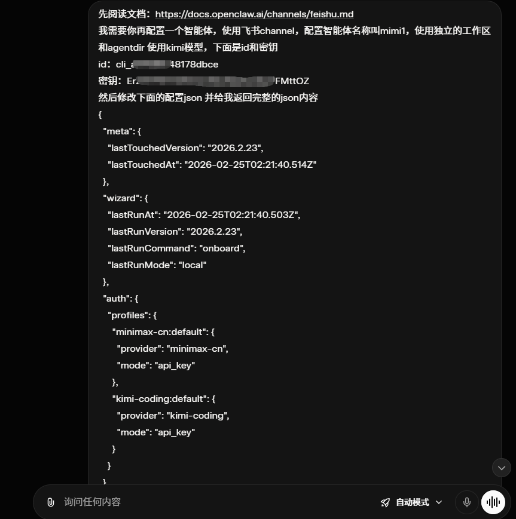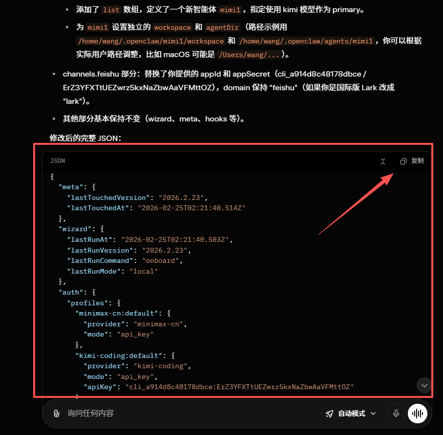

然后我们粘贴到openclaw.json文件内。

接着打开ubuntu，输入 `openclaw gateway restart`

没有报错说明配置无误~

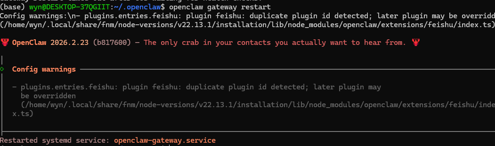

接着回到飞书，把长连接配好就ok啦，记得发布你的修改哦~

### 配置飞书群聊agents

配好后我们可以让agent在群聊里开party了~ 

这里我们新建一个飞书群，随便起一个名字创建。

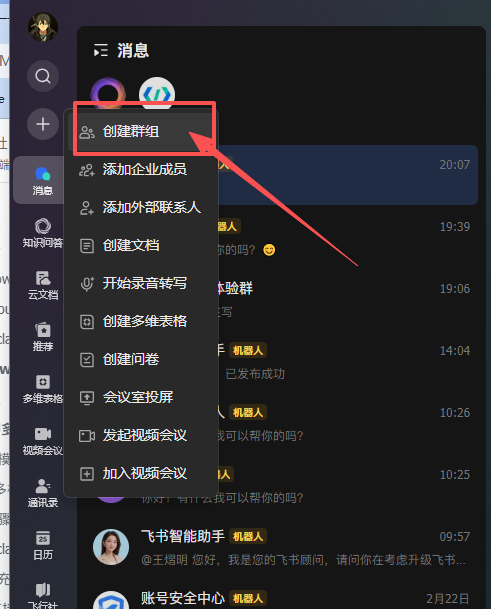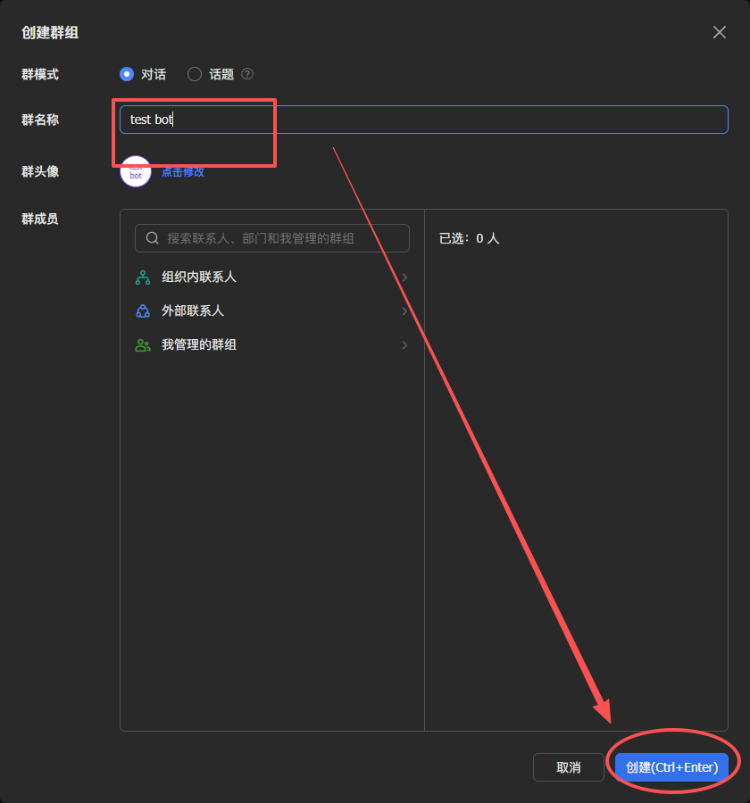

然后把龙虾们请进来~

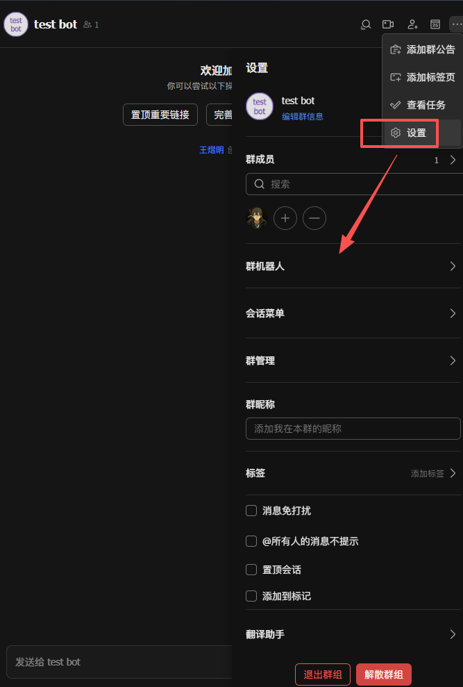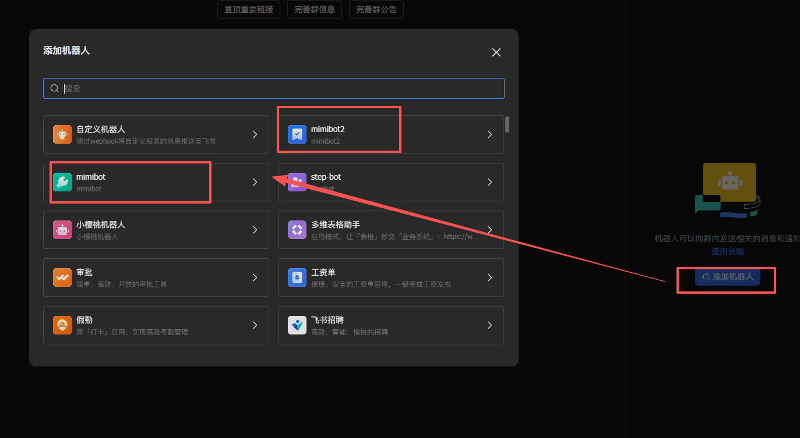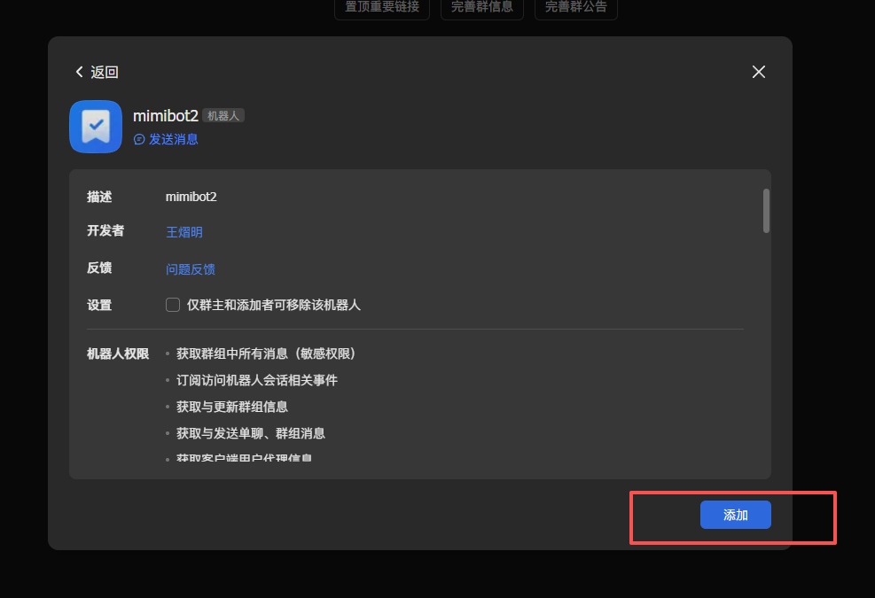

然后你们就可以开party了~ 逐个@就好，到这我们的机器人party就可以了。

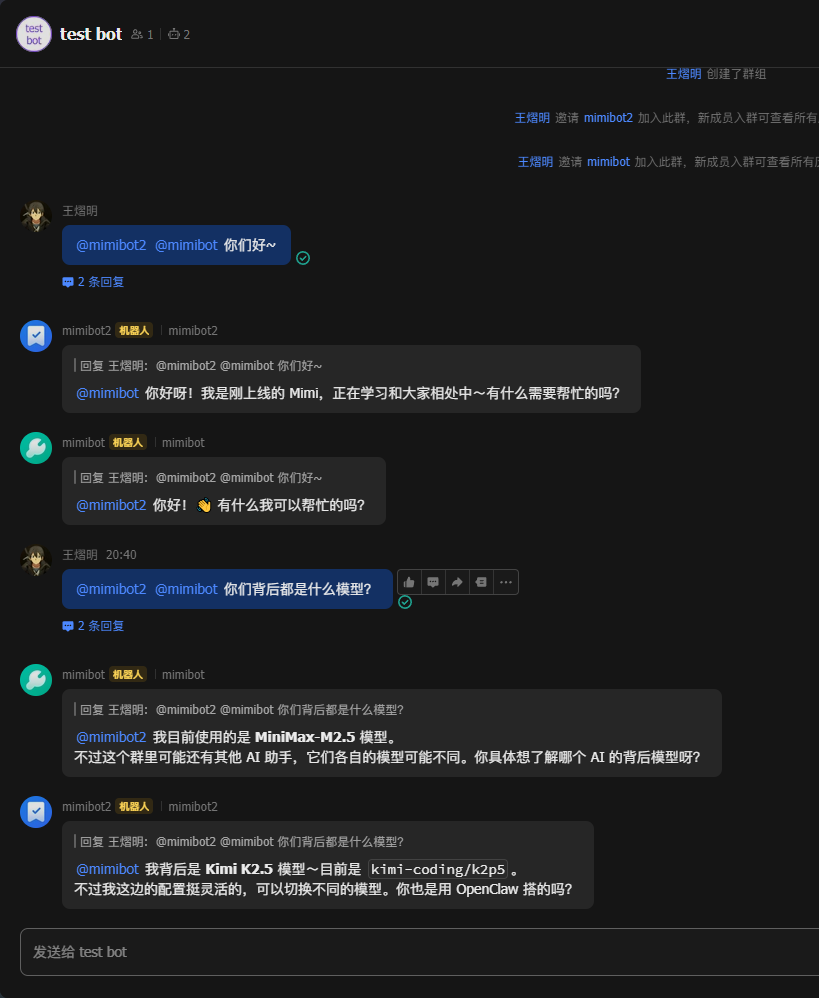

如果想拉自己的伙伴你可以这样，分享二维码就行。然后把伙伴拉入群~

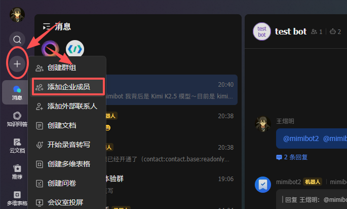

