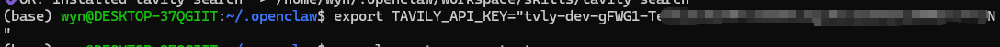

# 从 ClawHub 安装 Skills 与实用技巧

## 7.1 联网skills

联网是个大问题hh，可能需要两个方面。一个是主动拉取浏览器，另一个是阅读网址。

这里我们选择使用Tavily作为我们的核心工具~请大家先注册一个账号：

https://app.tavily.com/home

然后需要你新建一个api并复制key~


接着来到ubuntu的界面，输入下面命令并输入y。

```Plain
 npx clawhub@latest install tavily-search
```


装好之后再输入，下面的“apikey”替换为你的key即可~

```Plain
export TAVILY_API_KEY="apikey"
```



接着进入飞书，找一个想用这个技能的agent：

让他查看skill并将刚才我们安装的tavily-searchskill也加进来~


测试通过~


## 7.2 如何优雅地使用**ClawHub** 

下面是一份「**如何优雅地使用 OpenClaw 的 ClawHub**」教程：先讲它是什么、为什么好用，再给你一套从 0 到熟练的使用流程，最后附上我更推荐的新手技能清单（并带上安全注意事项）。

### 7.2.1 ClawHub 是什么？（一句话理解）

**ClawHub 是 OpenClaw 的公共 Skills 注册中心/官方商店**：你可以把它理解成「给智能体装插件的 App Store / npm」。Skills 本质上是一个文件夹，核心是 `SKILL.md`（外加一些辅助文件），既能在网页上浏览，也能用 CLI 搜索、安装、更新、发布。([OpenClaw](https://docs.openclaw.ai/zh-CN/tools/clawhub))

### 7.2.2 为什么这个“官方商店”好用？

ClawHub好用主要在这几件事上（都很“工程化”）：

1. **语义搜索（不只关键词）** 它支持基于向量/嵌入的搜索，更适合你用自然语言找能力，比如“帮我管理日历”“连接 Trello”。([OpenClaw](https://docs.openclaw.ai/zh-CN/tools/clawhub))
2. **版本管理像** **npm****：可回滚、可打标签** Skills 支持语义化版本号、变更日志、`latest` 之类标签；每次发布生成版本，标签可移动，天然支持回滚。([OpenClaw](https://docs.openclaw.ai/zh-CN/tools/clawhub))
3. **CLI** **工作流****顺滑：装、更新、同步、发布一条命令** `search / install / update --all / publish / sync` 这些命令把“扩展能力”变成标准化运维动作。([OpenClaw](https://docs.openclaw.ai/zh-CN/tools/clawhub))
4. **可审计/可协作：公开内容、评论星标、（还有审核钩子）** 技能内容（`SKILL.md`）可直接查看；并且有星标/评论等信号；官方文档也提到审核钩子用于审批与审计。([OpenClaw](https://docs.openclaw.ai/zh-CN/tools/clawhub))

### 7.2.3优雅使用 ClawHub：推荐的“最佳实践”流程

#### Step A：先用网页挑选，再用 CLI 安装（最省心）

- 网页端用来“逛”：看简介、版本、安装量、是否 Highlighted、以及（如果有）安全扫描/报告等信号。
- CLI 用来“装”和“管”：保证可重复、可更新、可同步。

ClawHub 网页上有 **Highlighted**（偏“官方/社区精选信号”）以及 **Hide suspicious**（隐藏可疑内容）的入口，建议你默认开启“隐藏可疑”。([ClawHub](https://clawhub.ai/skills?nonSuspicious=true&utm_source=chatgpt.com))

#### Step B：安装 CLI（一次搞定）

任选其一：(OpenClaw)

```Bash
npm i -g clawhub
# 或
pnpm add -g clawhub
```

#### Step C：搜索与安装（新手最常用）

官方给的最小闭环是：先搜再装：(OpenClaw)

```Bash
clawhub search "calendar"
clawhub install <skill-slug>
```

安装后要让 OpenClaw **重新启动****一个会话**，它才会加载新 skills。([OpenClaw](https://docs.openclaw.ai/zh-CN/tools/clawhub))

#### Step D：把“技能管理”做得更优雅（工作区、锁文件、可重复）

几个关键点：

- **默认安装位置**：CLI 会把 skills 装到当前目录的 `./skills`。([OpenClaw](https://docs.openclaw.ai/zh-CN/tools/clawhub))
- **更推荐做法**：为你的 OpenClaw 项目准备一个“固定工作区”（workspace），让 skills 都进 `<workspace>/skills`，项目更可移植。([OpenClaw](https://docs.openclaw.ai/zh-CN/tools/clawhub))
- **用锁文件掌控状态**：已安装 skills 记录在 `.clawhub/lock.json`，这让“在另一台机器复现同一套技能”更靠谱。([OpenClaw](https://docs.openclaw.ai/zh-CN/tools/clawhub))

常用命令：

```Bash
# 看已安装
clawhub list

# 更新全部（我建议定期做，但要先看变更）
clawhub update --all
```

#### Step E：发布/备份你自己的 skills（进阶但很爽）

当你写了自己的 skill（一个文件夹+SKILL.md），你可以发布备份：(OpenClaw)

```Bash
clawhub publish ./my-skill \
  --slug my-skill \
  --name "My Skill" \
  --version 1.0.0 \
  --tags latest
```

或者用 `sync` 扫描并同步发布多个 skills：([OpenClaw](https://docs.openclaw.ai/zh-CN/tools/clawhub))

```Bash
clawhub sync --all
```

### 7.2.4 agent下也可以用几句话轻松搞定安装

这里我用安装：**self-improving-agent 举例：**

前提是你提前装好了clawhub，我用到的prompt如下。但请注意：如果需要apikey （例如Tavily），最好手动安装。

```Plain
安装：self-improving-agent skill 使用clawhub
```


### 7.2.5 安全提醒（非常重要，但不需要恐慌）

因为 Skills 可能包含可执行逻辑或引导你执行命令，**它们本质上要当“第三方代码”对待**。官方文档也明确提到安全注意：把第三方 skills 当作不可信代码，启用前先阅读。([OpenClaw](https://docs.openclaw.ai/tools/skills?utm_source=chatgpt.com))

另外，近期也确实有媒体报道 ClawHub 出现恶意 skills/供应链风险（尤其伪装成加密货币相关工具），并提醒用户谨慎安装与审查。(Tom's Hardware)

**我的“优雅安全习惯”清单：**

- **只从你能看懂/能审核的来源装**：至少打开 `SKILL.md` 看它要什么权限、要读写哪些文件、要不要你复制粘贴奇怪命令。
- **优先选择 Highlighted / 有较多安装量 / 有扫描报告的**（但仍要自己看）。
- **对“要你运行一长串** **curl****|bash、混淆命令、索要****私钥****/助记词/****API** **Key”的技能直接拒绝**。
- **给技能最小权限**：能用单独 API key 就别给全能 key；能用专门账号就别用主账号。

### 7.2.6 x上10个最受欢迎的skills

X上大家讨论和推荐的实用/高频技能（基于社区反馈、安装量、使用场景，排除明显恶意类），我整理出下面这些被多次提到“很推荐”“必装”“日常用”的，基本覆盖核心需求：

1. **tavily-search** 联网搜索技能（AI优化版），让Agent能实时查最新资讯、数据，避免“闭眼编”。几乎所有人都说“没这个跟瞎子一样”。 安装：clawhub install tavily-search
2. **find-skills** 让Agent自己去ClawHub搜并安装需要的技能，解决“不知道用哪个工具”的痛点。 安装：clawhub install find-skills
3. **proactive-agent**（或旧版proactive-agent-1-2-4） 给Agent加“主动性”和自我迭代能力，能记住历史、优化行为、减少重复问。长期用很香。 安装：clawhub install proactive-agent
4. **github** GitHub集成，能自动管repo、issue、PR、code search。开发者必备。 安装：clawhub install github
5. **gog** Google Workspace全家桶（Gmail、日历、Drive、Docs），办公自动化神器。 安装：clawhub install gog
6. **skill-vetter** / **clawsec** 安装前扫描技能安全，防恶意代码。**安全第一步**，很多人后悔没先装这个。 安装：clawhub install skill-vetter 或类似安全扫描类
7. **automation-workflows** 工作流编排，把多个技能串起来干复杂事（自动邮件+报告+数据同步等）。 安装：clawhub install automation-workflows
8. **bird** X/Twitter集成，能发帖、搜趋势、管理账号（但小心伪装恶意版）。（社区提到，但慎用高赞的“Twitter”相关）
9. **self-improving-agent** 加记忆+自我优化，长期交互越用越聪明。 安装：clawhub install self-improving-agent
10. **feishu-doc**（针对国内用户） 飞书文档/云盘集成，企业/团队协作常用。 安装：clawhub install feishu-doc

### 7.2.7 最建议新手使用的10个skills

作为新手，最建议先装的10个ClawHub skills（基于2026年ClawHub热门榜、awesome-openclaw-skills精选、社区/X/Reddit真实反馈），重点选**低风险、高实用、立竿见影提升体验**的。顺序也很重要：先安全+基础，再加生产力，最后加高级。

这些技能几乎都是@steipete 等靠谱作者的，安装量高、star多、恶意报告极少。**强烈建议**：先用 clawhub install skill-vetter 或类似安全扫描技能检查，再装别的。安装用 clawhub install <slug> 或 npx clawhub@latest install <slug>。

1. **self-improving-agent** 自我迭代/主动代理。让Agent记住错误、自我优化、越来越聪明。新手最容易感受到“哇，变聪明了”。 （ClawHub热门榜第一，46k+ installs）
2. **tavily-search** (或 tavily-web-search) 联网搜索（Tavily API优化版）。没这个Agent就是“井底之蛙”，查不了实时信息。几乎所有新手必装第一梯队。 （37k+ installs，AI Agent标配）
3. **gog** (Google Workspace CLI) Gmail、日历、Drive、Docs全家桶。日常办公/邮件/日程神器，新手最快看到实际自动化效果（读邮件、加日历、写文档）。 （46k+ installs，超级实用）
4. **github** GitHub集成（用gh CLI）。能搜代码、管issue/PR、创建repo。新手学代码/做项目超方便。 （35k+ installs，开发者入门必备）
5. **summarize** 总结URL、PDF、图片、YouTube、音频。快速消化信息，新手研究东西时超级省力。 （36k+ installs，高频使用）
6. **find-skills** 让Agent自己去ClawHub搜并推荐/安装技能。解决“不知道装什么”的最大痛点，新手最友好。 （社区反复推荐的“元技能”）
7. **ontology** 或 **agent-memory** / **memory** 结构化记忆/知识图谱。让Agent真正“记住你”、跨对话连贯，不再健忘。新手交互体验提升巨大。 （35k+ installs，长期用越用越香）
8. **weather** 查天气（无需API key）。超级简单、零配置，新手第一个测试技能，成功率100%，建立信心。 （29k+ installs，入门玩具但实用）
9. **proactive-agent** (或 proactive-agent-1-2-4 等版本) 增加主动性，能自己规划、迭代任务。让Agent从“被动回答”变成“主动帮忙”。 （X上中文社区特别推，新手用后反馈“活了”）
10. **skill-vetter** / **security-audit** 或类似安全扫描 安装前扫描技能代码、防恶意。**新手安全第一**，装这个后再放心装别的。 （安全类必备，社区共识“后悔没先装”）

**新手安装建议顺序**（一步步来，别一下全装）：

1. 先装 skill-vetter（安全）
2. tavily-search（联网）
3. self-improving-agent + proactive-agent（聪明起来）
4. gog 或 github（看你日常用Google还是代码）
5. summarize + find-skills（研究+扩展）
6. ontology/memory（长期记忆）
7. weather（测试玩玩）

**Tips**：

- 先去 https://www.clawhub.ai/ 浏览热门/ trending，看安装量和作者。
- 用 clawhub search "beginner" OR "essential" 自己搜。
- 装完后新开session（重启OpenClaw），技能才会生效。
- 别一次性开太多，token和性能会爆炸。先3-5个玩熟了再加。
- 安全永远第一：用隔离环境（Docker）、别给敏感权限、定期 clawhub update --all。

### 7.2.8 一套“优雅到位”的新手上手脚本（你可以照抄）

```Bash
# 1) 装 CLI
npm i -g clawhub

# 2) 搜索（先用自然语言）
clawhub search "calendar"
clawhub search "trello"

# 3) 安装（挑你确认过的 slug）
clawhub install skills/calendar
clawhub install steipete/trello

# 4) 查看安装列表 & 锁定状态
clawhub list

# 5) 之后定期更新
clawhub update --all
```

> 注意：实际 slug 以你在网页端看到的为准；装完记得重启 OpenClaw 会话让它加载。([OpenClaw](https://docs.openclaw.ai/zh-CN/tools/clawhub))

## 7.3 我发现了 OpenClaw 的技能仓库项目：这个 20k+ Stars 的“神级清单”里，几乎涵盖了所有好用的 Skills（小白教程流）

如果你是第一次接触 OpenClaw，十有八九会卡在一个问题：**Skill 到底该装哪个？** 这时候，`VoltAgent/awesome-openclaw-skills` 就像一张“技能世界地图”——它把技能按场景整理成目录，帮你快速找到“从哪开始”。更夸张的是，这个仓库在 GitHub 上显示 **Star 约 20.1k**，已经成了很多人入门时默认会收藏的“神级清单”。([GitHub](https://github.com/VoltAgent/awesome-openclaw-skills/blob/main/README.md?utm_source=chatgpt.com))

你会学到——这个仓库是什么、它和 ClawHub（官方技能商店/注册中心）怎么配合使用、如何优雅地挑技能 + 安装 + 更新，以及一定要写进文章里的安全注意事项。

### 7.3.1 先搞清楚：awesome 仓库 vs ClawHub，到底谁负责什么？

你只要记住一句话：

- **awesome-openclaw-skills**：是“导购/目录/精选清单”，负责帮你**发现**技能，按场景分类整理。([GitHub](https://github.com/VoltAgent/awesome-openclaw-skills?utm_source=chatgpt.com))
- **ClawHub**：是 OpenClaw 的技能注册中心（更像 App Store / npm），负责**搜索、安装、更新、版本管理**；网页端有向量搜索、并提供 CLI 管理工作流。([ClawHub](https://clawhub.ai/skills?nonSuspicious=true&utm_source=chatgpt.com))

所以最优雅的搭配是：

> 用 awesome 找方向 → 点进去看说明 → 回到 ClawHub 用 CLI 安装与管理（可复现、可更新）。

### 7.3.2 为什么这个 20k+ Stars 仓库会火：它解决了小白最大的痛点

小白逛“商店”的真实体验经常是：

- 我只知道自己想“更省事”，但不知道该搜什么关键词
- 搜出来一堆结果，质量参差、看得头大

awesome 清单的价值就在于：它把“技能生态”从散乱变成了**按场景的目录**，你可以从“我想做什么”出发，而不是从“我该搜什么”出发。([GitHub](https://github.com/VoltAgent/awesome-openclaw-skills/blob/main/README.md?utm_source=chatgpt.com))

- **它像新手地图**：带你从 0 建立“技能能做什么”的全局认知
- **它像候选池过滤器**：先筛一轮，再去商店/仓库细看说明
- **它像作业答案**：你能直接抄“同类人常用的组合”

### 7.3.3 小白最推荐的“优雅工作流”：三步挑技能 + 两步装技能

下面是你可以直接写进文章、读者照着做就能跑通的流程。

#### 第一步：用 awesome 清单挑“场景”，别急着挑“技能”

先问自己：你最想让 OpenClaw帮你干什么？（只选 1～2 个场景就够了）

- 日程/任务管理
- 写作与内容整理
- 开发辅助（代码、文档、Issue）
- 桌面自动化（点按钮、打开软件、抓取 UI 信息）
- 信息检索与知识库

然后去 awesome 清单里，找到对应分类，**每个场景先挑 2～3 个候选**。不要贪多：装太多你反而不知道哪个有效。

> 这一步“少即是多”：小白最容易踩的坑就是一次性装 20 个技能，最后一个也没用起来。

#### 第二步：点进候选技能，做一个“30 秒体检”

每个候选技能，你只检查三件事（这套检查很“优雅”，也很现实）：

1. **它要不要你提供凭据（token/****API** **key/账号密码）？**
2. **它会不会读写本地文件、执行命令、访问网络？**
3. **说明文档是否清楚：配置步骤、例子、输入输出？**

（你不需要一上来读源码，但一定要把“它要你交出什么权限”看明白。）

#### 第三步：回到 ClawHub，用 CLI 安装（让一切可复现）

ClawHub 官方文档给的最短闭环就是：`search → install → 重启会话`。([Claw](https://docs.claw.so/engine/tools/clawhub/?utm_source=chatgpt.com))

**安装** **CLI****：**

```Bash
npm i -g clawhub
# 或
pnpm add -g clawhub
```

**搜索 + 安装：**

```Bash
clawhub search "calendar"
clawhub install <skill-slug>
```

安装后记得**启动一个新的 OpenClaw 会话**，它才会加载新技能。([Claw](https://docs.claw.so/engine/tools/clawhub/?utm_source=chatgpt.com))

### 7.3.4 “优雅使用”的关键：让技能管理像管理依赖一样可靠

#### 4.1 固定你的工作区：别让技能散落一地

ClawHub CLI 默认把技能装到当前目录的 `./skills`。([Claw](https://docs.claw.so/engine/tools/clawhub/?utm_source=chatgpt.com)) 更推荐你做一个专门的 OpenClaw 工作目录（比如 `~/openclaw-workspace`），以后所有技能都在同一个地方，方便迁移、备份、复用。

#### 4.2 锁文件：你装过什么，版本是什么，一清二楚

ClawHub 会把已安装技能记录在 `.clawhub/lock.json`（位于你的 workdir 下）。([OpenClaw](https://docs.openclaw.ai/tools/clawhub?utm_source=chatgpt.com)) 这意味着你可以把“我这套好用的技能组合”变成**可复现**的配置，而不是“我电脑上装了啥我也说不清”。

#### 4.3 更新：一条命令，但别无脑更新

```Bash
clawhub update --all
clawhub list
```

> 更新前先看看变更说明（changelog/README），尤其是涉及凭据、命令执行、文件读写的技能。

### 7.3.5必须单独写一节：安全使用（小白最需要的“护身符”）

你前面说“涵盖所有好用的 skills”，这句话在“发现层面”没问题；但从安全角度，你一定要补一句：

> **awesome 清单是目录，不是安全背书。安装前仍要把 Skill 当作第三方代码审查。**

为什么要这么强调？因为最近确实出现过针对 ClawHub 技能生态的恶意投放与供应链攻击报道：有技能伪装成生产力/加密工具，诱导用户运行混淆命令、下载恶意载荷，窃取凭据或敏感数据。

#### 给小白的一套“极简但有效”安全守则

1. **凡是让你复制粘贴一长串看不懂的终端命令：先停。**
2. **凡是索要助记词/****私钥****/浏览器密码/****SSH** **key：直接拒绝。**
3. **能用最小权限 token 就别给全能 token；能用小号就别用主账号。**
4. **优先装“有清晰文档 + 维护活跃 + 社区使用信号强”的技能。**
5. 逛 ClawHub 网页时，建议开启 **Hide suspicious（隐藏可疑）**，并优先看 **Highlighted** 等更强信号的技能列表。([ClawHub](https://clawhub.ai/skills?nonSuspicious=true&utm_source=chatgpt.com))

### 7.3.6 新手行动清单：

**今天就做 4 件事：**

1. 收藏 `VoltAgent/awesome-openclaw-skills`，先选 1 个场景（比如日程/任务）。([GitHub](https://github.com/VoltAgent/awesome-openclaw-skills/blob/main/README.md?utm_source=chatgpt.com))
2. 在清单里挑 2～3 个候选技能，做“30 秒体检”。
3. 安装 ClawHub CLI，用 `search → install` 装上其中 1 个。([Claw](https://docs.claw.so/engine/tools/clawhub/?utm_source=chatgpt.com))
4. 从此把技能当依赖管理：定期 `update --all`，但更新前先读说明。([OpenClaw](https://docs.openclaw.ai/tools/clawhub?utm_source=chatgpt.com))

## 7.4 定时任务

待补充

## 7.5 主从agent管理模式（进阶）

待补充
